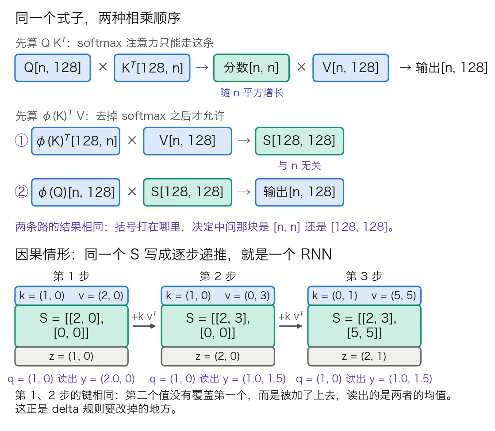

## 14.1 高效注意力：突破平方复杂度的瓶颈

标准自注意力的 $$O(n^2)$$ 复杂度（[2.5 节](../02_attention/2.5_complexity_limits.md)已详细分析）是 Transformer 处理超长序列的根本瓶颈。本节回答三个问题：把 softmax 拿掉之后，注意力变成什么；变成的那个东西为什么只需要一块固定大小的状态；固定状态换来的效率，代价是丢了什么。

承接的缺口来自 [3.8 节](../03_components/3.8_gpt_inference_flow.md)的瓶颈三：KV 缓存随序列线性增长，先吃显存容量，再吃显存带宽。本节的两条路线分别从两个方向动它——稀疏注意力少读几块缓存，线性注意力干脆不留缓存。14.3 节讲的状态空间模型与本节的递推形式是同一个数学对象，两节共用一套记号。

### 14.1.1 两类“高效”的分界

[2.5.6 节](../02_attention/2.5_complexity_limits.md)的表 2-13 已按“是否精确”把应对平方复杂度的思路分成四类。本节只取其中一条分界：改变注意力数学结构的方案（稀疏、线性、状态空间模型），与保持结果精确、只动 IO 与缓存的实现优化（FlashAttention 见 [10.3 节](../10_inference_optimization/10.3_flash_attention.md)，PagedAttention 见 [11.4 节](../11_serving/11.4_kv_memory_management.md)，MQA/GQA 与 MLA 见 [10.2 节](../10_inference_optimization/10.2_kv_cache.md)）。

这条分界的实际后果是训练成本。FlashAttention 把中间的 `[n, n]` 分数矩阵留在片上，输出与朴素实现逐位相同，换上去不必重训；块稀疏注意力改变的是哪些格子参与 softmax，输出必然不同，必须重训或续训。生产系统里第二类始终是默认项，第一类要拿质量换。本节讲的是第一类。

### 14.1.2 线性注意力：从核化到递推状态

记号沿用第 3 章起的一套（见 [3.8.3 节](../03_components/3.8_gpt_inference_flow.md)表 3-18）：每头宽度记作 $$d_h$$，第 2 章的数学推导把同一个量记作 $$d_k$$。本节另需一个 $$d_v$$，它是线性注意力状态矩阵的第二维，即 Value 每头的宽度；真实配置里两者相等，分开写只为让状态矩阵的形状可读。

**问题。** 一次解码，softmax 注意力要把当前 Query 与缓存里的全部 Key 打分。缓存有多长，这一步就有多大。有没有办法把“历史”压成一块固定大小的东西，使每步开销与已有长度无关。

**第一步：把 softmax 写成通式。** 位置 $$i$$ 的输出是各位置 Value 的加权平均，权重由某个相似度函数给出（[Katharopoulos 等的线性 Transformer](https://arxiv.org/abs/2006.16236) 式 3；原式求和到 $$N$$，下式已按因果情形截到 $$j \le i$$，对应该文式 8）：

$$
y_i = \frac{\sum_{j=1}^{i}\operatorname{sim}(q_i, k_j)\, v_j}{\sum_{j=1}^{i}\operatorname{sim}(q_i, k_j)}
$$

取 $$\operatorname{sim}(q,k) = \exp(q^Tk/\sqrt{d_h})$$，这就是第 2 章的缩放点积注意力。分母正是 softmax 的行和。

**第二步：把相似度拆成两个特征的内积。** 只要 $$\operatorname{sim}$$ 非负，就可以找一个特征映射 $$\phi$$ 使 $$\operatorname{sim}(q,k) = \phi(q)^T\phi(k)$$。代入后分子里的 $$\phi(q_i)^T$$ 与求和号无关，可以提到外面：

$$
y_i = \frac{\phi(q_i)^T \sum_{j\le i}\phi(k_j)v_j^T}{\phi(q_i)^T \sum_{j\le i}\phi(k_j)}
$$

求和号里再没有 $$i$$。分子的和是一个 $$[d_h, d_v]$$ 的矩阵，分母的和是一个 $$[d_h]$$ 的向量。这两块就是全部历史。

**第三步：形状对照。** 图 14-1 的上半幅把两种相乘顺序并排画出。按 Llama 3 8B 的单头取值（`d_h = d_v = 128`，见 3.8.6 的表 3-25）：

- 先算打分矩阵：`Q[n, 128] × Kᵀ[128, n] → 分数[n, n]`，再 `分数[n, n] × V[n, 128] → 输出[n, 128]`。
- 先算状态矩阵：`φ(K)ᵀ[128, n] × V[n, 128] → S[128, 128]`，再 `φ(Q)[n, 128] × S[128, 128] → 分子[n, 128]`。

两条路的结果相同，括号打在哪里决定中间那块是 `[n, n]` 还是 `[128, 128]`。softmax 走不了第二条：$$\exp$$ 作用在整个点积上，不能拆成两个特征的内积。

图 14-1：同一个式子的两种相乘顺序，以及因果情形下的递推状态（[生成脚本](https://github.com/yeasy/llm_internals/blob/main/tools/figures/ch14a_linear_state.py)）。蓝色是随输入变化的数据，青绿色是本轮新算出的中间量。上半幅第二条路上的 ① ② 标出相乘的先后；下半幅的数值即 14.1.2 第五步的三步手算。

**第四步：因果掩码把求和变成前缀和。** 因果情形下第 $$i$$ 步只加到 $$j \le i$$，于是两个和都是前缀和，可以增量维护（原论文式 16 到 20）：

$$
\begin{aligned}
S_t &= S_{t-1} + \phi(k_t)v_t^T && [d_h, d_v] \\
z_t &= z_{t-1} + \phi(k_t) && [d_h] \\
y_t &= \frac{\phi(q_t)^T S_t}{\phi(q_t)^T z_t} && [d_v]
\end{aligned}
$$

这三行就是一个 RNN：$$(S, z)$$ 是隐状态，每步读一次、写一次，形状不随 $$t$$ 变化。该论文的标题“Transformers are RNNs”说的正是这件事。$$\phi$$ 的常见取法是 $$\phi(x) = \operatorname{elu}(x) + 1$$（原论文式 7，选 elu 而非 relu 是为了避免负半轴梯度为 0）；Performer 改用随机特征去逼近指数核。

**第五步：三步手算。** 取 $$d_h = d_v = 2$$、$$\phi$$ 为恒等映射，初始 $$S_0 = 0$$、$$z_0 = 0$$。三步的输入见图 14-1 下半幅：

- 第 1 步，$$k_1 = (1,0)$$、$$v_1 = (2,0)$$。外积 $$k_1v_1^T$$ 只有左上角非零，$$S_1 = [[2,0],[0,0]]$$，$$z_1 = (1,0)$$。用 $$q = (1,0)$$ 读出：分子 $$(2,0)$$，分母 $$1$$，$$y = (2,0)$$，正是刚写进去的值。
- 第 2 步，$$k_2 = (1,0)$$、$$v_2 = (0,3)$$。键与上一步相同。$$S_2 = [[2,3],[0,0]]$$，$$z_2 = (2,0)$$。同一个 $$q = (1,0)$$ 读出分子 $$(2,3)$$、分母 $$2$$，$$y = (1, 1.5)$$。
- 第 3 步，$$k_3 = (0,1)$$、$$v_3 = (5,5)$$。新键写进第二行，$$S_3 = [[2,3],[5,5]]$$。$$q = (1,0)$$ 只读第一行，$$y$$ 仍是 $$(1, 1.5)$$。

第 2 步是关键：两个值写在同一个键上，后来的没有覆盖先前的，而是被加了上去，读出的是两者的均值。分母 $$z$$ 只做归一化，改不了这一点。14.1.3 的 delta 规则正是冲着这里来的。

**第六步：账。** 沿用 Llama 3 8B 的配置（`d_model = 4096`、32 个 Query 头、8 个 KV 头、`d_h = 128`、32 层）：

- GQA 每层每词元的 KV 是 `2 × 8 × 128 = 2048` 个数，全模型 `2048 × 32 = 65,536` 个数，BF16 下 128 KiB/词元。
- 同宽的线性注意力每层要存 32 个头各一块 `[128, 128]` 的状态，即 `32 × 128 × 128 = 524,288` 个数，外加 `32 × 128 = 4096` 个数的分母。
- 交叉点 `524,288 ÷ 2048 = 256` 个词元。短于 256 时线性注意力反而更占显存，长于 256 才开始省；到 100 万词元时，KV 缓存是固定状态的 3906 倍。

计算量的账同样一边倒。单头解码一步，softmax 要对 $$n$$ 行各做一次打分和一次读取，约 $$2nd_h$$ 次乘加；线性注意力读一次状态、写一次状态，约 $$2d_h^2$$ 次，与 $$n$$ 无关。表 14-1 代入数字。

| 已有长度 n | softmax 每头乘加次数 | 线性注意力每头乘加次数 | 比值 |
| ---: | ---: | ---: | ---: |
| 256 | 65,536 | 32,768 | 2.0 |
| 4,096 | 1,048,576 | 32,768 | 32 |
| 131,072 | 33,554,432 | 32,768 | 1,024 |
| 1,048,576 | 268,435,456 | 32,768 | 8,192 |

表 14-1：单个注意力头解码一步的乘加次数，`d_h = 128`。softmax 一列按 $$2nd_h$$ 算，线性注意力一列按 $$2d_h^2$$ 算。这两列只数注意力本身；每层 FFN 与投影的开销两者相同，在总账里往往仍占大头（见 3.8.7）。

**第七步：代价在哪。** $$S$$ 是一个 `[128, 128]` 的矩阵，秩至多 128。往里写 $$m$$ 个键值对，只要 $$m > 128$$，这些键就不可能线性无关，读任何一个键都会带出别的键的值。softmax 注意力没有这个上界：它把全部 $$n$$ 个 Key 原样留着，$$n$$ 多大就能分辨多少个位置。

这不是工程缺陷，是维度决定的。固定状态越小，能无损记住的东西越少；一旦写入量超过容量，先丢的往往是久远且只出现过一次的内容。逐字复制长串、在长文里回头找一个具体编号，是最容易暴露的两类任务。14.3.6 会给出同一结论在 SSM 上的表述。

### 14.1.3 delta 规则与门控：把“累加”改成“改写”

14.1.2 第 2 步的毛病是：同一个键上的新值只会被累加。**delta 规则**（delta rule）的做法是先把该键上的旧值读出来减掉，再写新值：

$$
S_t = \left(I - \beta_t k_t k_t^T\right)S_{t-1} + \beta_t\, k_t v_t^T
$$

记号沿用 14.1.2 的 $$S \in \mathbb{R}^{d_h \times d_v}$$、读出为 $$q_t^T S_t$$；文献中常按转置约定写成 $$S_{t-1}(I - \beta_t k_tk_t^T) + \beta_t v_tk_t^T$$，两者等价。其中 $$\beta_t \in [0,1]$$ 是写入强度。$$\beta_t = 0$$ 表示这一步什么也不写；$$\beta_t = 1$$ 表示彻底改写。把 14.1.2 的同一组输入代进去（$$\beta = 1$$，记号按行读写，$$k^T S$$ 即该键上的旧值）：

- 第 1 步，旧值 $$(0,0)$$，减掉等于没减，$$S_1 = [[2,0],[0,0]]$$，读出 $$(2,0)$$。
- 第 2 步，先读出该键上的旧值 $$(2,0)$$ 并减掉，再写入 $$(0,3)$$，得 $$S_2 = [[0,3],[0,0]]$$。同一个 $$q = (1,0)$$ 读出 $$(0,3)$$，就是新值本身，不再是均值。
- 第 3 步换了键，旧值为 $$(0,0)$$，$$S_3 = [[0,3],[5,5]]$$，读第一行仍得 $$(0,3)$$。

对照 14.1.2 的 $$(1, 1.5)$$ 与这里的 $$(0,3)$$，差别一目了然：累加得到的是历史平均，delta 规则得到的是最近一次写入。有限容量下，后者显然更划算。

**门控**（gating）解决另一半问题：旧内容该什么时候退场。做法是在递推里乘一个逐通道的衰减因子 $$\alpha_t \in (0,1)$$：

$$
S_t = \alpha_t \odot \left[\left(I - \beta_t k_t k_t^T\right)S_{t-1}\right] + \beta_t\, k_t v_t^T
$$

$$\alpha_t$$ 由当前输入算出，于是“忘多少”也成了随内容变化的决策。这一项与 14.3 节 Mamba 的 $$\bar{A}_t = \exp(\Delta_t A)$$ 是同一个东西，只是那边从连续系统离散化推出来，这边直接参数化。**Gated DeltaNet** 是这条路线的代表；Moonshot 的 **Kimi Delta Attention**（KDA，见 [Kimi Linear](https://arxiv.org/abs/2510.26692)）在其上引入更细粒度的门控。

**数值稳定性是真实代价。** KDA 的分块并行形式需要用累积衰减的倒数 $$1/\Gamma$$ 去缩放块内的键，而 $$\Gamma$$ 是一串 $$(0,1)$$ 区间内保留因子的乘积，其倒数可以无界增长，在有限精度下直接溢出。Kimi Linear 的对策是在对数空间计算相对衰减，并把块再切成 16 词元的次级小块，让非对角小块可以直接用稠密矩阵乘在 Tensor Core 上算；代价是对角小块仍需按位置对显式计算，成了块内的主要瓶颈。Kimi K3 在此基础上给衰减加了下界（lower-bounded decay）来约束数值范围（[arXiv:2607.24653](https://arxiv.org/abs/2607.24653)）。这是线性注意力落地时的典型代价：理论上省下的计算，要用额外的数值稳定性工程换回来。

### 14.1.4 稀疏注意力：从预设形状到学出来的选择

稀疏注意力不换数学结构，只让每个位置少看几个位置。早期方案的稀疏模式都是人手设计、与内容无关的。

**局部窗口注意力。** 每个词元只看前后固定窗口内的邻居，复杂度 $$O(n\cdot w)$$。代表是 Longformer（[12.3 节](../12_encoder_models/12.3_longformer_bigbird.md)）。

**分块注意力。** 序列切成固定大小的块，块内全注意力，块间选择性交互或完全不交互。与 FlashAttention 的分块无关：后者只是把精确计算拆成片上能放下的块，结果逐位相同，不属于稀疏注意力。

**哈希注意力。** Reformer 用局部敏感哈希把相近的 Q 和 K 分到同一个桶，只在桶内算，复杂度 $$O(n\log n)$$。它没有进入生产的一条硬原因写在线性 Transformer 论文的相关工作里：为了能做 LSH，Reformer 要求 Key 与 Query 相同，因此无法用在 Key 与 Query 必须不同的解码任务上。桶大小不均、排序开销与内核不友好是另外几条。

**可训练稀疏注意力。** 2025 到 2026 年的转向是把“看哪里”本身变成学出来、随内容变化的决策：模型自带一个轻量索引器，为每个查询挑出最相关的少数块，再只在这些块上做精确注意力。

MiniMax 的 [MiniMax Sparse Attention](https://arxiv.org/abs/2606.13392)（MSA）是一个清晰的样本。它建在 GQA 之上，分成两支：**索引分支**用一个极轻量的头为所有 KV 块打分，为每个查询、每个 GQA 组各自选出 Top-k 个块；**主分支**只在选中的块上做精确的块稀疏注意力。在 MiniMax-M3 的官方配置中，块大小为 128、每次保留 16 个块。

**选块的账。** 100 万词元的上下文按 128 切块，得 `1,000,000 ÷ 128 = 7813` 块。每个查询保留 16 块，即只看 `16 × 128 = 2048` 个 KV。论文式 12 把两支的计算量写成

$$
F_{\text{GQA}}(N) = 2n_h d_h N^2, \qquad F_{\text{MSA}}(N) = \underbrace{n_{kv} d_{\text{idx}} N^2}_{\text{索引分支}} + \underbrace{4n_h d_h N k B_k}_{\text{主分支}}
$$

式中 $$n_h$$ 与 $$n_{kv}$$ 是 Query 头数与 KV 头数（原文记作 $$H_q$$、$$H_{kv}$$），$$d_{\text{idx}}$$ 是索引头的宽度，$$B_k$$ 是块大小、$$k$$ 是每个查询保留的块数，即 MiniMax-M3 配置里的 128 与 16。其中 $$F_{\text{GQA}}$$ 的系数 2 已经把因果掩码折进去了。只比主分支那一项，缩减是 $$N / (2kB_k) = 1{,}000{,}000 \div 4096 \approx 244$$ 倍，与头数、头宽都无关。

论文报告的每词元注意力计算量只降 28.4 倍，不到 244 的八分之一。差额几乎全在索引分支：式 12 里只有它带 $$N^2$$，因为它要为每个查询给全部 7813 个块打分。用这两个数反推，主分支只占 MSA 注意力计算量的 `28.4 ÷ 244 ≈ 12%`，其余九成是索引分支付的。落到墙钟时间还要再打一次折，口径也换成端到端：该文在 H800 上配套内核的实测是预填充 14.2 倍、解码 7.6 倍，分母里这时还多了投影、FFN 与内核本身的开销。“理论压缩比”“每词元注意力 FLOPs 比”“端到端墙钟加速比”是三个不同的口径，读任何稀疏注意力论文都要先分清。

**训练难点是 Top-k 不可导。** 语言建模损失无法直接训练索引器的投影矩阵。MSA 的解法是给索引分支加一个 KL 对齐损失，让它去拟合主分支的注意力分布，并用梯度截断把这个信号与主干隔离。另一项是强制保留查询所在的局部块：它占掉 16 个名额中的一个（论文 3.2 节 Local Block），剩下 15 个才交给索引分支挑，以免选择退化成完全忽略邻域。因为占的是名额而不是额外预算，这一项不增加任何计算。代价是要额外设计一路训练信号来监督这个选择器。

### 14.1.5 混合比例：三笔账怎么合

纯线性注意力至今没有独占旗舰模型，落地的配方是混合：绝大多数层用线性注意力换效率，按固定比例插入少量全注意力层守住精确检索。Kimi Linear 用 KDA 与全注意力 MLA 按 3:1 逐层交替；Kimi K3（2.8T 总参 / 104B 激活）把同一配方推到旗舰规模，并在骨干末尾额外放一层 Gated MLA，确保最后一层一定是全局注意力。更多模型的层布局见 [14.3.7 节](14.3_ssm_hybrid.md)。

**为什么 3:1 能把 KV 缓存降 75%。** 仍按 Llama 3 8B 的口径。32 层全注意力时每词元 65,536 个数；3:1 混合后只有 8 层留 KV，每词元 `2048 × 8 = 16,384` 个数，降 `1 − 8/32 = 75%`。降幅只由留 KV 的层占比决定，与序列长度无关。

线性层的固定状态要另算，且这笔账在短序列上是倒着的。24 个线性层的状态共 `24 × 524,288 = 12,582,912` 个数，与 $$n$$ 无关，于是混合模型的 `16,384n + 12,582,912` 与纯注意力的 `65,536n` 持平于 `n = 256` 个词元，短于此混合反而更占显存。交叉点的一般算法与一份真实配置（Qwen3.5-397B-A17B，60 层、交叉点 1024 个词元）的逐步验算见 [14.3.7 节](14.3_ssm_hybrid.md)，此处不重复。

Kimi Linear 在 100 万词元上下文下报告 KV 缓存降低最多 75%、解码吞吐提升最多约 6 倍。前一个数正是上面的算式，后一个数还包含了内核与批大小的收益。

### 14.1.6 选型：四条路线的对照与失效情形

表 14-2 把四条路线按同一组维度并排。

| 维度 | 精确优化栈 | 块稀疏 | 线性 / 递推 | 混合（3:1） |
| --- | --- | --- | --- | --- |
| 结果是否精确 | 是 | 否 | 否 | 全注意力层是，其余否 |
| 解码每步与 n 的关系 | 线性 | 保留块数固定，但索引仍需扫全部块 | 常数 | 由全注意力层决定，线性但系数小 |
| 每词元缓存 | 随 n 线性增长 | 随 n 线性增长（块照存不误） | 固定 | 按留 KV 的层占比缩小 |
| 精确检索能力 | 完整 | 取决于选块召回率 | 受状态秩上界约束 | 由全注意力层兜底 |
| 是否需要专用内核 | 需要（FlashAttention） | 需要 | 需要 | 两套都要 |
| 训练是否需额外损失 | 否 | 是（索引器对齐） | 否 | 否 |

表 14-2：四条路线的对照。“块稀疏”一列的缓存不减，是最容易被忽略的一条：选块只减少读取量，被跳过的块仍然占着显存。

据此可以给出几条判断。

- **上下文短于几千词元**时，第一类方案基本无收益。表 14-1 里 n = 256 时线性注意力只快 2 倍，而 14.1.2 与 14.1.5 的两个交叉点都落在 256：更短的上下文上它连显存都不省。块稀疏在短序列下索引开销还可能反超。
- **需要逐字复制或精确定位**时，纯线性方案不可靠。状态秩的上界是硬约束，加多少门控也绕不过去。这正是所有落地方案都保留全注意力层的原因。
- **块稀疏解决不了显存问题**。它减的是计算量与读取量，不是容量。显存紧张时仍得靠 GQA、MLA、KV 量化与分页（[10.2 节](../10_inference_optimization/10.2_kv_cache.md)、[11.4 节](../11_serving/11.4_kv_memory_management.md)）。
- **任何“降低 N 倍复杂度”的说法都要问口径**：是理论计算量、每词元注意力计算量，还是端到端墙钟时间。14.1.4 的 244 / 28.4 / 14.2 三个数来自同一个方法。

本节讲的都是注意力层。每一层的 FFN 原样保留，每个词元仍要穿过它的全部参数——[14.2 节](14.2_moe.md)动的是这一层。
