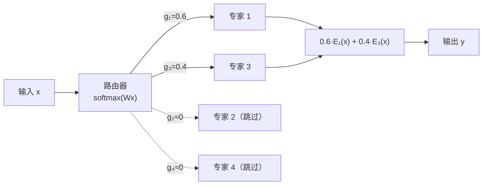
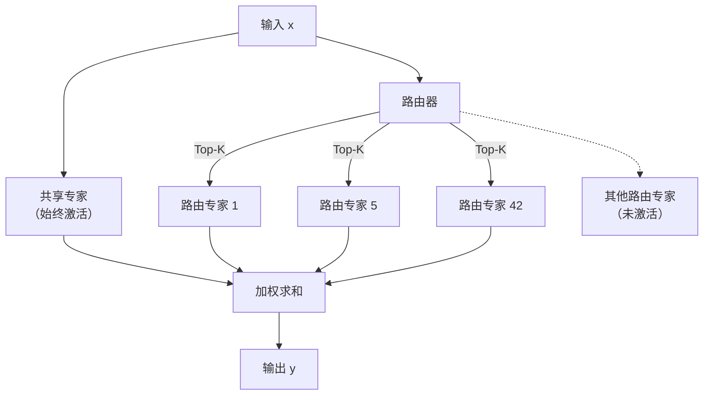

## 14.2 混合专家模型：为什么不必激活所有参数

**混合专家模型**（Mixture of Experts，MoE）是近年来扩展模型容量最成功的方法之一。它的核心洞察打破了一个直觉：**模型不必在每次推理时使用所有参数。** 从 Mixtral 8x7B 到 DeepSeek-V3，MoE 已从一种新奇的架构选择演变为前沿大模型的主流设计范式。

本节从 MoE 的基本结构出发，深入讨论路由机制的设计哲学、细粒度专家与共享专家的创新、推理基础设施的独特挑战，以及实际部署中的工程经验。

### 14.2.1 MoE 的基本结构

MoE 将 Transformer 中的 FFN 层替换为一组并行的“专家”网络。每个专家本质上就是一个独立的 FFN，拥有自己的权重参数。一个**路由器**（Router/Gate）网络根据输入决定每个词元应该由哪些专家处理。

标准 FFN：$y = \text{FFN}(x)$（一个网络处理所有输入）

MoE FFN：$y = \sum_{i \in \text{TopK}} g_i \cdot \text{Expert}_i(x)$

其中 $g_i$ 是路由器为第 $i$ 个专家分配的权重，TopK 表示只激活权重最大的 $K$ 个专家（通常 $K=1$ 或 $K=2$）。路由器本身通常是一个简单的线性层，将输入 $x$ 映射到专家数量维度的 logits，再通过 Softmax 得到概率分布。

下图展示了 MoE 路由机制的工作流程：

图 14-2：MoE 路由机制（Top-2 选择）

### 14.2.2 效率优势

MoE 的核心价值在于**解耦了模型容量和计算成本**：

- **模型容量**（总参数量）决定了模型能存储多少知识
- **计算成本**（每词元激活的参数量）决定了推理的速度和资源需求

以 DeepSeek-V3 为例：671B 总参数赋予了巨大的知识容量，但每个词元只激活 37B 参数，推理成本仅相当于一个中等大小的密集模型。

与同等总参数量的密集模型相比，MoE 模型：

- 训练速度更快（更少的每步计算量）
- 推理更高效（同上）
- 但需要更多显存（必须加载所有专家的参数）

这种“大容量、低激活”的特性使 MoE 成为扩展模型规模的可持续路径——在不成比例增加推理成本的前提下扩大模型容量。

### 14.2.3 路由机制：如何选择正确的专家

路由机制是 MoE 架构中最关键的设计维度，它直接决定了模型的训练稳定性和最终性能。围绕路由机制的设计，包括选择范式、负载均衡策略和训练稳定性技术三个核心问题。

#### 两种选择范式

路由机制存在两种根本不同的范式：

**词元选择专家**（Token-Choice）：每个词元独立地选择 Top-K 个专家。这是最常见的方式（Switch Transformer、Mixtral、DeepSeek 均采用），优点是实现简单、推理路径清晰，但不同词元可能集中选择同一批专家，导致负载不均衡。

**专家选择词元**（Expert-Choice）：每个专家从批次中选择固定数量的词元来处理。这种方式天然保证负载均衡——每个专家处理相同数量的词元——但带来了新问题：某些词元可能不被任何专家选中（被“丢弃”），也可能被多个专家重复选中。

实践中，Token-Choice 是主流方案，因为它在推理时更易实现确定性的计算图。

#### Top-K 的选择

$K$ 值的选择体现了容量与效率的权衡：

- **Top-1**（Switch Transformer）：计算最高效，但每个词元的表达能力受限于单个专家，且训练容易不稳定
- **Top-2**（Mixtral 8x7B）：最常见的选择，兼顾了表达能力和计算效率。两个专家的加权组合提供了更丰富的表示
- **Top-K > 2**（DeepSeek-V3，$K=8$）：配合细粒度专家设计使用。当专家数量很多（如 256 个）且每个专家很小时，激活更多专家仍然能保持较低的计算成本

#### 负载均衡：核心挑战

MoE 训练中最棘手的问题是**负载坍塌**——路由器倾向于将大部分词元路由到少数几个专家，未被选中的专家梯度接近零、无法有效训练，形成“强者愈强”的恶性循环。

**辅助负载均衡损失**是最经典的解决方案（Google 的 Switch Transformer 提出）。其核心思想是在主训练目标之外，增加一个鼓励均衡路由的惩罚项：

$$\mathcal{L}_{\text{balance}} = \alpha \cdot N \sum_{i=1}^{N} f_i \cdot p_i$$

其中 $f_i$ 是实际路由到专家 $i$ 的词元比例，$p_i$ 是路由器分配给专家 $i$ 的平均概率，$N$ 是专家数量，$\alpha$ 是平衡系数。当路由完全均衡时，该损失取最小值。

辅助损失的问题在于：$\alpha$ 的调节非常敏感。**过大**会压制路由器的学习信号，迫使所有专家趋于同质化，损害模型性能；**过小**则不足以阻止负载坍塌。

**无辅助损失路由**是 DeepSeek-V3 提出的创新方案。它完全移除了辅助损失，转而为每个专家维护一个可学习的**偏置项** $b_i$：

$$g_i' = g_i + b_i$$

路由决策基于 $g_i'$（加偏置后的分数）进行 Top-K 选择，但最终的专家权重仍使用原始的 $g_i$（不含偏置）。偏置项通过一个简单的规则更新：如果某专家被过多词元选中，则降低其偏置；反之则提升。

这种方法的优势在于：路由器的主梯度流完全不受平衡约束的干扰，模型能自由学习最优路由，同时通过偏置项的外部调节实现自然的负载均衡。DeepSeek 团队报告，这种方法在不牺牲性能的前提下，实现了比辅助损失方法更好的负载均衡效果。

### 14.2.4 细粒度 MoE 与共享专家

传统 MoE 架构（如 Mixtral 8x7B）使用少量大专家（8 个），每个专家与标准 FFN 大小相同。DeepSeek 系列模型开创的**细粒度 MoE** 从根本上重新思考了专家的粒度设计。

#### 为什么要细粒度

直觉上，8 个大专家每个都需要学习大量知识，专家之间的“职责分工”较粗。将同样的参数量拆分为 256 个小专家，每个专家可以专注于更狭窄的知识域，路由器也有更多组合选择来匹配不同输入的需求。

具体来说，假设 FFN 层总参数量相同，细粒度设计的优势包括：

- **更精细的路由**：256 选 8 比 8 选 2 提供了更丰富的组合空间（$\binom{256}{8} \gg \binom{8}{2}$）
- **更好的负载均衡**：专家数量多时，统计上更容易实现均匀分布
- **更灵活的知识组合**：不同词元可以激活完全不同的专家子集，实现更细粒度的知识检索

#### 共享专家机制

DeepSeek 系列的另一关键创新是**共享专家**（Shared Expert）。在每个 MoE 层中，部分专家被标记为“共享”——它们对所有词元始终激活，不参与路由选择。

下图展示了共享专家与路由专家的协同架构：

图 14-3：共享专家 + 路由专家架构（DeepSeek 设计）

共享专家的设计动机是：**并非所有知识都需要条件性地激活。** 某些通用能力（如基本的语法处理、常见的语义模式）应该被所有输入共享，而路由专家则负责处理特定领域或特定模式的知识。这种分离避免了路由专家浪费容量去冗余地学习通用知识。

在 DeepSeek-V3 中，每个 MoE 层包含 1 个共享专家和 256 个路由专家，每个词元激活共享专家 + Top-8 路由专家，总共 9 个专家。共享专家的参数量与单个路由专家相同，因此始终激活的计算开销很小。

有关 DeepSeek 系列模型的整体架构创新（包括 MLA、多词元预测等），详见 [13.3 节](../13_decoder_models/13.3_deepseek_gemini.md)。

### 14.2.5 MoE 的推理挑战与专家并行

MoE 模型在推理阶段面临着与密集模型截然不同的挑战。理解这些挑战对于设计高效的 MoE 推理系统至关重要。

#### 显存与通信瓶颈

MoE 模型的推理特殊性在于：虽然每个词元只激活少量专家，但**所有专家的参数必须常驻显存**（或至少可快速访问）。以 DeepSeek-V3 为例，671B 总参数即使在 FP8 精度下也需要约 670GB 显存——远超单卡容量。

此外，不同词元可能选择不同的专家，这意味着在批量推理时，需要在设备间进行复杂的**All-to-All 通信**：将每个词元发送到其选中专家所在的设备，计算完成后再将结果收集回来。

#### 专家并行

**专家并行**（Expert Parallelism，EP）是 MoE 推理的核心并行策略——将不同的专家分布到不同的计算设备上。当某个词元选中了分布在设备 A 上的专家 3 和设备 B 上的专家 7 时，该词元的输入需要通过网络分别发送到两台设备进行计算。

专家并行通常需要与其他并行策略组合使用：

| 并行策略 | 拆分维度 | 主要用途 |
|---------|---------|---------|
| 数据并行（DP） | 批次 | 提高吞吐量 |
| 张量并行（TP） | 权重矩阵 | 拆分单个专家（当专家太大） |
| 专家并行（EP） | 专家集合 | 分布不同专家到不同设备 |
| 流水线并行（PP） | 层 | 跨多节点分布层 |

图 14-4：MoE 推理中的并行策略组合

实际部署中，典型的组合是 **EP + DP**：在一组设备间使用专家并行分布专家，在多组设备间使用数据并行提高吞吐量。

#### MoE 特有的推理优化

除了并行策略，MoE 模型还催生了一些独特的推理优化技术：

- **专家预取**（Expert Prefetching）：利用路由器的预测结果，提前将即将被激活的专家参数从 CPU 内存或远程设备加载到 GPU 显存中
- **专家缓存**（Expert Caching）：在显存中维护一个“热门专家”缓存，高频使用的专家常驻 GPU，低频专家按需加载。这类似于操作系统的页面缓存机制
- **动态批处理**：将同一批次中选择相同专家的词元合并处理，减少专家调用的次数，提高 GPU 利用率

这些优化使得在消费级硬件上运行大规模 MoE 模型成为可能。例如，通过专家卸载（Offloading）技术，Mixtral 8x7B 可以在单张 24GB 显卡上运行，只是延迟会显著增加。

### 14.2.6 实际部署：从 Mixtral 到 DeepSeek-V3

MoE 架构的实际部署经验揭示了其作为生产系统的优势与限制。

#### Mixtral：首个主流开源 MoE

Mistral AI 的 **Mixtral 8x7B**（2023 年底）是首个引发广泛关注的开源 MoE 模型。它的设计相对简洁：

- 8 个专家，每层 Top-2 路由，总参数 47B，激活 13B
- 每个专家是标准 FFN，无共享专家
- 使用滑动窗口注意力（Sliding Window Attention）处理长序列

Mixtral 8x7B 证明了一个关键点：**在相同激活参数量下，MoE 模型显著优于密集模型。** 其性能超越了 Llama 2 70B（激活参数量是 Mixtral 的 5 倍以上），甚至在多项基准上接近 GPT-3.5。

**Mixtral 8x22B**（2024 年）进一步扩展了这一路径，总参数 141B，激活 39B，在开源模型中达到了新的性能高度。

Mixtral 的部署实践提供了几条重要经验：

- **显存 vs 计算的权衡**：47B 参数需要约 90GB 显存（BF16），但推理时的 FLOPs 仅相当于 13B 密集模型
- **量化友好**：MoE 模型对量化（如 GPTQ、AWQ）的容忍度较好，4-bit 量化后可在单卡 48GB GPU 上运行
- **批处理效率**：小批次时 MoE 的效率不如密集模型（因为每个专家只处理少量词元），大批次时优势明显

#### DeepSeek-V3：MoE 工程的极致

DeepSeek-V3 将 MoE 的工程优化推向了新的高度。在细粒度路由和共享专家之外，其推理系统还采用了多项创新：

- **FP8 量化推理**：配合训练阶段的 FP8 优化，推理时直接使用 8 位浮点，吞吐量提升显著
- **多词元预测加速**：训练时学习的多词元预测头可用于推测解码（[10.6 节](../10_inference_optimization/10.6_speculative_decoding.md)），进一步提升推理速度
- **冗余专家部署**：对高频专家进行多副本部署，减少 All-to-All 通信瓶颈

下表对比了主流 MoE 模型的关键架构参数：

| 模型 | 总参数 | 激活参数 | 专家数 | Top-K | 共享专家 | 专家粒度 |
|------|-------|---------|--------|-------|---------|---------|
| Switch Transformer | 多种 | 多种 | 128 | 1 | 无 | 粗 |
| Mixtral 8x7B | 47B | 13B | 8 | 2 | 无 | 粗 |
| Mixtral 8x22B | 141B | 39B | 8 | 2 | 无 | 粗 |
| DeepSeek-V2 | 236B | 21B | 160 | 6 | 2 | 细 |
| DeepSeek-V3 | 671B | 37B | 256 | 8 | 1 | 细 |
| Qwen2.5-MoE | 多种 | 多种 | 64 | 8 | 4 | 细 |

图 14-5：主流 MoE 模型架构参数对比

从表中可以清晰地看到两条演化路线：**Mixtral 路线**（少量大专家、Top-2）和 **DeepSeek 路线**（大量小专家、较大 K 值、共享专家）。两条路线各有适用场景——前者部署简单，后者性能上限更高。

### 14.2.7 MoE 的发展趋势

MoE 已经从一种“新奇的架构实验”演变为前沿大模型的**事实标准**。展望未来，以下方向值得关注：

**更智能的路由**：从静态的 Top-K 选择走向动态路由——根据输入的复杂度自适应调整激活专家数量。简单的输入只需少量专家，复杂的输入激活更多专家，实现计算资源的按需分配。

**MoE 与混合架构的融合**：将 MoE 与 SSM 等高效架构结合（详见 [14.3 节](14.3_ssm_hybrid.md)），例如 Jamba 模型已尝试在 Mamba-Transformer 混合架构上叠加 MoE。这种三重混合可能兼具 SSM 的长序列效率、注意力的精确检索能力和 MoE 的参数效率。

**端侧 MoE**：随着边缘设备算力增长和 MoE 推理优化技术的成熟，MoE 架构有望扩展到手机和边缘设备——在有限的计算预算下提供更强大的模型能力。
