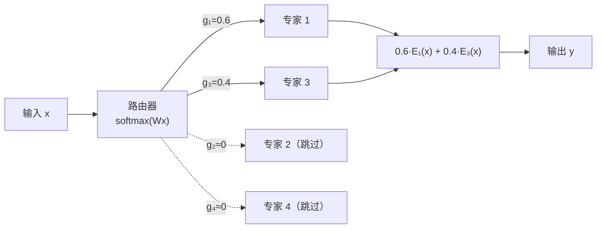

## 14.2 混合专家模型：为什么不必激活所有参数

**混合专家模型**（Mixture of Experts，MoE）是近年来扩展模型容量最成功的方法之一。它的核心洞察打破了一个直觉：**模型不必在每次推理时使用所有参数。**

### 14.2.1 MoE 的基本结构

MoE 将 Transformer 中的 FFN 层替换为一组并行的"专家"网络。一个**路由器**（Router/Gate）网络根据输入决定每个词元应该由哪些专家处理。

标准 FFN：$y = \text{FFN}(x)$（一个网络处理所有输入）

MoE FFN：$y = \sum_{i \in \text{TopK}} g_i \cdot \text{Expert}_i(x)$

其中 $g_i$ 是路由器为第 $i$ 个专家分配的权重，TopK 表示只激活权重最大的 $K$ 个专家（通常 $K=1$ 或 $K=2$）。

图 14-2：MoE 路由机制（Top-2 选择）

### 14.2.2 效率优势

MoE 的核心价值在于**解耦了模型容量和计算成本**：

- **模型容量**（总参数量）决定了模型能存储多少知识
- **计算成本**（每词元激活的参数量）决定了推理的速度和资源需求

以 DeepSeek-V3 为例：671B 总参数赋予了巨大的知识容量，但每个词元只激活 37B 参数，推理成本仅相当于一个中等大小的密集模型。

与同等总参数量的密集模型相比，MoE 模型：
- 训练速度更快（更少的每步计算量）
- 推理更高效（同上）
- 但需要更多显存（必须加载所有专家的参数）

### 14.2.3 路由设计的挑战

MoE 的核心挑战是**负载均衡**——如何确保所有专家被均匀地使用。

**负载坍塌**问题：如果路由器持续将大部分输入路由到少数几个专家，其他专家的梯度几乎为零、无法被有效训练，形成恶性循环。

常见的解决方案包括：
- **辅助负载均衡损失**：在训练目标中加入惩罚不均衡路由的损失项
- **专家容量限制**：限制每个专家在每个批次中处理的词元数上限，溢出的词元被路由到次优专家
- **无辅助损失的路由策略**：DeepSeek-V3 提出不使用辅助损失的路由方法，通过偏置项调整实现自然的负载均衡

### 14.2.4 MoE 的采用趋势

MoE 架构已被越来越多的前沿模型采用：

| 模型 | 总参数 | 激活参数 | 专家数 | Top-K |
|------|-------|---------|--------|-------|
| Mixtral 8x7B | 47B | 13B | 8 | 2 |
| DeepSeek-V3 | 671B | 37B | 256 | 8 |
| Gemini 1.5 | 未公开 | 未公开 | MoE | - |
| Llama 4 | 多种 | 多种 | MoE | - |

图 14-3：采用 MoE 架构的代表模型

MoE 代表了大模型扩展的一种可持续路径——在不成比例增加推理成本的前提下扩大模型容量。
