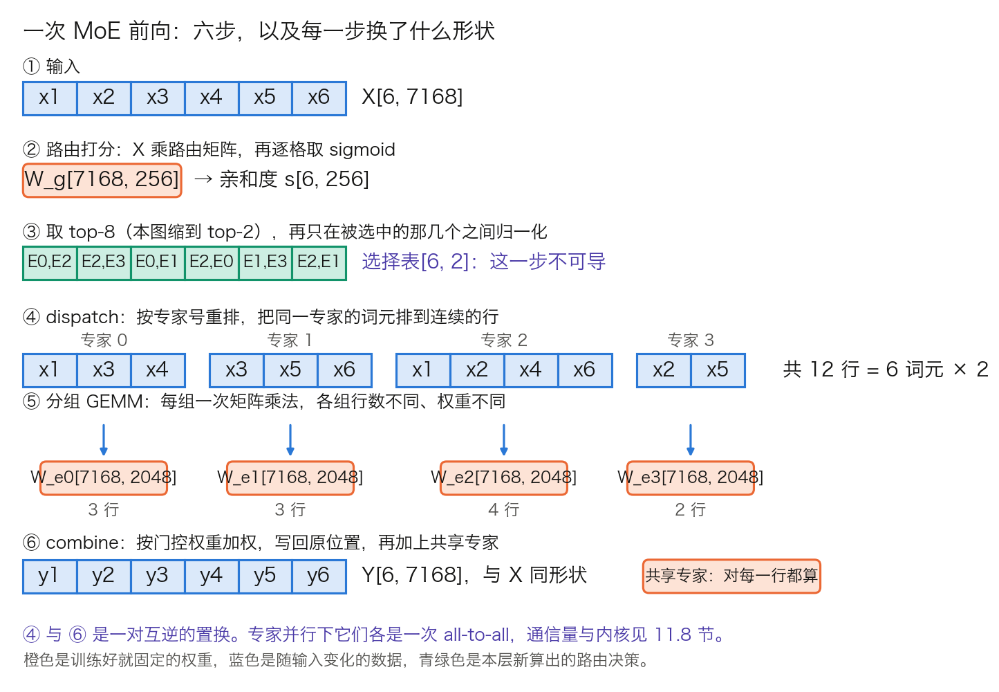
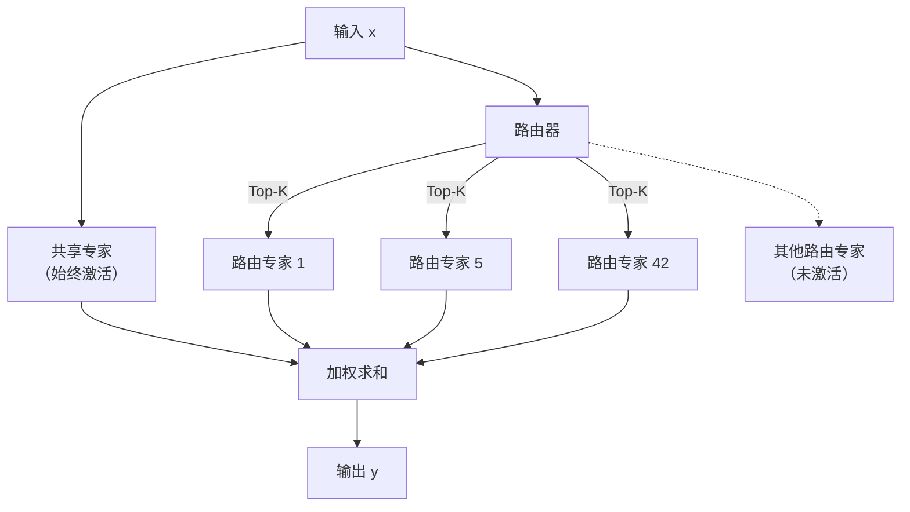

## 14.2 混合专家模型：为什么不必激活所有参数

[14.1 节](14.1_efficient_attention.md)的稀疏、线性与混合方案，改的都是注意力层；每一层的 FFN 原样保留，每个词元仍要穿过它的全部参数。本节动的是这一层。

**混合专家模型**（Mixture of Experts，MoE）把一层 FFN 换成一组并行的 FFN，每个词元只走其中几个。它打破的直觉是：模型不必在每次前向中使用全部参数。本节先把一次 MoE 前向的六步与形状走一遍，再算清“总参与激活参数”这笔账，然后讨论路由与负载均衡的机制、算例和失效情形。推理侧的专家并行已在 [11.8.7 节](../11_serving/11.8_multi_gpu_inference.md)写完，本节只做衔接。

### 14.2.1 一次 MoE 前向：六步与形状

标准 FFN 是 $$y = \text{FFN}(x)$$，一个网络处理所有输入。MoE 层改成：

$$
y = \sum_{i \in \text{TopK}} g_i \cdot \text{Expert}_i(x)
$$

其中 $$g_i$$ 是路由器给第 $$i$$ 个专家的门控权重，TopK 是被选中的那几个专家。形式很短，但它省略了实现上最关键的一步——同一批词元选了不同的专家，怎样仍然用矩阵乘法算完。图 14-2 把六步逐一画出，形状按 DeepSeek-V3 的公开配置写（`hidden_size = 7168`、`moe_intermediate_size = 2048`、`n_routed_experts = 256`、`num_experts_per_tok = 8`）。

图 14-2：一次 MoE 前向的六步，以及每一步换了什么形状（[生成脚本](https://github.com/yeasy/llm_internals/blob/main/tools/figures/ch14a_moe_forward.py)）。示意设定为 6 个词元、4 个路由专家、top-2；每个词元的选择是手工设定的，用来说明置换。橙色是权重，蓝色是数据，青绿色是本层新算出的路由决策。

六步依次是：

1. **输入**：`X[T, 7168]`，与稠密层完全相同。
2. **路由打分**：`X[T, 7168] × W_g[7168, 256] → s[T, 256]`。DeepSeek-V3 对每一格取 sigmoid 得到亲和度，而不是对整行取 softmax（技术报告式 15）。
3. **取 top-k 并归一化**：每行留下最大的 8 个，其余置 0，再在这 8 个之间归一化得到门控权重（式 13、14）。这一步不可导，是后面一切均衡手段的根源。
4. **dispatch 置换**：按专家号重排，把同一专家的词元排到连续的行。`T` 个词元、top-8，重排后共 `8T` 行。
5. **分组 GEMM**：每个专家对自己那一组做一次矩阵乘法，`[m_i, 7168] × W_i[7168, 2048] → [m_i, 2048]`，再投回 7168 维。各组行数 $$m_i$$ 不同，权重不同，这是与稠密 FFN 唯一的实质差别。
6. **combine**：按门控权重加权，按第 4 步的逆置换写回原位置，再加上共享专家的输出，得 `Y[T, 7168]`。

第 4、6 两步是一对互逆的置换。单卡上它们是一次 gather 加一次 scatter；多卡专家并行下各是一次 all-to-all，通信量、内核与实测耗时见 [11.8.7 节](../11_serving/11.8_multi_gpu_inference.md)。

在实现里，这六步分别对到 HF `DeepseekV3MoE` 的 `gate` 与 `experts`、vLLM `FusedMoE` 的排序—分组—GEMM 三段内核。第 4 步之所以需要显式置换，是因为 GPU 上最快的路径仍是大矩阵乘法；Megablocks 一类 dropless 实现改用变长分组 GEMM，把置换和变长一起交给内核。

### 14.2.2 激活参数怎么算：以 DeepSeek-V3 为例

MoE 的核心价值在于解耦了两件事：总参数量决定模型能存多少知识，每词元激活参数量决定推理要算多少。“671B 总参、37B 激活”这句话常被引用，下面把它从公开配置一路算出来。

配置取自 DeepSeek-V3 的 `config.json` 与[技术报告](https://arxiv.org/abs/2412.19437) 4.2 节：`hidden_size = 7168`、`intermediate_size = 18432`、`moe_intermediate_size = 2048`、`n_routed_experts = 256`、`n_shared_experts = 1`、`num_experts_per_tok = 8`、`num_hidden_layers = 61`、`first_k_dense_replace = 3`。

**单个专家。** 采用 SwiGLU，一个专家是三个 `[7168, 2048]` 的矩阵：

$$
3 \times 7168 \times 2048 = 44{,}040{,}192 \approx 44.0\ \text{M}
$$

**一个 MoE 层。** 256 个路由专家加 1 个共享专家，共 257 个：`257 × 44.0M = 11.32B`。61 层里前 3 层是稠密 FFN，其余 58 层是 MoE 层，合计 `58 × 11.32B = 656.5B`。

**每词元激活多少。** 每个词元走 8 个路由专家加 1 个共享专家，共 9 个：`9 × 44.0M = 396.4M`。58 层合计 `58 × 396.4M = 22.99B`。注意分母是 257 而分子是 9，MoE 层只用了 `9/257 = 3.5%` 的专家参数。

**其余部分全部激活。** 前 3 层的稠密 FFN 每层 `3 × 7168 × 18432 = 396.4M`，共 1.19B。MLA 按报告 4.2 的取值（`n_h = 128`、`d_h = 128`、`d_c = 512`、`d_c' = 1536`、`d_h^R = 64`）每层约 187.1M，61 层共 11.41B。嵌入表与输出头各 `129,280 × 7168 = 926.7M`。

**汇总。** 四部分并排在表 14-3。

| 部分 | 总参数 | 每词元激活 |
| --- | ---: | ---: |
| 58 个 MoE 层的专家 | 656.5B | 22.99B |
| 前 3 层稠密 FFN | 1.19B | 1.19B |
| 61 层 MLA | 11.41B | 11.41B |
| 嵌入表 + 输出头 | 1.85B | 1.85B |
| 合计 | 671B | 37.4B |

表 14-3：DeepSeek-V3 的参数分布。总参与官方的 671B 吻合，激活与官方的 37B 吻合（本表未计入多词元预测模块）。激活占总参 5.6%；用官方取整的 37B/671B 算是 5.51%（[13.3 节](../13_decoder_models/13.3_deepseek_gemini.md)用的是后者），差别来自本表算到小数位的 37.4B。

这张表有两条可以推广的读法。第一，**稀疏只发生在专家上**：注意力、嵌入、输出头和稠密层全部参与每一次前向，它们在激活侧占了 14.4B，接近激活总量的四成。所以“总参 / 激活参数”的比值永远小于“专家总数 / 每词元专家数”的比值。第二，**显存按总参算，算力按激活参数算**：671B 即使在 FP8 下也需约 670 GB 权重显存，远超单卡容量，这是 MoE 部署的第一道门槛。

### 14.2.3 路由与负载均衡

#### 两种选择范式

**词元选择专家**（Token-Choice）：每个词元独立选 Top-K 个专家。Switch Transformer、Mixtral、DeepSeek 均采用，实现简单、推理路径确定，但不同词元可能扎堆选同一批专家，负载不均。

**专家选择词元**（Expert-Choice）：每个专家从批次中选固定数量的词元。负载天然均衡，代价是某些词元可能不被任何专家选中，也可能被多个专家重复选中。推理时它还破坏了“一个词元的输出只依赖于它自己”这个性质——同一批次里别的词元会影响它的路由结果。

实践中 Token-Choice 是主流，因为推理时计算图确定。

#### Top-K 的选择

- **Top-1**（Switch Transformer）：计算最省，但每个词元的表达受限于单个专家，训练容易不稳。
- **Top-2**（Mixtral 8x7B）：两个专家的加权组合提供更丰富的表示。
- **Top-K > 2**（DeepSeek-V3 的 8、Qwen3.5 的 10）：配合细粒度专家使用。专家数多且每个很小时，激活更多个仍然便宜。

#### 负载坍塌与两类对策

MoE 训练最棘手的问题是**负载坍塌**（routing collapse）：路由器把大部分词元送给少数几个专家，未被选中的专家梯度接近零、无法训练，形成“强者愈强”。

**辅助负载均衡损失**是最经典的对策，思想最早见于[稀疏门控 MoE 的开创性工作](https://arxiv.org/abs/1701.06538)与 GShard，[Switch Transformer](https://arxiv.org/abs/2101.03961) 给出了广为使用的简化形式：

$$
\mathcal{L}_{\text{balance}} = \alpha \cdot N \sum_{i=1}^{N} f_i \cdot p_i
$$

$$f_i$$ 是实际路由到专家 $$i$$ 的词元比例，$$p_i$$ 是路由器给专家 $$i$$ 的平均概率，$$N$$ 是专家数。

**一格算术。** 取 $$N = 4$$，某批的 $$f = [0.7, 0.1, 0.1, 0.1]$$、$$p = [0.4, 0.2, 0.2, 0.2]$$：

$$
\begin{aligned}
f_i p_i &= [0.28,\ 0.02,\ 0.02,\ 0.02] \\
\textstyle\sum_i f_i p_i &= 0.34 \\
N\textstyle\sum_i f_i p_i &= 4 \times 0.34 = 1.36
\end{aligned}
$$

完全均衡时 $$f = p = [0.25, 0.25, 0.25, 0.25]$$，每项 $$f_ip_i = 0.0625$$，$$\sum_i f_ip_i = 4 \times 0.0625 = 0.25$$，$$N\sum_i f_ip_i = 4 \times 0.25 = 1$$，取到最小值。全部塞给一个专家时该值为 $$N = 4$$，取到最大值。所以这个损失的取值范围是 $$[1, N]$$，1.36 表示“有点偏，但远未坍塌”。

这里还藏着一个设计要点：$$f_i$$ 由 top-k 的计数得到，不可导；$$p_i$$ 是 softmax 或 sigmoid 的输出，可导。梯度只经由 $$p_i$$ 回传，$$f_i$$ 充当一个“当前有多偏”的系数。某个专家越是超载，压它概率的力度就越大。

$$\alpha$$ 的调节非常敏感：过大会压制路由器的学习信号，迫使专家趋于同质；过小则不足以阻止坍塌。

**无辅助损失路由**是 DeepSeek-V3 的方案。它为每个专家维护一个偏置项 $$b_i$$，只在 top-k 比较时加上（技术报告式 16）：

$$
g'_{i,t} = \begin{cases} s_{i,t}, & s_{i,t} + b_i \in \operatorname{Topk}(\{s_{j,t} + b_j\},\ K_r) \\ 0, & \text{其他} \end{cases}
$$

关键在于偏置只用于路由；最终与专家输出相乘的门控值仍来自原始亲和度 $$s_{i,t}$$。$$b_i$$ 不是反向传播学出来的参数，而是按负载规则更新：每一步结束时监控全批的专家负载，超载的减去 $$\gamma$$，欠载的加上 $$\gamma$$。报告里 $$\gamma$$ 称为偏置更新速率，前 14.3T 词元取 0.001，最后 500B 词元取 0.0。

**“完全移除辅助损失”是不准确的说法。** 同一份报告在紧接着的小节里说明，为防止单条序列内部出现极端不均衡，仍保留一项序列级均衡损失（Complementary Sequence-Wise Auxiliary Loss），其系数 $$\alpha$$ 取 0.0001，明确标注为“极小值”。准确的表述是：不再依赖辅助损失作为主要手段。该报告的 4.5.3 小节还解释了为什么这样更好——偏置法在全批范围内配平，序列级辅助损失则强制每条序列内部均衡，后者妨碍专家按领域分化。

**节点受限路由。** V3 还限制每个词元最多发往 4 个节点（$$M = 4$$），节点按“该节点上专家的最高 $$K_r/M$$ 个亲和度之和”挑选。动机是通信：报告称 NVLink 带宽 160 GB/s，约为 IB 的 50 GB/s 的 3.2 倍，限制节点数即压低跨节点 IB 流量。这条约束是路由算法与网络拓扑协同设计的样本。

#### 容量因子与词元丢弃

上面讲的是“怎么让路由更均衡”，还有一问必须回答：在均衡尚未达成的那些步里，多出来的词元怎么办。分布式实现中每个专家的批大小必须静态确定，于是引入容量因子：

$$
\text{capacity} = \frac{\text{总词元数} \times K}{\text{专家数}} \times \text{capacity factor}
$$

这是 GShard 式的推广。Switch 原文的式 3 写作 `(tokens per batch / num experts) × capacity factor`，不含 $$K$$，因为它是 top-1。

**一格算术。** 批内 8192 个词元、64 个专家、top-2，则分派总数 `8192 × 2 = 16,384`，平均每专家 `16,384 ÷ 64 = 256` 个。容量因子取 1.25，每专家槽位 `256 × 1.25 = 320`。若某专家实际收到 500 个词元，丢弃 `500 − 320 = 180` 个——这些词元不经过这一层，残差连接让它们直接跳过去。反过来，若路由完全均匀，`64 × 320 = 20,480` 个槽位里有 4096 个空转，20% 的计算与通信白做。

[Switch Transformer 把这个取舍讲得很明确](https://arxiv.org/abs/2101.03961)：调小则丢词元、调大则烧算力，两头都是真实损失。近年的 dropless 实现改用变长分组 GEMM 避开静态上限，代价是内核复杂度。DeepSeek-V3 报告称，得益于有效的均衡策略，训练与推理全程都不丢弃词元。

这也给出了 MoE 训练该盯哪三个指标：**路由熵**（是否坍塌成少数几个专家）、**每专家的词元分布**（是否长尾）、**词元丢弃率**（容量因子是否合适）。只看最终损失不够——路由坍塌可以在损失曲线上潜伏很久，直到某几个专家事实上已经死掉才显现。

### 14.2.4 细粒度 MoE 与共享专家

传统 MoE（如 Mixtral 8x7B）用少量大专家，每个专家与标准 FFN 同宽。DeepSeek 系列开创的**细粒度 MoE** 把同样的参数量拆成大量小专家。

**组合空间的差别可以算出来。** 256 选 8 的组合数是

$$
\binom{256}{8} = 409{,}663{,}695{,}276{,}000 \approx 4.1\times10^{14}
$$

而 8 选 2 只有 $$\binom{8}{2} = 28$$。前者是后者的约 $$1.5\times10^{13}$$ 倍。组合数当然不等于有效表达能力——大量组合在训练中从未出现，专家之间也并非彼此独立——但它说明为什么细粒度设计能让路由器做出远更精细的区分。专家数多时统计上也更容易均衡。

代价在实现侧：专家越小，第 5 步的每个分组 GEMM 越窄。单个 `[m_i, 7168] × [7168, 2048]` 在 $$m_i$$ 很小时算不满 Tensor Core，退化为访存受限。这是 14.2.5 要展开的。

**共享专家**（Shared Expert）是另一项关键设计：每层留若干专家对所有词元始终激活，不参与路由。动机是并非所有知识都需要条件激活——基本语法、常见语义模式等通用能力应被所有输入共享，否则每个路由专家都要冗余地学一遍。图 14-3 把两类专家的分工画在一起。

```mermaid
graph TB
    input["输入 x"] --> shared["共享专家<br/>（始终激活）"]
    input --> router["路由器"]
    router -->|"Top-K"| re1["路由专家 1"]
    router -->|"Top-K"| re2["路由专家 5"]
    router -->|"Top-K"| re3["路由专家 42"]
    router -.-> reN["其他路由专家<br/>（未激活）"]
    shared --> combine["加权求和"]
    re1 --> combine
    re2 --> combine
    re3 --> combine
    combine --> output["输出 y"]
```

图 14-3：共享专家与路由专家的分工。共享专家不经过路由，对每个词元都算；路由专家只在被选中时参与。

在 DeepSeek-V3 中每个 MoE 层有 1 个共享专家和 256 个路由专家，每词元走共享专家加 top-8，共 9 个。共享专家与单个路由专家同宽，因此始终激活的开销只占激活量的 1/9。DeepSeek 系列的整体架构创新（MLA、多词元预测等）详见 [13.3 节](../13_decoder_models/13.3_deepseek_gemini.md)。

### 14.2.5 推理侧：显存、通信与小批量

MoE 推理面对的约束与稠密模型截然不同。

**显存按总参算。** 每个词元只激活少量专家，但所有专家的参数必须常驻显存或可快速访问。DeepSeek-V3 的 671B 参数即使在 FP8 下也需约 670 GB，远超单卡容量。

**通信来自第 4、6 两步的置换。** 多卡下每层两次 all-to-all，词元要送到选中专家所在的卡，算完再收回。[11.8.7 节](../11_serving/11.8_multi_gpu_inference.md)给出了完整的通信量算例、DeepEP 的实测耗时，以及为什么专家要用专家并行而不是张量并行切——这里不重复。该节的结论直接接到本节：单个专家是三个 `7168 × 2048` 的矩阵，FP8 下 44 MB，用 8 路张量并行切之后中间层只剩 256 维，矩阵太窄。表 14-4 只列出四种并行方式在 MoE 上各切什么，细节回 11.8 节。

| 并行策略 | 拆分维度 | 在 MoE 里的作用 |
| --- | --- | --- |
| 数据并行（DP） | 批次 | 提高吞吐；多副本各服务不同请求 |
| 张量并行（TP） | 权重矩阵 | 切注意力层；切单个专家只在专家足够宽时划算 |
| 专家并行（EP） | 专家集合 | 把不同专家放到不同卡，每层两次 all-to-all |
| 流水线并行（PP） | 层 | 跨节点分布层，通信最少但时延不降 |

表 14-4：MoE 推理中的四种并行方式。通信量、组合判据与命令行开关见 [11.8.8 节](../11_serving/11.8_multi_gpu_inference.md)。

**解码小批量**是 MoE 最吃亏的场景，而且可以算出多吃亏。平均每个专家分到的词元数是“全组词元总数 × K ÷ 专家数”，V3 即总数的 1/32。一个专家的三个矩阵在 FP8 下是 44 MB；它为 $$b$$ 个词元做的运算约 `2 × 44.04M × b` 次，于是算术强度是

$$
I = \frac{2 \times 44{,}040{,}192 \times b}{44{,}040{,}192\ \text{字节}} = 2b\ \text{FLOPs/Byte}
$$

按 [10.1 节](../10_inference_optimization/10.1_bottleneck.md)给出的 H100 拐点 295 FLOPs/Byte，要让这个 GEMM 算力受限，需要 $$b \ge 148$$。换算回全组：`148 × 32 = 4736` 个词元每步。全组一步只有 64 个词元时每个专家平均 2 个，算术强度只有 4，比拐点低近两个数量级——读 44 MB 权重只为算 2 行。

这就是“大专家并行 + 大批量”成为主流部署形态的原因：不是为了吞吐好看，而是不这样做，专家的 GEMM 根本喂不饱。同一道理下，小批次时 MoE 的效率不如同激活量的稠密模型，大批次时优势才显现。权重用 BF16 时字节数翻倍，$$I = b$$，门槛升到每专家 295 个词元——这也是 MoE 比稠密模型更依赖低精度权重的原因。

**MoE 特有的优化。** 专家预取（利用路由预测提前把即将激活的专家权重搬进显存）、专家缓存（热门专家常驻，冷门按需加载，类似页面缓存）、以及把选同一专家的词元合并处理。通过量化与专家卸载，部分 MoE 模型可以在少量 GPU 上以更高延迟换取可运行性；具体门槛取决于量化格式、上下文长度和框架实现。

#### 执行侧的负载均衡：不改路由，只改在哪儿算

前面的均衡手段都作用在路由本身。但即使路由分布已经很均匀，**执行**仍可能不均衡：专家分布在不同的 EP 卡上，某一批次的实际词元分布、冗余副本的放置方式，都会让某些卡成为拖慢整层的长板。于是在“训练期改路由”之外，还存在一层运行时的执行侧均衡。它的定义性约束是必须保持语义不变。

以 SGLang 中的两个机制为例（见 [Improving DeepEP MoE Load Balance in SGLang with Waterfill and LPLB](https://lmsys.org/blog/2026-06-26-waterfill-lplb)）：

- **Waterfill** 处理共享专家。共享专家对每个词元都生效，若固定绑在某张卡上就成了额外负担。Waterfill 把它变成可调度的槽位：路由专家选定之后，估计各 EP 卡的当前负载，再把共享专家的工作按空闲程度分配过去。
- **LPLB**（Linear-Programming-Based Load Balancer）处理冗余专家副本。它为每一层、每一批求解一个线性规划：在各物理副本之间切分该逻辑专家的词元，目标是最小化各卡负载的峰值。一条守恒约束保证它只重新分配已有流量，既不凭空制造也不丢弃词元。

两者都不改变路由器的 top-k 决策：Waterfill 只改共享专家由哪张卡执行，LPLB 只改词元落到同一逻辑专家的哪个副本上，模型选择的专家集合始终不变，输出不变。这是它能在推理阶段安全启用的原因。

收益的量级要说清楚。在该文公布的实测配置下（两台 Hopper 节点、16 卡、TP16-DP16-EP16），这类优化带来的是个位数百分比的吞吐改善，且 LPLB 需要确实配置了冗余专家，否则是纯额外开销。把它当成压榨最后几个百分点的手段是恰当的，当成数量级优化则不是。

### 14.2.6 公开模型的架构参数

表 14-5 把前面各节讨论的设计选择落到公开配置上：专家数、每词元路由几个、有没有共享专家、专家做到多窄。

| 模型 | 总参数 | 激活参数 | 路由专家数 | 每词元路由 | 共享专家 | 专家中间层宽度 |
| --- | ---: | ---: | ---: | ---: | ---: | ---: |
| Switch Transformer | 多种 | 多种 | 2 到 2048 | 1 | 无 | 与稠密 FFN 同宽 |
| Mixtral 8x7B | 46.7B | 13B | 8 | 2 | 无 | 14,336 |
| Mixtral 8x22B | 141B | 39B | 8 | 2 | 无 | — |
| DeepSeek-V2 | 236B | 21B | 160 | 6 | 2 | — |
| DeepSeek-V3 | 671B | 37B | 256 | 8 | 1 | 2,048 |
| Llama 4 Scout | 109B | 17B | 16 | 1 | 1 | 8,192 |
| Llama 4 Maverick | 400B | 17B | 128 | 1 | 1 | — |
| Qwen3.5-397B-A17B | 397B | 17B | 512 | 10 | 有 | 1,024 |

表 14-5：主流 MoE 模型的架构参数。Mixtral 8x7B 一行的专家数、top-k 与中间层宽度取自 `mistralai/Mixtral-8x7B-v0.1` 的 `config.json`（`num_local_experts = 8`、`num_experts_per_tok = 2`、`intermediate_size = 14336`）；DeepSeek-V3 一行取自其 `config.json` 与技术报告 4.2；Llama 4 Scout 一行取自其 `config.json`（`num_local_experts = 16`、`num_experts_per_tok = 1`、`intermediate_size = 8192`、`intermediate_size_mlp = 16384`），Llama 4 的 MoE 层在路由专家之外另有一个共享专家；Qwen3.5 一行取自其 `config.json`（`num_experts = 512`、`num_experts_per_tok = 10`、`moe_intermediate_size = 1024`）。Switch Transformer 一行为论文覆盖的范围：下界 2 来自附录 D 的图 12（该文写“as few as 2 experts produce compelling gains”），上界 2048 是 Switch-C。

“专家中间层宽度”一列比“粒度粗细”的标签更有信息量。DeepSeek-V3 的 2048 只有它稠密 FFN（18,432）的 1/9，Qwen3.5 的 1024 只有 `hidden_size`（4096）的 1/4，这两个才是典型的细粒度。Llama 4 Scout 的 8192 是其稠密 FFN（16,384）的一半，与 Mixtral 的 14,336 更接近，按宽度算并不算细——它的稀疏性来自“16 选 1”这个极低的 top-k，而不是把专家切小。把两种做法都笼统叫“细粒度”会掩盖这个差别。

从表中能读出两条演化路线。**Mixtral 路线**是少量大专家加 Top-2；**DeepSeek / Qwen 路线**是大量小专家加共享专家，路由空间大得多。Llama 4 Maverick 是第三种：128 个路由专家但每词元只进 1 个，加 1 个共享专家，不要把它误写成 Mixtral 式的 Top-2。

Mixtral 8x7B 当年证明了一件事：在相同激活参数量下，MoE 可以显著强于稠密模型。它以 13B 激活超过了 Llama 2 70B。这条结论成立有两个前提——总参数量大得多，且训练词元足够多；脱离前提照搬会得出错误结论。部署上它也给出了三条经验：46.7B 参数 BF16 下需约 87 GiB 显存而推理 FLOPs 只相当于 13B 稠密模型；MoE 对 GPTQ、AWQ 一类量化的容忍度较好；小批次不如稠密、大批次优势明显（原因见 14.2.5）。

### 14.2.7 趋势

三个方向值得关注。**动态路由**：按输入复杂度自适应调整激活专家数，简单输入少走几个。**与混合架构融合**：MoE 与 SSM 结合（见 [14.3 节](14.3_ssm_hybrid.md)），Jamba 已在 Mamba-Transformer 混合骨干上叠加 MoE，Qwen3.5 把线性注意力与 512 专家的 MoE 放在同一个模型里。**端侧 MoE**：边缘设备上用专家卸载换显存，瓶颈从算力转向存储带宽与调度延迟。
