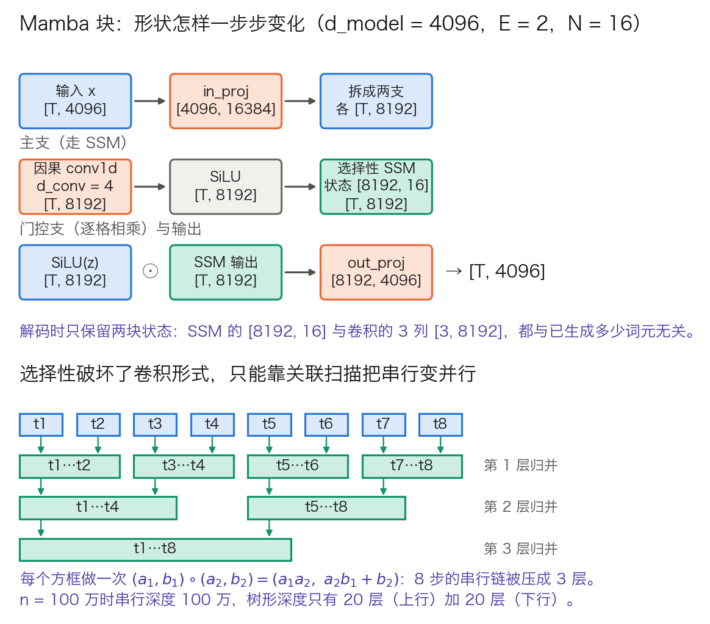

## 14.3 状态空间模型与混合架构：注意力的挑战者

上一节的 MoE 拆开了“模型有多大”与“每个词元算多少”，671B 总参数只激活 37B。但它拆不开另一笔账：序列每长一个词元，KV 缓存就多一份，这笔开销与激活了几个专家无关。

**状态空间模型**（State Space Model，SSM）从另一个方向动这笔账：用一块固定大小的状态替代不断变长的缓存。[14.1.2 节](14.1_efficient_attention.md)已经从核化注意力推出过同一个递推形式。本节换一条路走到同一个地方：从连续系统的离散化出发。沿途回答三个新问题：为什么“选择性”这一步破坏了卷积形式，逼出并行扫描；固定状态在真实配置下到底多大；混合架构为什么收敛到 3:1。

### 14.3.1 从连续系统到递推：离散化那一格

SSM 源于控制理论中的线性时不变系统。连续形式把输入信号 $$x(t)$$ 经一个隐状态 $$h(t)$$ 映到输出 $$y(t)$$：

$$
h'(t) = A h(t) + B x(t), \qquad y(t) = C h(t)
$$

语言模型面对的是离散词元，因此要先把这个系统按步长 $$\Delta$$ **离散化**（discretization）。常用的零阶保持（Zero-Order Hold，ZOH）给出：

$$
\bar{A} = \exp(\Delta A), \qquad \bar{B} = (\Delta A)^{-1}\left(\exp(\Delta A) - I\right)\Delta B
$$

于是得到递推式，形状写在右侧（$$N$$ 是状态维，即 `d_state`）：

$$
\begin{aligned}
h_t &= \bar{A} h_{t-1} + \bar{B} x_t && [N] \\
y_t &= C h_t && [1]
\end{aligned}
$$

**一格算术。** $$\Delta$$ 的作用最容易被写成“步长”而看不出它管什么。取标量 $$A = -1$$，$$\bar{A} = \exp(-\Delta)$$，代入几个取值见表 14-6：

| $$\Delta$$ | $$\bar{A} = e^{-\Delta}$$ | 旧状态衰减到一半需要几步 |
| ---: | ---: | ---: |
| 0.01 | 0.9900 | 69.3 |
| 0.1 | 0.9048 | 6.9 |
| 1.0 | 0.3679 | 0.7 |
| 2.0 | 0.1353 | 0.3 |

表 14-6：离散化步长怎样决定遗忘速度。最后一列是 $$\ln 2 / \Delta$$。$$\Delta$$ 小则 $$\bar{A}$$ 接近 1，旧状态几乎原样留着；$$\Delta$$ 大则一两步就把历史冲掉，同时 $$\bar{B}$$ 把当前输入放大写入。所以 $$\Delta$$ 不是时间刻度，而是“保持”与“快进”之间的旋钮。

**S4**（Structured State Space for Sequence Modeling，Gu 等人）通过对 $$A$$ 的结构化参数化（HiPPO 初始化）解决了长距离建模的困难，首次在长序列基准上达到 Transformer 的水平。但 S4 的 $$A$$、$$B$$、$$C$$、$$\Delta$$ 都与输入无关，这正是下一步要改的地方。

### 14.3.2 选择性：为什么它逼出了并行扫描

**线性时不变的代价。** $$A$$、$$B$$、$$C$$ 固定时，把递推展开，整条序列可以写成一次卷积（[Mamba 论文](https://arxiv.org/abs/2312.00752)式 3）：

$$
K = (CB,\ C\bar{A}B,\ C\bar{A}^2B,\ \dots), \qquad y = x * K
$$

卷积核 $$K$$ 与输入无关，可以先算好，再用 FFT 一次算完整条序列。训练因此很快。代价是模型无法按内容决定记什么：同一个卷积核作用在每一个位置上。

**Mamba 的选择性机制**（selective mechanism，Gu & Dao）让 $$B$$、$$C$$、$$\Delta$$ 依赖于输入：

$$
B_t = f_B(x_t), \qquad C_t = f_C(x_t), \qquad \Delta_t = \tau_\Delta(f_\Delta(x_t))
$$

论文取 $$f_B$$、$$f_C$$ 为投到 $$N$$ 维的线性层，$$f_\Delta$$ 先投到 1 维再广播到全部通道，$$\tau_\Delta$$ 取 softplus。于是每个位置有自己的一套 $$(\bar{A}_t, \bar{B}_t, C_t)$$，模型可以按当前词元决定“保持”还是“快进”。

这一改，卷积形式当场失效：$$K$$ 不再固定，没有可以预先算好的核。论文对此给出的替代是**并行扫描**（parallel scan）。

**扫描的结合律算子。** 递推 $$h_t = a_t h_{t-1} + b_t$$ 可以把一段区间概括成一对数 $$(a, b)$$，表示“进来的状态乘 $$a$$ 再加 $$b$$”。两段相邻区间的合并是：

$$
(a_1, b_1) \circ (a_2, b_2) = (a_1a_2,\ a_2 b_1 + b_2)
$$

这个算子满足结合律，因此合并顺序可以任意。图 14-4 的下半幅用 8 个时间步展示树形归并：两两合并得 4 段，再合并得 2 段，再合并得 1 段。串行深度 8 被压成 3 层；$$n = 100$$ 万时串行深度 100 万，树形深度只有 20 层（上行）加 20 层（下行），总工作量约 $$2n$$。

**不物化中间状态。** 朴素实现要在显存里准备 `[B, L, d_inner, N]` 的扫描输入，读写量是 $$O(BLDN)$$，一眼就是访存受限。Mamba 的硬件感知实现只从显存读 $$(\Delta, A, B, C)$$，在 SRAM 里完成离散化、扫描和乘 $$C$$，只把 `[B, L, d_inner]` 的输出写回；反向传播需要的中间状态不保存，而是在反向时重算。论文明确说明，这使融合后的选择性扫描层与用 FlashAttention 的 Transformer 有相同的显存需求——思路与 [10.3 节](../10_inference_optimization/10.3_flash_attention.md)完全一致。

### 14.3.3 Mamba 块：形状怎样一步步变化

图 14-4 的上半幅按论文 3.4 节的块结构画出形状。取 `d_model = 4096`、扩张因子 $$E = 2$$（论文固定值），得 `d_inner = 8192`；状态维 $$N = 16$$（论文速度基准的取值），卷积核 `d_conv = 4`（官方实现 `mamba_ssm` 中 `Mamba` 的默认值，与 `d_state = 16`、`expand = 2` 同处）。

图 14-4：Mamba 块的形状流，以及选择性为什么逼出关联扫描（[生成脚本](https://github.com/yeasy/llm_internals/blob/main/tools/figures/ch14a_mamba_block.py)）。橙色是权重，蓝色是数据，青绿色是本层新算出的状态。

形状清单，与 3.8.3 同一写法：

- **输入投影**（一次矩阵乘法，同时产出主支与门控支）：`x[T, 4096] × W_in[4096, 16384] → [T, 16384]`，拆成两块 `[T, 8192]`。
- **因果卷积**（逐通道，核长 4）：`[T, 8192] → [T, 8192]`，解码时保留最近 3 列。
- **激活**（SiLU，逐格）：`[T, 8192] → [T, 8192]`。官方实现里它与卷积写在同一行（`mamba_simple.py` 的 `x = self.act(self.conv1d(x)[..., :seqlen])`）。
- **选择性 SSM**：`[T, 8192] → [T, 8192]`，内部状态 `[8192, 16]`。
- **门控**（逐格相乘）：`SiLU(z)[T, 8192] ⊙ SSM 输出[T, 8192] → [T, 8192]`。
- **输出投影**：`[T, 8192] × W_out[8192, 4096] → [T, 4096]`，与输入同形状。

块内参数绝大部分落在两个投影上：论文指出输入投影 $$2ED^2$$、输出投影 $$ED^2$$，合计 $$3ED^2$$，而 $$\Delta$$、$$B$$、$$C$$、$$A$$ 的投影小得多。$$E = 2$$ 时一个块是 $$6D^2$$，两个块叠起来正好对上 Transformer 一层“注意力加 MLP”的 $$12D^2$$。这就是为什么 Mamba 模型的层数通常是同宽 Transformer 的两倍。

在 `mamba_ssm` 库里，这些超参就是 `Mamba(d_model, d_state, d_conv, expand)` 四个构造参数，扫描内核是 `selective_scan_fn`；$$\Delta$$ 的低秩投影宽度由 `dt_rank` 控制。

### 14.3.4 状态账：固定状态对 KV 缓存，交叉点在哪

“不需要 KV 缓存”常被读成“不占显存”。真实情况是换了一块大小固定的显存。沿用 [14.1.2 节](14.1_efficient_attention.md)的 Llama 3 8B 口径（8 个 KV 头、`d_h = 128`）：

- Mamba 层每层的 SSM 状态是 `8192 × 16 = 131,072` 个数，外加卷积缓存 `3 × 8192 = 24,576` 个数，两者都与已生成多少词元无关。
- 同宽的 GQA 层每词元每层 `2 × 8 × 128 = 2048` 个数。
- 交叉点 `131,072 ÷ 2048 = 64` 个词元。序列短于 64 时 Mamba 层反而更占显存；之后每多一个词元，注意力侧就多 2048 个数，Mamba 侧一个不多。

状态维一变，交叉点就跟着变。Mamba 论文自己的消融给出一条前提：加大 $$N$$ 能显著改善困惑度，但只在 $$B$$、$$C$$ 也是选择性的时候成立（表 10）。[Mamba-2 的 SSD 内核](https://arxiv.org/abs/2405.21060)把速度限制放开，称可在几乎不减速的前提下把状态做到 Mamba 的 8 倍甚至更大；其消融的默认取值是 $$N = 64$$，关联召回实验一路测到 $$N = 256$$。对应的状态是 `8192 × 64 = 524,288` 与 `8192 × 256 = 2,097,152` 个数，交叉点分别是 256 和 1024 个词元。这是一条清晰的取舍：状态越大越能记住，也越晚开始省显存。

吞吐上的收益同样要看条件。Mamba 论文报告的是“比同规模 Transformer 高 4 到 5 倍的推理吞吐”，并说明了原因——没有 KV 缓存，因此可以用大得多的批。这不是每步更快，而是同一块显存能同时服务更多请求；把它读成“单请求延迟降 5 倍”是误读。

### 14.3.5 Mamba-2 与 SSD：和线性注意力是同一件事

**Mamba 2** 把选择性 SSM 与结构化矩阵联系起来，这层关系称为状态空间对偶（State Space Duality，SSD）。把 14.3.1 的递推按 $$t$$ 全部展开，位置 $$t$$ 的输出是

$$
y_t = \sum_{s \le t} C_t \left(\prod_{r=s+1}^{t}\bar{A}_r\right)\bar{B}_s x_s
$$

括号里的连乘是一个只依赖于 $$(s, t)$$ 的累积衰减标量。把它记作 $$L_{ts}$$，整条序列就写成一次矩阵乘法：$$y = (L \circ CB^T)x$$，其中 $$L$$ 是由累积衰减构成的下三角矩阵。

这个式子与 [14.1.3 节](14.1_efficient_attention.md)带门控的线性注意力逐项对应：$$C$$ 对应 Query，$$B$$ 对应 Key，$$x$$ 对应 Value，$$L$$ 对应门控衰减 $$\alpha$$ 的累积。两条技术路线落在了同一个数学对象上：一条从注意力去掉 softmax 走来，一条从控制理论离散化走来。

对读者的实际意义有两条。第一，14.1 与 14.3 的两套记号可以互换，不必当成两件事学。第二，二者共享同一组实现技巧：分块并行训练、状态递推解码、以及 14.1.3 里那个“累积衰减的倒数会溢出”的数值问题。

### 14.3.6 固定状态的代价：什么任务会塌

[14.1.2 节](14.1_efficient_attention.md)第七步给出的秩上界，在 SSM 上是同一条：状态 `[d_inner, N]` 的容量固定，写入量超过容量后，旧内容只能被挤掉或被干扰。

具体到任务，最先塌的是两类。一是**逐字复制**：给一段随机串要求原样输出，所需状态随串长增长，而固定状态给不出。二是**关联召回**：文中先给出若干“键—值”对，末尾问其中某一个键对应什么。纯 SSM 在这两类任务上明显弱于注意力，也正是长文检索评测（“大海捞针”）里失分的来源。

反过来也解释了混合为什么有效。注意力层把全部 Key 原样留着，任何一个位置都能被精确寻址；只要每隔几层插一层，模型就有了“回头看原文”的通道，而大部分层仍走固定状态。代价是这几层的 KV 缓存照样随序列线性增长，长上下文下它们决定显存上限。

### 14.3.7 混合比例：公开配置里长什么样

混合架构已不是中等规模上的实验。表 14-7 汇总公开配置。

| 模型 | 序列层类型 | 比例 | MoE | 上下文 |
| --- | --- | --- | --- | --- |
| Jamba（AI21） | Mamba 与注意力交替 | 注意力 : Mamba = 1:7 | 每 2 层一个 MoE 层，16 专家 top-2 | 256K |
| Qwen3.5-397B-A17B（397B 总参 / 17B 激活） | 45 层线性注意力 + 15 层全注意力 | 3:1（`full_attention_interval = 4`） | 512 专家 top-10，另有共享专家 | — |
| Kimi Linear（48B / 3B 激活） | KDA 与全注意力 MLA 交替 | 3:1 | — | 1M |
| Kimi K3（2.8T / 104B 激活） | 每块 3 层 KDA 接 1 层 Gated MLA | 3:1，骨干末尾额外加一层 Gated MLA | 是 | — |
| NVIDIA Nemotron 3 Ultra（550B / 55B 激活） | Mamba-2 层与 MoE 层交替，保留少量注意力层 | 周期排布，间隔不均匀 | 是 | 1M |

表 14-7：公开混合架构的层布局。Jamba 一行取自[其论文](https://arxiv.org/abs/2403.19887)图 1 的配置（`l = 8`、`a : m = 1:7`、`e = 2`、`n = 16`、top-2），该文的消融显示 1:3 与 1:7 质量几乎无差，选 1:7 是因为更省算力。Qwen3.5 一行取自其 HF 仓库 `config.json` 的 `layer_types` 数组（45 个 `linear_attention`、15 个 `full_attention`）与 `num_experts`、`num_experts_per_tok` 等字段。Kimi 两行见 [14.1.5 节](14.1_efficient_attention.md)；Nemotron 3 Ultra 的参数量以 NVIDIA 官方模型卡为准。

**Qwen3.5 的缓存账。** 这份配置的数字全部公开，可以一路算到底：`num_key_value_heads = 2`、`head_dim = 256`，故每个全注意力层每词元的 KV 是 `2 × 2 × 256 = 1024` 个数。15 个全注意力层合计 `15 × 1024 = 15,360` 个数，BF16 下 30 KiB/词元。若 60 层全用全注意力，是 61,440 个数，即 120 KiB/词元，降幅恰是 `1 − 15/60 = 75%`。100 万词元上下文下，这是 29 GiB 对 114 GiB 的差别。

线性层的固定状态按 value 头计。Transformers 里 `Qwen3_5MoeGatedDeltaNet` 的递推状态形状是 `[batch, linear_num_value_heads, linear_key_head_dim, linear_value_head_dim]`，即每个 value 头一块 `[128, 128]` 的矩阵。`linear_num_key_heads = 16` 小于 `linear_num_value_heads = 64`，实现里把 Query 与 Key 按 4 倍 `repeat_interleave` 广播上去。这是 GQA 那套共享搬到线性侧，省的是投影参数，不是状态。所以每层是 `64 × 128 × 128 = 1,048,576` 个数，45 层合计 `45 × 1,048,576 = 47,185,920` 个数，与序列长度无关。$$n$$ 个词元下，混合模型合计占 `15,360n + 47,185,920` 个数，60 层纯全注意力合计占 `61,440n` 个数，两者持平于 `n = 47,185,920 ÷ (61,440 − 15,360) = 1024` 个词元，远低于这类模型的目标上下文。

其他模型的共同配方值得记住：以线性或状态空间层为主体承担长程效率，周期性插入少量全注意力层保住精确检索。Griffin（Google）走的是另一种组合：局部注意力加门控线性循环层。Zamba（Zyphra）则让多个 Mamba 块共享同一个注意力层，省的是参数而非缓存。

混合架构不是替代 Transformer，而是把“全模型只用一种注意力”这个隐含前提去掉。层与层之间用哪种算子，成了一个可以按缓存预算调的超参。

[14.4 节](14.4_multimodal.md)换一个方向：前面三节改的都是模型内部的算子，共享一个没被说破的前提——送进来的是一串文本词元。
