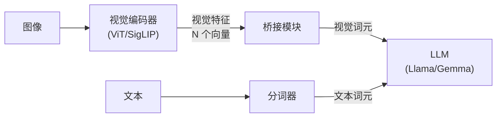
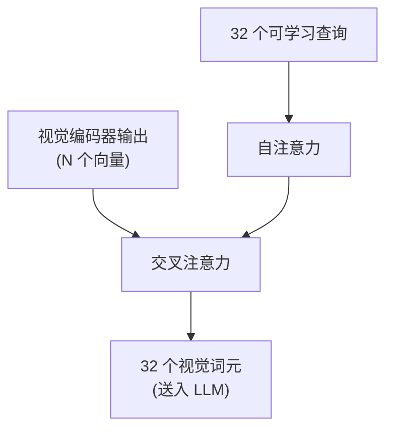
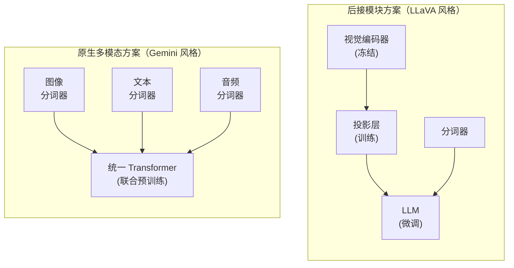

## 14.4 多模态 Transformer：统一不同模态的表示

自然世界中的信息以多种形态存在——文字、图像、声音、视频。**多模态 Transformer** 的目标是用统一的架构同时理解和生成这些不同模态的信息。从 LLaVA 的简洁设计到 Gemini 的原生多模态架构，这一领域已经从概念验证走向了成熟的工程实践。

本节从多模态的动机出发，深入讨论视觉编码器的工作原理、三种主流的视觉-语言桥接方案、原生多模态与后接模块两种范式的对比，以及跨模态注意力的设计哲学。

### 14.4.1 为什么走向多模态

人类的认知是天然多模态的——看到一张猫的图片，会联想到“猫”这个词、猫叫的声音、猫柔软的触感。将 AI 模型从纯文本扩展到多模态，是通向更通用智能的必然路径。

从实际应用看，大量任务天然涉及多种模态：

- 图文问答（看图回答问题）
- 视频理解（描述视频内容）
- 文档分析（处理包含图表的文档）
- 代码生成（根据 UI 截图生成代码）

核心技术挑战在于：**如何将不同模态的信息转化为 Transformer 能统一处理的词元序列？** 对文本，分词器（Tokenizer）已经是成熟方案；但对图像、音频等连续信号，需要专门的编码器将其转化为离散或连续的表示——这正是下面几节讨论的核心问题。

### 14.4.2 视觉编码器：从像素到词元

多模态模型的第一步是将图像转化为 Transformer 可处理的表示。视觉编码器承担这一关键角色，其设计直接影响模型的视觉理解能力。

#### 视觉词元化方法

**Patch Embedding**（ViT 方案）是最基础的视觉词元化方法：将图像切分为固定大小的块（如 16×16 像素），每个块经过线性投影变为一个向量。一张 224×224 的图像产生 196 个视觉词元。ViT 还会在序列前增加一个可学习的 `[CLS]` 词元，其最终表示可作为整张图像的全局特征。

**离散视觉词元**（Visual Tokenizer）是另一条路径：使用 VQ-VAE 等方法将图像块编码为离散的码本索引，使图像处理与文本处理在形式上完全统一。这种方法支持图像的**自回归生成**——像生成文字一样逐个生成图像词元。

#### 主流视觉编码器的选择

在多模态 LLM 中，视觉编码器通常不从零训练，而是复用已在大规模图文数据上预训练的模型。三种主流选择如下：

**CLIP ViT**（OpenAI）：通过对比学习在 4 亿图文对上训练，使图像和文本共享一个对齐的嵌入空间。LLaVA、InternVL 等模型使用 CLIP ViT 作为视觉编码器。CLIP 的优势在于其视觉特征天然与文本语义对齐，降低了后续桥接的难度。

**SigLIP**（Google）：CLIP 的改进变体，将对比损失从 Softmax 替换为 Sigmoid。传统 CLIP 的 Softmax 对比损失需要在整个批次内归一化，限制了批次大小的扩展；SigLIP 对每个图文对独立计算二分类损失（匹配/不匹配），消除了批次内的全局依赖，使训练可以扩展到更大批次。PaliGemma、LLaVA-NeXT 等新一代模型已转向 SigLIP。

**InternViT**（上海 AI 实验室）：专为多模态大模型设计的 6B 参数视觉编码器，通过渐进式训练策略在更大规模的图文数据上训练，在细粒度视觉理解任务上表现突出。

选择视觉编码器时的核心权衡包括：

| 编码器 | 参数量 | 训练数据 | 主要优势 | 典型应用 |
|-------|-------|---------|---------|---------|
| CLIP ViT-L | 304M | 4 亿图文对 | 文本-图像对齐好 | LLaVA、BLIP-2 |
| SigLIP SO400M | 400M | 数十亿图文对 | 更好的扩展性 | PaliGemma、LLaVA-NeXT |
| InternViT-6B | 6B | 数十亿图文对 | 细粒度理解 | InternVL 系列 |

图 14-6：主流视觉编码器对比

### 14.4.3 视觉-语言桥接：三种主流方案

视觉编码器输出的特征序列与 LLM 的输入空间通常存在维度差异和语义鸿沟。**桥接模块**（也称投影模块或适配器）负责弥合这一差距。这是多模态架构设计中最关键的组件之一，不同的桥接方案体现了截然不同的设计哲学。

下图展示了三种桥接方案在多模态 LLM 中的位置：

图 14-7：多模态 LLM 的整体架构

#### 线性投影

**线性投影**是最简洁的桥接方案，由 LLaVA 首创。其核心思想极其简单：用一个或两个全连接层将视觉编码器的输出维度映射到 LLM 的嵌入维度。

$$h_v = W_2 \cdot \text{GELU}(W_1 \cdot z_v)$$

其中 $z_v$ 是视觉编码器的输出，$W_1$ 和 $W_2$ 是可学习的投影矩阵。LLaVA-1.0 使用单层线性投影，LLaVA-1.5 改用两层 MLP（加入 GELU 激活），效果显著提升。

线性投影的优势在于：

- **训练高效**：参数量极小（数百万级），可在较少数据上快速收敛
- **视觉信息无损**：不压缩视觉词元数量，保留了所有空间细节
- **概念简洁**：整个系统的认知负担最小

代价是：视觉编码器输出多少个词元，LLM 就需要处理多少个视觉词元。一张 336×336 的图像产生 576 个视觉词元，高分辨率图像可达数千个，这会显著增加 LLM 的计算负担。

#### Q-Former

**Q-Former**（Querying Transformer）由 BLIP-2 提出，解决了一个关键问题：**如何在压缩视觉信息的同时保留语义？**

其核心设计是引入一组固定数量（通常 32 个）的**可学习查询向量**（Learned Queries）。这些查询通过交叉注意力从视觉编码器的输出中“提取”最相关的信息：

图 14-8：Q-Former 的查询-提取机制

Q-Former 内部交替堆叠**自注意力层**（查询之间交互）和**交叉注意力层**（查询访问视觉特征），经过多层处理后，32 个查询向量被变换为 32 个压缩的视觉表示——不论输入图像的分辨率如何，LLM 始终只需处理 32 个视觉词元。

Q-Former 的关键优势是**词元数压缩**：从数百个视觉词元压缩到数十个，大幅降低了 LLM 的计算负担。但它也引入了新的复杂性——Q-Former 本身就是一个需要精心训练的 Transformer 模块，BLIP-2 采用了三阶段训练策略（图文对比学习 → 图文匹配 → 图文生成）才使其有效工作。

#### Perceiver Resampler

**Perceiver Resampler**（Flamingo 提出）与 Q-Former 的思路相似，但设计更加通用。它同样使用一组可学习的**潜变量**（Latent Vectors）通过交叉注意力从视觉特征中提取信息，但架构更为简洁——不需要 Q-Former 那样复杂的多阶段训练。

Perceiver Resampler 的独特之处在于其**模态无关性**：同一个重采样器架构可以处理图像、视频帧甚至音频频谱图，只要将它们编码为向量序列即可。这种通用性使其在需要处理多种模态的系统中特别有价值。

#### 三种方案的对比

下表总结了三种桥接方案的核心差异：

| 方案 | 代表模型 | 输出词元数 | 参数量 | 训练复杂度 | 视觉细节保留 |
|------|---------|-----------|--------|-----------|-------------|
| 线性投影 | LLaVA | 与输入相同（数百） | 数百万 | 低 | 高 |
| Q-Former | BLIP-2 | 固定（32） | 约 1 亿 | 高（多阶段） | 中 |
| Perceiver Resampler | Flamingo | 固定（64–128） | 数千万 | 中 | 中 |

图 14-9：三种视觉-语言桥接方案对比

实践表明，**没有绝对最优的桥接方案**。线性投影因其简洁性和对高分辨率输入的友好性，逐渐成为主流选择（LLaVA-NeXT、InternVL-2 等新模型均采用）。Q-Former 和 Perceiver Resampler 在需要严格控制视觉词元数量的场景（如视频理解、多图输入）中仍有独特优势。

### 14.4.4 原生多模态 vs 后接模块：两种范式

构建多模态 LLM 存在两种根本不同的范式：**后接模块方案**将视觉能力“嫁接”到已有的文本 LLM 上，**原生多模态方案**则从预训练阶段就让模型同时接触多种模态。两种范式体现了截然不同的工程哲学。

#### 后接模块方案（LLaVA 风格）

以 LLaVA 为代表，这种范式的核心思想是：**复用已有的强大组件，只训练连接它们的胶水层。**

训练通常分为两个阶段：

1. **预训练阶段**：冻结视觉编码器和 LLM，只训练投影层。使用大量图文对数据（如 CC3M），让投影层学会将视觉特征映射到 LLM 的语义空间
2. **指令微调阶段**：冻结视觉编码器，解冻 LLM 和投影层。在高质量的视觉指令数据上联合微调，使模型学会根据图像内容执行各种指令

下图展示了后接模块与原生多模态两种范式的对比架构：

图 14-10：两种多模态范式的架构对比

后接模块方案的主要优势包括：

- **训练成本极低**：LLaVA-1.5 的训练仅需 1 天、8 张 A100 GPU
- **模块化灵活**：可以自由组合不同的视觉编码器和 LLM，快速跟进最新的基座模型
- **已有 LLM 能力完整保留**：文本能力不会因多模态训练而退化

主要局限在于：视觉能力受限于视觉编码器的上限——如果 CLIP 在某类图像上表现不佳（如细粒度文字识别），后接的 LLM 也无能为力。

#### 原生多模态方案（Gemini 风格）

**Gemini**（Google）代表了另一种极致的设计哲学：**从预训练的第一步就让模型同时学习所有模态。**

原生多模态模型使用特定的分词器（如图像分词器、音频分词器）将不同模态的输入编码为统一的词元序列，然后用同一套 Transformer 架构和注意力机制处理所有模态。模型在包含交错的图文、音视频数据上进行大规模预训练。

**GPT-4o**（OpenAI）同样采用了原生多模态路线，支持跨文本、图像和音频的理解与生成，实现了实时语音对话体验。

原生多模态方案的核心优势在于：

- **更深层的模态对齐**：模型从训练初期就学习模态间的对应关系，而非后期“嫁接”
- **跨模态推理更自然**：不同模态的词元在同一个注意力空间中交互，模型可以学到更复杂的跨模态模式
- **支持多模态生成**：可以同时生成文本、图像、音频，而非只能生成文本

代价是巨大的：需要海量的多模态预训练数据（万亿词元级）、巨大的算力预算，以及精心设计的各模态分词器和训练配比策略。

#### 两种范式的本质取舍

下表总结了两种范式的核心差异：

| 维度 | 后接模块（LLaVA） | 原生多模态（Gemini） |
|------|-------------------|---------------------|
| 训练成本 | 低（数十 GPU-天） | 极高（数万 GPU-天） |
| 训练数据 | 数百万图文对 | 万亿级多模态数据 |
| 模态对齐质量 | 受限于投影层能力 | 深层对齐 |
| 模块化灵活性 | 高（可替换组件） | 低（端到端设计） |
| 多模态生成 | 通常仅文本输出 | 支持多模态输出 |
| 开源生态 | 丰富 | 较少 |

图 14-11：两种多模态范式的对比

当前的趋势是**两种范式正在融合**。例如，InternVL-2 虽然采用后接模块的架构，但通过大规模的动态分辨率训练和精心的数据配比，达到了接近原生多模态模型的性能。而一些原生多模态模型也开始在微调阶段借鉴后接模块的模块化思想。

### 14.4.5 跨模态注意力

在多模态 Transformer 中，不同模态的词元如何交互是关键设计问题。主要存在三种方案：

**全交互**（Early Fusion）：所有模态的词元放在同一序列中，使用标准自注意力。Gemini 采用此方案。优点是模态间交互充分，缺点是当视觉词元数量很大时计算成本高——每个文本词元都需要关注所有视觉词元。LLaVA 也属于此类，因为投影后的视觉词元与文本词元一起作为 LLM 的输入序列。

**交叉注意力**（Cross-Attention）：在 LLM 的特定层中插入交叉注意力模块，文本词元通过 Cross-Attention 查询视觉词元，但视觉词元之间不经过 LLM 的自注意力。Flamingo 采用此方案，每隔若干层插入一个 Gated Cross-Attention 层。优势是减少了计算量（视觉词元不占用自注意力的序列长度），且可以在不改变 LLM 主体架构的前提下引入视觉能力。

**Perceiver 架构**：引入一组可学习的“潜变量”词元，所有模态的信息先通过交叉注意力汇聚到潜变量中，再从潜变量中提取。这将计算量从输入长度解耦出来，使模型能高效处理超大量的多模态输入（如长视频的数千帧）。

实践中，**全交互方案**因其实现简洁和效果优越正在成为主流。随着 Flash Attention（[10.3 节](../10_inference_optimization/10.3_flash_attention.md)）等高效实现的普及，自注意力的计算成本已不再是决定性瓶颈。

### 14.4.6 多模态的发展趋势

多模态已从 LLM 的“附加功能”演变为**核心能力维度**。展望未来，以下方向值得关注：

**统一理解与生成**：当前大多数多模态模型只能“理解”图像（输入图像、输出文本），下一步是实现统一的理解与生成——同一个模型既能看图回答问题，也能根据文字生成图像。这需要在自回归框架中同时支持连续特征（理解）和离散词元（生成）的处理。

**更多模态的整合**：从 GPT-4o 的实时语音对话到 Gemini 的视频理解，模态的边界正在消融。未来的模型将自然地处理文本、图像、音频、视频、3D 和触觉等信号，真正实现“类人”的多模态感知。

**Any-to-Any 生成**：更长远的目标是 **Any-to-Any**——任意模态的输入可以生成任意模态的输出。用语音描述一个场景，模型同时生成对应的图像和背景音乐。这需要在架构层面实现所有模态的深度统一，而非简单的模态间转换。
