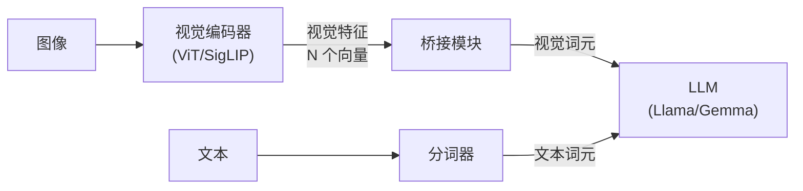
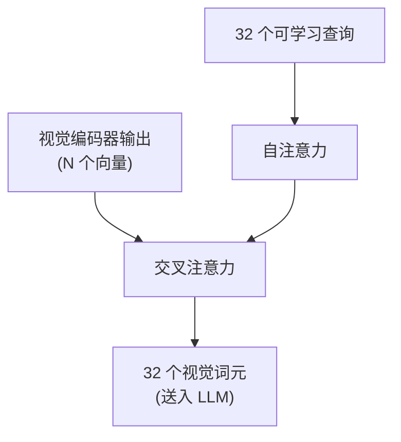
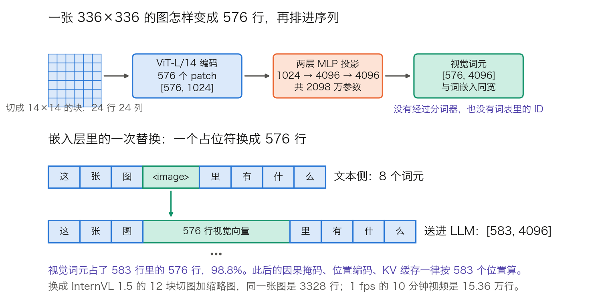
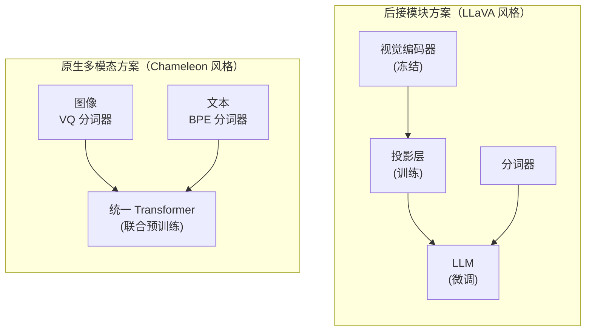

## 14.4 多模态 Transformer：统一不同模态的表示

前面三节改的都是模型内部的算子——注意力怎么算、把 FFN 换成一组专家、用状态空间模型替换注意力。三者共享一个没被说破的前提：送进来的是一串**文本**词元。本节拆的就是这个前提。

核心问题只有一个：图像、音频这类连续信号，怎样变成 Transformer 能和文本一起处理的向量序列。本节先把这条链路的每一步算清楚——一张图变成多少行、投影器有多少参数、这些行怎样插进序列——再讨论三种桥接方案的取舍、两种训练范式的差别，以及这条链路上系统性的失效点。

### 14.4.1 视觉编码器：从像素到向量

**Patch Embedding**（ViT 方案）是最基础的视觉词元化：图像切成固定大小的块，每块经线性投影变为一个向量。词元数由除法决定：

$$
\text{词元数} = \left(\frac{\text{边长}}{\text{patch 边长}}\right)^2
$$

ViT-L/14 处理 224×224 的图得 $$(224/14)^2 = 256$$ 个；处理 336×336 得 $$(336/14)^2 = 576$$ 个。ViT 还会在序列前加一个可学习的 `[CLS]` 词元，其最终表示可作为整图的全局特征；多模态模型通常丢弃它，只取 patch 特征。

**离散视觉词元**（Visual Tokenizer）是另一条路：用 VQ-VAE 一类方法把图像块编码为码本索引，使图像与文本在形式上完全统一，从而支持像生成文字一样逐个生成图像词元。Chameleon 的分词器把一张 512×512 的图编码成 1024 个离散词元，码本大小 8192；它的 BPE 词表共 65,536 项，其中就包含这 8192 个图像码本词元。

在多模态 LLM 中视觉编码器通常不从零训练，而复用已在大规模图文数据上预训练的模型。

**CLIP ViT**（OpenAI）通过对比学习在 4 亿图文对上训练，使图像与文本共享一个对齐的嵌入空间。优势是视觉特征天然与文本语义对齐，降低后续桥接难度。

**SigLIP**（Google）把对比损失从 Softmax 换成 Sigmoid。Softmax 对比损失需要在整个批次内归一化，限制了批大小；SigLIP 对每个图文对独立算二分类损失，消除批内全局依赖，训练可扩展到更大批次。

**InternViT**（上海 AI 实验室）是专为多模态大模型设计的 6B 参数视觉编码器，通过渐进式训练在更大规模图文数据上训练，细粒度视觉理解突出。三者并排见表 14-8。

| 编码器 | 参数量 | 训练数据 | 主要优势 | 典型应用 |
|-------|-------|---------|---------|---------|
| CLIP ViT-L | 304M | 4 亿图文对 | 文本-图像对齐好 | LLaVA、BLIP-2 |
| SigLIP SO400M | 400M | 数十亿图文对 | 更好的批大小扩展性 | PaliGemma、LLaVA-OneVision |
| InternViT-6B | 6B | 数十亿图文对 | 细粒度理解 | InternVL 系列 |

表 14-8：主流视觉编码器对比。

### 14.4.2 一张图变成多少行：三个算例

视觉词元数直接决定 LLM 要算多少，是整条链路上最需要先算清的一个量。

**固定分辨率。** LLaVA-1.5 用 CLIP ViT-L/14 @336，一张图 576 行。配一句 8 个词元的问句（其中一个是图像占位符），替换后序列是 `7 + 576 = 583` 行，视觉侧占 `576 ÷ 583 = 98.8%`。替换的过程见 14.4.4。

**动态分辨率切图。** InternVL 1.5 把图按长宽比切成若干 448×448 的块，训练时 1 到 12 块，测试可零样本扩到 40 块（约 4K 分辨率）。每块 $$(448/14)^2 = 1024$$ 个 patch，再经 pixel shuffle 压到四分之一，即每块 256 行。12 块加一张缩略图是 `13 × 256 = 3328` 行；40 块加缩略图是 `41 × 256 = 10,496` 行。

**视频。** 按 1 fps 采样、每帧 256 行，10 分钟就是 `600 × 256 = 153,600` 行。这个数已经超过多数模型的上下文上限，也说明为什么视频理解几乎必须配词元压缩。

三个算例合起来是一条完整的因果链：分辨率 → 词元数 → 预填充计算量与 KV 缓存。把 153,600 这个数带回 [3.8.7 节](../03_components/3.8_gpt_inference_flow.md)的账里，或带回 [2.5.3 节](../02_attention/2.5_complexity_limits.md)的平方项门槛，就能看出高分辨率与长视频为什么昂贵。

### 14.4.3 视觉-语言桥接：三种方案

视觉编码器的输出维度与 LLM 的嵌入维度通常不同，语义空间也有鸿沟。**桥接模块**（也称投影模块或适配器）负责弥合这一差距。图 14-5 给出它在整条链路里的位置。

```mermaid
graph LR
    img["图像"] --> ve["视觉编码器<br/>(ViT/SigLIP)"]
    ve --> |"视觉特征<br/>N 个向量"| bridge["桥接模块"]
    bridge --> |"视觉词元"| llm["LLM<br/>(Llama/Gemma)"]
    txt["文本"] --> tok["分词器"] --> |"文本词元"| llm
```

图 14-5：后接模块式多模态 LLM 的整体链路。桥接模块是唯一必须新训练的部件。

#### 线性投影

**线性投影**最简洁：一个或两个全连接层把视觉特征映到 LLM 的嵌入维度。

$$
h_v = W_2 \cdot \text{GELU}(W_1 \cdot z_v)
$$

LLaVA-1.0 用单层线性投影，LLaVA-1.5 改用两层 MLP，效果显著提升。

**参数量的手算。** 按 `liuhaotian/llava-v1.5-7b` 的 `config.json`：`mm_hidden_size = 1024`、`hidden_size = 4096`、`mm_projector_type = mlp2x_gelu`，即 `1024 → 4096 → 4096` 的两层 MLP：

$$
1024\times4096 + 4096 + 4096\times4096 + 4096 = 20{,}979{,}712 \approx 2098\ \text{万}
$$

13B 版本的 `hidden_size` 是 5120，同法算得 3147 万。LLaVA-1.0 的单层线性投影是 `1024 × 4096 + 4096 = 4,198,400`，约 420 万。所以“参数量只有数百万”只对 1.0 成立；1.5 的两层 MLP 已是两千万量级，仍然远小于视觉编码器（304M）和 LLM（7B）。

线性投影的优势是训练高效、不压缩词元、概念简洁。代价是视觉编码器输出多少行，LLM 就要处理多少行。

#### Q-Former

**Q-Former**（Querying Transformer）由 BLIP-2 提出，解决的是“如何在压缩视觉信息的同时保留语义”。

其核心是一组固定数量的**可学习查询向量**，通过交叉注意力从视觉特征中提取信息。BLIP-2 论文的设定是 32 个查询，每个 768 维；Q-Former 由 BERT-base 权重初始化，交叉注意力层每隔一个 Transformer 块插入一次，整个模块共 188M 参数（查询向量本身也算作参数）。图 14-6 给出它的提取路径：查询先彼此做自注意力，再以交叉注意力读视觉编码器的输出，最后只把这 32 行送进 LLM。

```mermaid
graph TB
    ve["视觉编码器输出<br/>(N 个向量)"] --> ca["交叉注意力"]
    queries["32 个可学习查询"] --> sa["自注意力"] --> ca
    ca --> out["32 个视觉词元<br/>(送入 LLM)"]
```

图 14-6：Q-Former 的查询-提取机制。

压缩比可以直接算：论文举的例子是 ViT-L/14 的 257×1024 特征被压成 32×768，这个瓶颈结构配合预训练目标，迫使查询只提取与文本最相关的信息。代价是 Q-Former 本身就是一个需要精心训练的 Transformer：BLIP-2 用了两阶段预训练（第一阶段联合优化图文对比、图文匹配、图文生成三个目标做表示学习，第二阶段接入冻结的 LLM 做生成式学习）才使其有效工作。

#### Perceiver Resampler

**Perceiver Resampler**（Flamingo 提出）思路相似但更通用：同样用一组可学习**潜变量**通过交叉注意力从视觉特征中提取，输出词元数等于潜变量数，Flamingo 取 64。与 Perceiver 和 DETR 不同的一处细节是，从潜变量算出的 Key 与 Value 会与视觉特征的 Key、Value 拼在一起，论文称这样效果略好。

它的独特之处是**模态无关**：同一个重采样器可以处理图像、视频帧甚至音频频谱，只要编码为向量序列即可。视频输入时先加时间位置嵌入再展平，因此输出词元数与帧数无关。

#### 四种做法的对照

除了上面三种，还有一类“廉价压缩”：不引入新模块，直接在投影前把相邻 patch 合并。表 14-9 把四种方案按“一张图产出多少行”“桥接模块多大”“训练多难”摆在一起。

| 方案 | 代表模型 | 一张 448×448 的图产出多少行 | 桥接模块参数量 | 训练复杂度 |
|------|---------|---------|--------|-----------|
| 线性投影 | LLaVA-1.5 | 与 patch 数相同 | 2098 万（7B 版） | 低 |
| 相邻 patch 合并 | InternVL（pixel shuffle 取 1/4）、Qwen2-VL（2×2 MLP 合并） | 1024 → 256 | 与线性投影同量级 | 低 |
| Q-Former | BLIP-2 | 固定 32 | 188M | 高（两阶段） |
| Perceiver Resampler | Flamingo | 固定 64 | 未公开（6 层、D = 1536、16 头） | 中 |

表 14-9：四种视觉-语言桥接方案对比。LLaVA-1.5 一行的参数量按 `llava-v1.5-7b` 的 `config.json` 算出；Q-Former 的 188M 与 32 个查询取自 [BLIP-2 论文](https://arxiv.org/abs/2301.12597) 3.1 节；Flamingo 的 64 与层数取自[其论文](https://arxiv.org/abs/2204.14198) 2.1 节与表 4，该文未单列 Resampler 的参数量。Qwen2-VL 论文给出一个可复核的例子：224×224 的图用 patch 14 编码，2×2 合并后是 64 行，加上 `<|vision_start|>` 与 `<|vision_end|>` 两个界标共 66 个词元。

实践中没有绝对最优的方案。相邻 patch 合并因为实现简单、压缩比可控、对高分辨率友好，已经成为主流；Q-Former 和 Perceiver Resampler 在需要把词元数严格钉死的场景（长视频、多图输入）仍有独特优势。

### 14.4.4 视觉词元怎样进入序列

桥接模块给出的是一批向量，不是词表里的 ID。它们靠一次替换进入序列，图 14-7 按 LLaVA-1.5-7B 的形状走完这条路。

图 14-7：一张 336×336 的图怎样变成 576 行，再排进 LLM 的输入序列（[生成脚本](https://github.com/yeasy/llm_internals/blob/main/tools/figures/ch14a_visual_tokens.py)）。形状按 LLaVA-1.5-7B 的配置写。

**占位符替换。** 文本侧先把图片写成一个占位符词元（LLaVA 用 `<image>`，Qwen2-VL 用 `<|vision_start|>` 与 `<|vision_end|>` 包住一段）。嵌入层查完表得到 `inputs_embeds` 之后，宿主代码把占位符所在的那一行换成桥接模块输出的 576 行。八个文本词元里若有一个是占位符，替换后送进 LLM 的是 `[583, 4096]`——视觉词元占了 98.8%。

**之后的一切按位置算。** 因果掩码、位置编码、KV 缓存都不区分这一行来自图像还是文本。这带来两个直接后果：视觉词元与文本词元在同一个注意力空间里交互，不需要额外机制；同时它们也照样占满 KV 缓存与平方项，14.4.2 的三个算例因此全部落到推理成本上。

**两处例外值得知道。** 一是掩码：多数模型对视觉词元也用因果掩码，而 PaliGemma 一类模型对前缀（含图像）用双向注意力，只对生成部分用因果掩码。二是位置：一维 RoPE 无法表达 patch 的二维排布，Qwen2-VL 为此提出 M-RoPE（Multimodal Rotary Position Embedding），把位置拆成时间、高、宽三组分量分别编码。

### 14.4.5 原生多模态与后接模块：两种范式

#### 后接模块

以 LLaVA 为代表，核心思想是复用已有的强大组件，只训练连接它们的胶水层。训练通常分两阶段：

1. **预训练**：冻结视觉编码器和 LLM，只训投影层。用大量图文对（如 CC3M）让投影层学会把视觉特征映到 LLM 的语义空间。
2. **指令微调**：冻结视觉编码器，解冻 LLM 和投影层，在视觉指令数据上联合微调。

图 14-8 把这条路线与下面的原生多模态并排画出，差别在于哪些模块是训练来的、哪些是拼上去的。

```mermaid
graph TB
    subgraph modular["后接模块方案（LLaVA 风格）"]
        direction TB
        m_ve["视觉编码器<br/>(冻结)"] --> m_proj["投影层<br/>(训练)"]
        m_proj --> m_llm["LLM<br/>(微调)"]
        m_tok["分词器"] --> m_llm
    end

    subgraph native["原生多模态方案（Chameleon 风格）"]
        direction TB
        n_img["图像<br/>VQ 分词器"] --> n_tf["统一 Transformer<br/>(联合预训练)"]
        n_txt["文本<br/>BPE 分词器"] --> n_tf
    end
```

图 14-8：两种多模态范式的架构对比。

优势是训练成本极低——LLaVA-1.5 的 13B 版本用 1.2M 条公开数据、在单个 8 卡 A100 节点上约 1 天完成全部训练——且模块化灵活，可以自由更换视觉编码器和基座 LLM。

限制有两条。第一，视觉能力受限于编码器的上限：CLIP 在某类图像上表现不佳（如细粒度文字识别），后接的 LLM 也无能为力。第二，第二阶段解冻 LLM 做全参微调，文本能力会受影响；LLaVA-1.5 为此在指令数据里混入纯文本样本。说“已有 LLM 能力完整保留”并不准确——真正被完整保留的只有第一阶段。

#### 原生多模态

另一种范式从预训练第一步就让模型同时学习所有模态。Chameleon 是细节公开的样本：图像经 VQ 分词器变成离散词元，与文本 BPE 词元共用一个 65,536 项的词表，同一个 Transformer 自回归地处理和生成两者，没有单独的视觉编码器，也没有桥接模块。

这条路的难点不在架构而在训练稳定性，Chameleon 论文把原因写得很清楚。softmax 有平移不变性（$$\operatorname{softmax}(z) = \operatorname{softmax}(z+c)$$），而各模态的熵差异很大；由于所有权重跨模态共享，每个模态都会靠抬高自己的范数来“竞争”输出。训练初期无害，一旦超出 bf16 的有效表示范围就发散。该文的消融显示，去掉图像生成任务就不再发散。对策是 **QK-Norm**（对进入注意力 softmax 的 Query 与 Key 做归一化，直接控制输入范数）加上层归一化位置的调整。论文还指出，最后一层输出范数的失控增长与后续损失发散强相关，可以当作早期预警指标——即使发散会在训练进行到 20% 到 30% 之后才出现。

原生路线的收益是模态从训练初期就对齐，且天然支持多模态生成。代价是海量多模态预训练数据、巨大算力预算，以及上面这类只有做到规模才会暴露的稳定性问题。Gemini、GPT-4o 也被描述为原生多模态，但其内部结构未公开到可以写进机制讨论的粒度。表 14-10 按六个维度收拢两条路线的取舍。

| 维度 | 后接模块（LLaVA） | 原生多模态（Chameleon） |
|------|-------------------|---------------------|
| 训练成本 | 低（13B 版约 8 卡 A100 一天） | 高（Chameleon-34B 的训练词元是 Llama 2 的 5 倍） |
| 训练数据 | 百万级图文对加指令数据 | 万亿级混合模态词元 |
| 视觉上限 | 受编码器约束 | 受 VQ 分词器重构质量约束 |
| 模块化灵活性 | 高（可替换组件） | 低（端到端设计） |
| 多模态生成 | 通常仅文本输出 | 支持图文交错输出 |
| 主要工程风险 | 文本能力退化 | 跨模态范数竞争导致训练发散 |

表 14-10：两种多模态范式的对比。

两条路线正在互相靠拢：后接模块方案通过大规模动态分辨率训练和精心的数据配比逼近原生模型的表现，原生模型也在微调阶段借鉴模块化思想。

### 14.4.6 跨模态注意力的三种安排

**全交互**（Early Fusion）：所有模态的词元放进同一序列，用标准自注意力。LLaVA、Chameleon 都属此类。模态间交互充分，代价是视觉词元数量大时计算成本高——每个文本词元都要关注所有视觉词元。

**交叉注意力**：在 LLM 的特定层插入交叉注意力模块，文本词元查询视觉词元，视觉词元不占自注意力的序列长度。Flamingo 每隔若干层插入一个 Gated Cross-Attention 层，其前向按论文的伪代码是：

$$
y \leftarrow y + \tanh(\alpha_{\text{xattn}})\cdot\operatorname{CrossAttn}(q{=}y,\ kv{=}x)
$$

$$\alpha$$ 初始化为 0，于是 $$\tanh(\alpha) = 0$$，插入的那一刻整个模块等价于恒等映射，冻结的 LLM 行为完全不变。训练逐步把 $$\alpha$$ 拉离 0，视觉信息才慢慢渗入。同样的门控也加在新插入的前馈层上。这是往一个已训练好的模型里安装新模块时的通用技巧。

**Perceiver 架构**：所有模态先通过交叉注意力汇聚到一组潜变量，再从潜变量中提取。计算量与输入长度解耦，适合超长视频。

实践中全交互方案因实现简洁、效果优越正在成为主流。FlashAttention（[10.3 节](../10_inference_optimization/10.3_flash_attention.md)）降低了 IO 和显存压力，但精确自注意力的计算量仍随序列长度平方增长。对长视频、多图和高分辨率输入，词元预算、重采样策略、动态分辨率与缓存设计仍是决定性约束。

### 14.4.7 这条链路上的系统性失效

多模态模型的错误有相当一部分不是“模型不够聪明”，而是链路上某一环的硬约束。知道是哪一环，比知道错了更有用。

**编码器决定上限的那几类任务。** CLIP 类编码器用图文对比学习训练，优化目标是整图与一句话的对齐，不是精确读出局部内容。计数、空间关系、细粒度文字因此系统性偏弱。Chameleon 论文也点名了对应问题：它的 VQ 分词器在重构含大量文字的图像上是弱项，这直接给 OCR 类任务定了上限。

**切图破坏跨片对象。** 动态分辨率把图切成独立编码的块，跨越切缝的对象在任何一块里都不完整。加一张全图缩略图是标准补救，但缩略图的分辨率本身就低。

**视觉词元稀释指令。** 14.4.4 的算例里视觉侧占了 98.8% 的序列。指令只有十来个词元，注意力分布又随序列变长而摊薄，模型“没照着要求做”往往出在这里而不是理解能力。

**幻觉与语言先验。** 后接模块方案里 LLM 的语言先验很强，图中没有的常见物体容易被顺口说出来。这是训练数据分布的产物，不是桥接模块的缺陷。

### 14.4.8 音频：两条路线

音频进入 LLM 有两条成熟路线，与视觉侧的连续、离散两条路一一对应。

**连续特征路线**把音频过一个语音编码器（Whisper 的编码器是常见选择），取其输出的连续特征，再经一个投影器接进 LLM——结构与 14.4.3 的线性投影完全相同，只是编码器换了。它保留了韵律等连续信息，但输出的是特征而非词元，模型无法反过来生成音频。

**离散词元路线**用神经音频编解码器（如残差向量量化的 codec）把波形编码成多层离散码，像图像 VQ 词元一样并入词表。它使音频可以被自回归生成，是实时语音对话的基础。代价是量化损失，且残差多层结构让一秒音频对应的词元数相当可观。

两条路线的共同约束与视觉一致：每秒音频折算多少词元，直接决定上下文能装多长的对话。

### 14.4.9 趋势

**统一理解与生成**：同一个模型既能看图回答，也能生成图像。难点在于理解侧偏好连续特征、生成侧需要离散词元，两者在同一个自回归框架里并存。

**更多模态**：文本、图像、音频、视频之外，3D 与传感器信号正在接入，接法与本节讲的两条路线相同。

**Any-to-Any**：任意模态输入生成任意模态输出。这要求所有模态在架构层面深度统一，而不是成对地做模态转换。

模态再多，模型交付的仍然只是内容本身；让外部系统真的动起来是另一回事，这是 [14.5 节](14.5_agent_tool_use.md)的题目。
