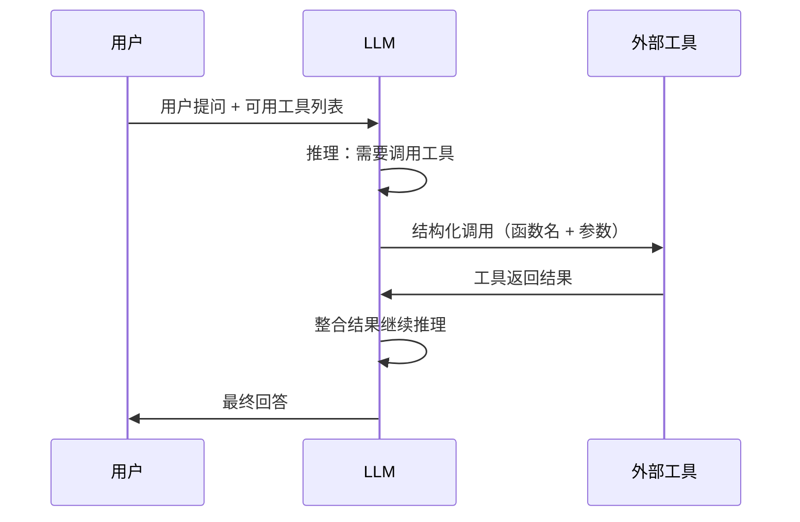
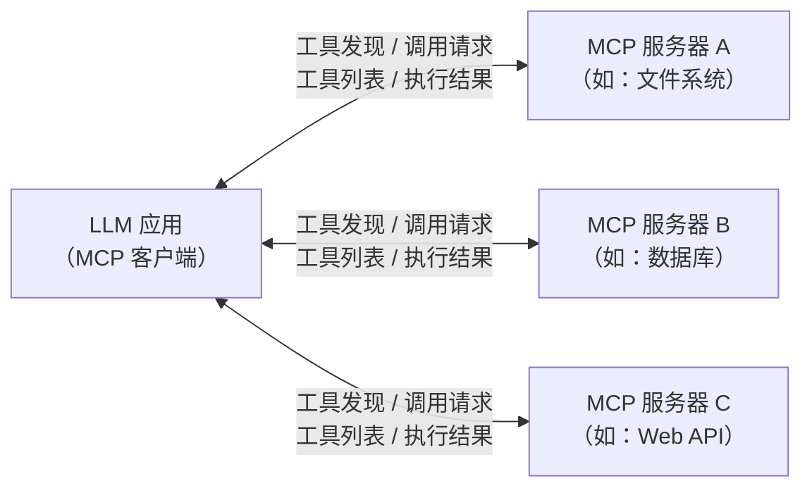

## 14.5 AI Agent 与工具调用：让模型从“说”到“做”

大语言模型在对话中展现出惊人的推理能力，但它们有一个根本限制——**只能生成文本**。模型无法浏览网页、查询数据库、执行代码或调用 API。**AI Agent**（智能体）通过让 LLM 与外部工具和环境交互，将“语言能力”转化为“行动能力”，是 LLM 从被动问答走向主动执行任务的关键演进。

### 14.5.1 从对话到智能体：为什么 LLM 需要“行动能力”

LLM 的知识存在三个根本性缺陷：

- **知识截止**：训练数据有时间边界，模型无法获取实时信息
- **无法计算**：模型擅长推理但不擅长精确计算（如大数乘法）
- **无法执行**：模型可以生成代码，但无法运行它来验证正确性

Agent 的核心思想是将 LLM 作为**推理与决策引擎**，辅以外部工具来弥补这些缺陷。一个典型的 Agent 循环包含三个阶段：

1. **感知**：接收用户指令和环境反馈
2. **推理**：分析当前状态，决定下一步行动
3. **行动**：调用外部工具执行操作，将结果反馈给推理过程

这个循环不断迭代，直到任务完成或需要用户进一步输入。

### 14.5.2 工具调用的实现机制

**工具调用**（Function Calling / Tool Use）是 Agent 能力的技术基础。其核心问题是：如何让 LLM 在生成自然语言的同时，输出结构化的工具调用指令？

#### 基本流程

工具调用的完整流程如下图所示：



图 14-12：工具调用的交互流程

关键步骤拆解：

1. **工具描述注入**：将可用工具的名称、参数类型和功能描述以结构化格式（通常为 JSON Schema）注入到系统提示词中
2. **模型决策**：LLM 根据用户问题判断是否需要调用工具、调用哪个工具、传入什么参数
3. **结构化输出**：模型生成符合预定格式的工具调用指令（如 JSON 对象），而非自然语言
4. **执行与回传**：外部系统解析指令、执行工具、将结果以特定格式回传给模型
5. **结果整合**：模型根据工具返回的结果生成最终回答，或发起下一轮调用

#### 结构化输出的关键作用

工具调用对 LLM 的输出格式有严格要求——必须是程序可解析的结构化数据。这正是 [9.4 节](../09_decoding/9.4_constrained.md)讨论的**约束解码**技术的核心应用场景。通过 JSON 模式、引导解码等手段，确保模型输出的函数名和参数始终是合法的、可执行的。

#### 训练数据构建

让模型学会工具调用，需要在微调阶段构建专门的训练数据：

- **对话-工具对**：将“用户问题 → 工具调用 → 工具结果 → 最终回答”的完整交互过程作为训练样本
- **多轮调用链**：包含需要连续调用多个工具才能完成的复杂任务样本
- **拒绝样本**：模型判断不需要调用工具、直接回答的场景，避免过度依赖工具

通过这种针对性的训练，模型学会在合适的时机生成格式正确的工具调用指令。

### 14.5.3 Agent 架构模式

在工具调用能力之上，研究者提出了多种 Agent 架构模式来组织 LLM 的推理和行动过程。

#### ReAct：推理与行动的交替

**ReAct**（Reasoning + Acting，Yao 等人，2023 年）是最经典的 Agent 范式。其核心思想是让模型**交替生成推理过程和工具调用**：

```
思考：用户想知道今天北京的天气，我需要调用天气查询工具。
行动：调用 get_weather(city="北京")
观察：晴，最高温度 25°C，最低温度 12°C
思考：我已经获取到天气信息，可以回答用户了。
回答：今天北京天气晴朗，气温 12°C 到 25°C。
```

ReAct 的优势在于**推理过程透明可解释**——每一步行动都有明确的思考依据，便于调试和审计。

#### 规划-执行分离

对于复杂任务，更有效的策略是将**规划**和**执行**分离：

1. **规划阶段**：LLM 将复杂任务分解为有序的子任务序列
2. **执行阶段**：逐步执行每个子任务，根据中间结果动态调整计划

这种模式避免了 ReAct 中“边想边做”可能导致的短视决策，更适合多步骤的复杂工作流。

#### 多 Agent 协作

当任务复杂度超过单个 Agent 的能力边界时，可以让多个 Agent 分工协作：

- **角色分工**：不同 Agent 扮演不同角色（如研究员、程序员、审查员），各自擅长不同类型的工具
- **层级结构**：主 Agent 负责任务分解和分派，子 Agent 负责具体执行
- **协商机制**：Agent 之间通过消息传递协商方案，形成集体决策

### 14.5.4 标准化协议：MCP

随着 Agent 生态的快速发展，一个现实问题浮出水面——每个工具提供者使用不同的接口定义方式，导致 Agent 与工具之间的集成成本极高。

**MCP**（Model Context Protocol）是 Anthropic 在 2024 年提出的开放标准，目标是为 LLM 与外部工具和数据源之间建立**统一的通信协议**，类似于 USB 协议为外设连接建立的标准。

MCP 采用**客户端-服务器**架构：



图 14-13：MCP 客户端-服务器架构

MCP 的核心设计包括：

- **工具发现**：客户端通过标准协议自动发现服务器提供的工具列表及其参数定义，无需硬编码
- **统一调用格式**：工具的输入输出格式遵循统一规范，降低集成成本
- **安全与权限**：协议内建权限控制机制，确保工具调用在安全边界内执行
- **传输无关性**：支持多种传输方式（标准输入输出、HTTP+SSE 等），适配不同部署场景

MCP 的意义在于：当工具集成变成即插即用时，Agent 开发者可以专注于推理逻辑而非接口适配，工具提供者只需实现一次标准接口就能被任意 Agent 使用。

### 14.5.5 Agent 对推理引擎的特殊需求

Agent 的工作模式与常规对话有显著差异，这对推理引擎（[第十一章](../11_serving/README.md)）提出了独特的挑战。

#### 长对话与上下文管理

一个 Agent 任务可能涉及数十轮工具调用，上下文窗口快速膨胀。推理引擎需要高效的**上下文压缩**和**KV 缓存管理**策略，在控制显存的同时保留关键的历史信息。

#### 状态与记忆

Agent 需要在多轮交互中维持一致的任务状态。这催生了对**外部记忆**机制的需求——将长期信息存储在向量数据库或结构化存储中，按需检索注入上下文，而非将所有历史塞入提示词。

#### 并发工具调用

当多个工具调用之间没有依赖关系时，并行执行能显著降低端到端延迟。推理引擎需要支持在单次生成中输出多个工具调用指令，并在所有结果返回后继续推理。

#### 流式输出与中间反馈

Agent 任务通常耗时较长。流式输出让用户实时看到模型的思考过程和工具调用进展，而非等待最终结果。这要求推理引擎支持在工具调用等待期间暂停生成、在结果返回后恢复生成的**断续式推理**模式。

这些需求推动推理引擎从“一问一答”的简单服务，演进为支持复杂工作流的**有状态推理平台**，是 LLM 基础设施演化的重要方向。
