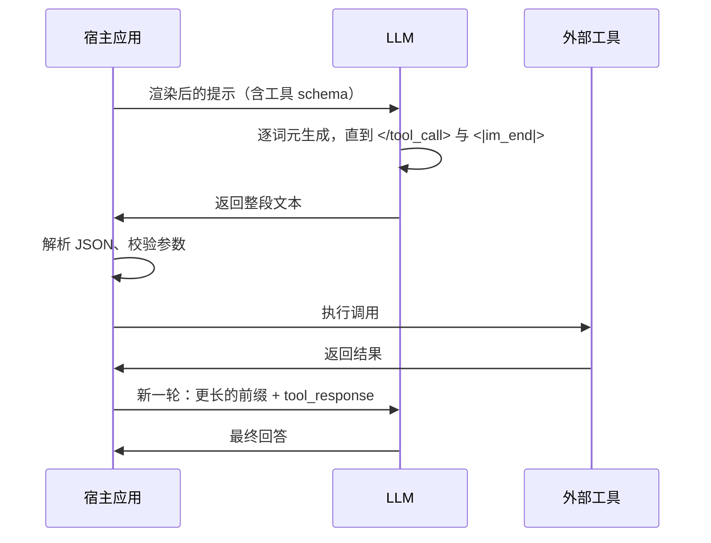
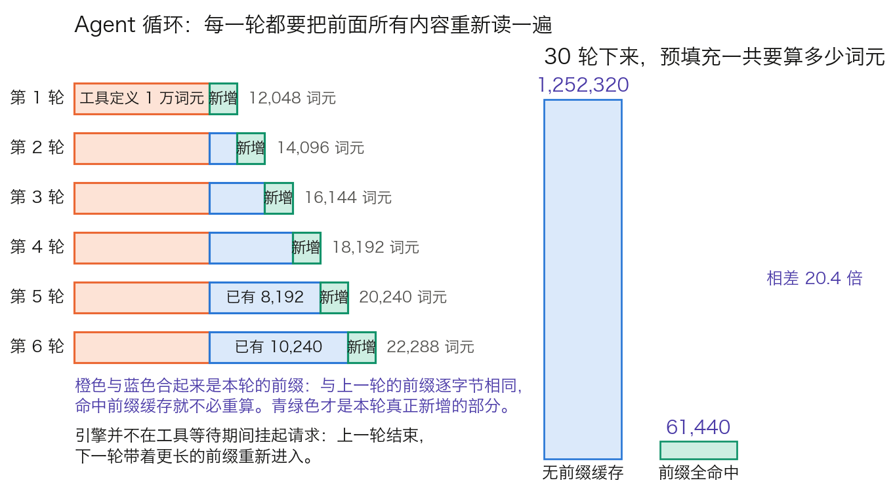
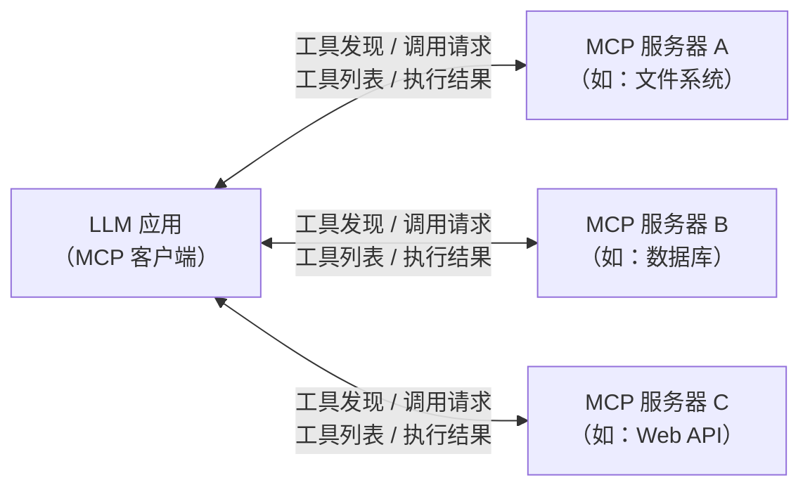

## 14.5 AI Agent 与工具调用：让模型从“说”到“做”

[14.4 节](14.4_multimodal.md)拓宽的是模型能读入和生成的模态。但模态再多，模型交付的仍然只是内容本身；让外部系统真的动起来，是另一回事。

本节回答一个容易被应用层叙事掩盖的问题：**工具调用在词元层到底发生了什么**。答案是——没有新的模型结构。工具调用只是一套聊天模板约定加上相应的微调数据，模型生成的仍然是普通词元，执行由宿主完成。弄清这一点之后，Agent 的成本账、失效模式和对推理引擎的要求都会变得可算。

### 14.5.1 为什么需要工具

裸模型的输出是词元序列。浏览网页、查询数据库、执行代码依赖宿主系统暴露的接口。工具弥补的是三类不同性质的缺口：

- **知识的时间边界**：训练数据有截止时间，实时信息不在权重里。
- **精确计算**：模型逐词元预测，大数乘法这类需要精确进位的运算不可靠。
- **副作用**：模型可以写出代码，但运行代码、发送邮件、修改文件都发生在权重之外。

后两条不是“知识”的缺陷，而是“模型只能生成词元”这一事实的直接后果。Agent 的核心思想是把 LLM 当作推理与决策引擎，由宿主执行它选中的动作，再把结果回灌。

### 14.5.2 一次工具调用在词元层发生了什么

**工具调用**（Function Calling / Tool Use）的全部机制可以用一个公开的聊天模板讲完。下面以 Qwen3 的 `tokenizer_config.json` 里的 `chat_template` 为例，它的每一步都能在文件里找到对应的 Jinja 分支。

**第 1 步：工具定义被渲染进提示。** 模板在有 `tools` 参数时，把工具的 JSON Schema 逐个写进系统段：

```text
<|im_start|>system
# Tools

You may call one or more functions to assist with the user query.

You are provided with function signatures within <tools></tools> XML tags:
<tools>
{"type": "function", "function": {"name": "get_weather", ...}}
</tools>

For each function call, return a json object with function name and arguments within <tool_call></tool_call> XML tags:
<tool_call>
{"name": <function-name>, "arguments": <args-json-object>}
</tool_call><|im_end|>
```

要点有三。工具定义就是普通文本，要占词元；每一轮请求都要重新渲染一遍，因为模型无状态；放在哪里由模板决定，Qwen3 放系统段，别的模型可能另开一段，所以“注入到系统提示词中”只是其中一种做法。

**第 2 步：模型生成调用片段。** 模型照常逐词元生成，只是生成出的是：

```text
<tool_call>
{"name": "get_weather", "arguments": {"city": "北京"}}
</tool_call>
```

`<tool_call>` 与 `</tool_call>` 在 Qwen3 的 `added_tokens_decoder` 里各是一个新增词元（`special` 字段为 `false`，该文件里标 `true` 的只有 `<|im_start|>` 与 `<|im_end|>` 一类控制词元），不是逐字符拼出来的。这一步与生成任何其他文本没有区别——同一套 logits、同一套采样。

**第 3 步：生成停止。** 模型在这一轮末尾生成 `<|im_end|>`，它是 Qwen3 的 `eos_token`。请求到此结束，引擎把整段文本返回给宿主。

**第 4 步：宿主解析并执行。** 宿主从返回文本里切出 `<tool_call>` 与 `</tool_call>` 之间的 JSON，校验参数，执行，拿到结果。这一步完全在模型之外。

**第 5 步：结果以新一轮回灌。** 结果作为一条 `role = "tool"` 的消息加进消息列表。模板的渲染方式值得单看：Qwen3 把连续的 tool 消息合并进一个 **user** 轮次，每条包在 `<tool_response>` 与 `</tool_response>` 之间。

```text
<|im_start|>user
<tool_response>
{"temp_c": 25, "condition": "晴"}
</tool_response><|im_end|>
<|im_start|>assistant
```

所以“工具角色”存在于 API 的消息列表里，未必存在于最终的词元流里。末尾的 `<|im_start|>assistant\n` 是生成提示，下一轮从这里继续。

**第 6 步：重复。** 带着更长的前缀重新走一次完整的前向。

这六步里没有任何一步需要改模型结构。能力来自训练数据——模板见过、格式学会了。图 14-9 把同样的流程画成时序图。


```mermaid
sequenceDiagram
    participant U as 宿主应用
    participant L as LLM
    participant T as 外部工具

    U->>L: 渲染后的提示（含工具 schema）
    L->>L: 逐词元生成，直到 </tool_call> 与 <|im_end|>
    L->>U: 返回整段文本
    U->>U: 解析 JSON、校验参数
    U->>T: 执行调用
    T->>U: 返回结果
    U->>L: 新一轮：更长的前缀 + tool_response
    L->>U: 最终回答
```

图 14-9：一次工具调用的完整往返。模型侧只有“生成”一件事，解析与执行全在宿主。

#### 约束解码的角色

工具调用要求输出可被程序解析，这正是 [9.4 节](../09_decoding/9.4_constrained.md)**约束解码**的典型场景：JSON Schema 编译成文法，每步为 logits 生成一个掩码，只允许文法接受的词元。

它保证的与不保证的要分清。它保证输出形状合法——括号配对、字段名在集合内、类型正确。它不保证参数语义正确（城市名写成邻市、单位写错），不保证调用被授权，也不保证操作幂等。工具执行前仍需要权限校验、参数审计、回滚设计和高风险操作确认。约束解码本身还有代价，见 9.4.5：逐步归一化会改变分布。

### 14.5.3 Agent 循环的成本账

工具调用的机制简单，但循环起来的成本增长很不直观。三笔账应当会算。



图 14-10：Agent 循环里上下文怎样逐轮变长，前缀缓存省掉了哪一块（[生成脚本](https://github.com/yeasy/llm_internals/blob/main/tools/figures/ch14a_agent_context.py)）。设定为工具定义 1 万词元、每轮新增 2048 词元。

**第一笔：工具定义的固定开销。** 每一轮都要重新渲染全部工具的 schema。一个工具的 JSON Schema 含名称、描述、参数类型与说明，约 200 词元是常见量级。10 个工具是 2000 词元，50 个是 1 万，100 个是 2 万。这笔开销与任务难度无关，只与挂了多少工具有关，且每一轮都付一次。这是“按需暴露工具子集”这类做法的直接动机。

**第二笔：预填充随轮次累积。** 设工具定义按第一笔取 1 万词元，每轮新增 2048 词元（模型的调用片段加工具返回结果），共 30 轮。第 $$k$$ 轮的前缀长度是 `10,000 + 2048k`。若每轮都从头预填充，30 轮合计：

$$
\sum_{k=1}^{30}\left(10{,}000 + 2048k\right) = 300{,}000 + 2048 \times 465 = 1{,}252{,}320\ \text{词元}
$$

若前缀缓存全命中，工具定义与已有对话都不必重算，每轮只算增量：

$$
2048 \times 30 = 61{,}440\ \text{词元}
$$

相差 20.4 倍。把轮数记作 $$R$$，这个比值是 $$10{,}000/2048 + (R+1)/2$$，随轮数近似线性增长：30 轮 20.4 倍，60 轮 35.4 倍。常数项 $$10{,}000/2048 = 4.9$$ 是工具定义带来的，轮数再多也不消失。所以前缀缓存（[11.5 节](../11_serving/11.5_prefix_reuse.md)）对 Agent 不是锦上添花，而是能不能跑的分界。

**第三笔：解码的 FLOPs。** 按 [3.8.7 节](../03_components/3.8_gpt_inference_flow.md)的口径，解码一个词元约 `2 × 激活参数量` 次浮点运算。Llama 3 8B 约 16 GFLOPs/词元，DeepSeek-V3（37B 激活）约 74 GFLOPs/词元。30 轮各输出 500 词元共 1.5 万词元，两者分别约 0.24 和 1.11 PFLOPs。与预填充的 125 万词元相比，解码的词元数小两个数量级，但解码是访存受限的，墙钟时间上往往反而是它占大头。

### 14.5.4 误差怎样逐步累积

单步可靠不等于全程可靠。设每一步（选对工具、填对参数、正确理解返回结果）的成功率为 $$p$$，$$k$$ 步串行且任一步出错即失败，则整体成功率是 $$p^k$$。

| 单步成功率 | 10 步 | 20 步 | 50 步 |
| ---: | ---: | ---: | ---: |
| 0.99 | 0.904 | 0.818 | 0.605 |
| 0.95 | 0.599 | 0.358 | 0.077 |
| 0.90 | 0.349 | 0.122 | 0.005 |

表 14-11：串行多步任务的整体成功率 $$p^k$$。

0.95 这个看起来相当不错的单步成功率，20 步之后只剩 0.358。反过来算：要让 20 步任务整体达到 0.9，单步需要 $$0.9^{1/20} = 0.9947$$，即单步错误率要低于 0.53%，约每 190 步才允许错一次。

这个指数衰减解释了 Agent 系统的几乎全部工程设计。**缩短链路**（一次多调几个工具而不是串起来）把指数的底数变少；**验证与重试**把单步的 $$p$$ 拉高；**检查点**让失败只回退一步而不是全程重来；**人工确认**在高风险步骤上把 $$p$$ 直接提到 1。把 $$p^k$$ 写在纸上，这些做法就不再是经验之谈。

需要说明的是这只是一个上界模型：真实任务的各步并不独立，失败也未必立刻终止。但它给出的量级感是对的——链路长度是最强的一阶因素。

### 14.5.5 Agent 架构模式

#### ReAct：推理与行动交替

**ReAct**（Reasoning + Acting）让模型交替生成推理过程和工具调用：

```text
思考：用户想知道今天北京的天气，需要调用天气查询工具。
行动：调用 get_weather(city="北京")
观察：晴，最高温度 25°C，最低温度 12°C
思考：已获取天气信息，可以回答。
回答：今天北京天气晴朗，气温 12°C 到 25°C。
```

优势是把“为什么调用某个工具”的依据显式写出来，便于调试和审计。但产品中通常只向用户展示摘要化的计划、进度和证据，不默认暴露模型的原始隐藏思维链；审计日志也应按权限和隐私边界保存。

按 14.5.4 的模型看，ReAct 的思考步本身也会失败，它是在增加链路长度换取单步成功率——只有当思考带来的 $$p$$ 提升超过多一步的代价时才划算。这解释了为什么简单任务上显式推理常常没有收益。

#### 规划-执行分离

复杂任务先整体分解为有序子任务，再逐步执行并按中间结果调整。它避免了“边想边做”的短视决策，也把一次长链路切成若干条短链路。代价是计划本身可能在第一步就错，而错误要到执行很久之后才暴露。

#### 多 Agent 协作

任务复杂度超过单个 Agent 的边界时，可以分工：不同角色（研究员、程序员、审查员）各自擅长不同工具；主 Agent 分解任务并分派，子 Agent 具体执行；Agent 之间通过消息协商。

它的实际收益主要来自上下文隔离——每个子 Agent 只看自己那段，避免 14.5.3 第二笔账的无限膨胀。代价是消息传递本身会丢信息，且 $$p^k$$ 的链路并没有真的变短，只是被拆到了不同的上下文里。

### 14.5.6 标准化协议：MCP

每个工具提供者用不同的接口定义方式，Agent 与工具之间的集成成本极高。**MCP**（Model Context Protocol）是 Anthropic 在 2024 年提出的开放标准，为 LLM 应用与外部工具、数据源之间建立统一协议。


```mermaid
graph LR
    A["LLM 应用<br/>（MCP 客户端）"] <-->|"工具发现 / 调用请求<br/>工具列表 / 执行结果"| B["MCP 服务器 A<br/>（如：文件系统）"]
    A <-->|"工具发现 / 调用请求<br/>工具列表 / 执行结果"| C["MCP 服务器 B<br/>（如：数据库）"]
    A <-->|"工具发现 / 调用请求<br/>工具列表 / 执行结果"| D["MCP 服务器 C<br/>（如：Web API）"]
```

图 14-11：MCP 的客户端-服务器架构。

**协议骨架。** 消息格式是 JSON-RPC 2.0。三类角色在规范里分得很清：**宿主**（Host）是发起连接的 LLM 应用，**客户端**（Client）是宿主里的连接器，**服务器**（Server）提供上下文与能力。服务器可提供的三类原语是 resources（数据）、prompts（模板）、tools（可执行函数）。

**工具发现与调用是两个方法。** 客户端发 `tools/list` 拿到工具清单，每个工具含 `name`、`description` 和 `inputSchema`——最后这个字段就是 14.5.2 第 1 步要渲染进提示的那份 JSON Schema。调用时发 `tools/call`，参数是 `name` 与 `arguments`：

```json
{"jsonrpc": "2.0", "id": 2, "method": "tools/call",
 "params": {"name": "get_weather", "arguments": {"location": "New York"}}}
```

返回里的 `content` 是结果内容，`isError` 标记工具自身是否出错。工具执行出错与协议层出错是两件事：前者用 `isError` 让模型看见并自行纠正，后者才是 JSON-RPC 错误。

**传输与版本。** 标准传输只有两种：标准输入输出（stdio）与 Streamable HTTP。更早的 HTTP+SSE 传输已被 Streamable HTTP 取代并标为弃用，规范只保留一节讲怎样与它保持向后兼容。协议修订版本号与具体字段集合是易过期事实，应以规范的当前修订为准，不宜背下来。

MCP 降低的是集成复杂度。它不自动解决身份认证、最小权限、数据驻留、速率限制和高风险工具确认等生产治理问题。从安全角度看，MCP 服务器返回的工具描述、资源内容和工具输出都应视为不可信输入。宿主相应地需要做四件事：固定批准的服务器与工具集合，限制凭据与文件权限的透传，隔离会话状态，对提示注入、工具投毒和数据外传建立审计与回滚机制。

### 14.5.7 工具调用能力怎样训练出来

14.5.2 说明了推理时没有新结构，能力全在权重里。这些权重来自两类训练。

**多轮轨迹的监督微调。** 训练样本是完整的交互过程：“用户问题 → 工具调用 → 工具结果 → 最终回答”，按同一套聊天模板渲染成一条词元序列。关键的实现细节是**损失掩码**：工具返回的结果是环境给的，不是模型该学着生成的内容，因此这些位置要从损失里排除，与 [8.1.2 节](../08_alignment/8.1_sft.md)对提示词位置做掩码是同一手法。漏掉这一步，模型会学着自己编造工具输出。

训练数据还要包含两类容易被忽略的样本：**多轮调用链**，即需要连续调用多个工具才能完成的任务；**拒绝样本**，即模型判断不需要调用工具而直接回答的场景，用来抑制过度调用。

生产系统的真实调用轨迹不应直接原样进入训练集：需要用户授权、数据最小化、敏感字段脱敏、工具副作用标注和权限边界保留，否则模型可能学到越权调用、泄漏私有结果或复现内部工作流。

**面向环境的强化学习。** 监督微调只能模仿已有轨迹。让模型在可验证环境里自己试错、按任务是否完成给奖励，是当前提升 Agent 能力的主线。它的技术难点是轨迹级的信用分配——一条 30 步的轨迹最后失败了，该罚哪一步。具体算法见 [14.6 节](14.6_test_time_scaling.md)。

### 14.5.8 Agent 对推理引擎的要求

Agent 的工作模式与常规对话差别很大，对引擎（[第十一章](../11_serving/README.md)）提出了几条具体要求。

**前缀缓存是第一位的。** 14.5.3 的 20.4 倍说明了原因。这里要纠正一个常见误解：主流引擎**并不**在工具等待期间挂起请求。第 3 步生成 `<|im_end|>` 之后请求就正常结束了，资源被释放；第 6 步是一个**新请求**，只是前缀更长。省掉重算靠的是前缀缓存命中（[11.5 节](../11_serving/11.5_prefix_reuse.md)的 RadixAttention 一类机制），不是引擎里有个暂停的状态机。这个区别很实际：它意味着 Agent 的性能高度依赖缓存命中率，而任何打乱前缀的改动（比如在提示开头插入时间戳）都会让命中率归零。

**上下文管理。** 数十轮之后上下文迅速膨胀。压缩历史、把长期信息放进外部存储按需检索，都是在控制 14.5.3 的第二笔账。注意压缩会改变前缀，从而使缓存失效——两个优化目标在这里打架。

**并行工具调用由模型和模板决定。** 一次生成里输出多个 `<tool_call>` 片段，是模型学出来的行为、模板支持的格式；引擎负责的是把整段文本原样返回。宿主解析出多个调用后并行执行，再把多条结果合并回灌。把这条能力算到引擎头上是主语错位。

**流式输出。** Agent 任务耗时长，流式让用户实时看到可展示的进度、工具调用状态和中间结果摘要。它不改变上面任何一条机制。

### 14.5.9 评测与常见失效

能力侧的失效模式与 14.5.4 的模型对得上：

- **工具选择错误**：可选工具多、描述相近时尤其常见，等价于降低单步 $$p$$。
- **幻觉出不存在的工具或参数**：约束解码可以挡住参数名不在 schema 里的情况，挡不住语义错误的取值。
- **循环**：反复调用同一个工具而不推进，常见于工具返回了模型看不懂的错误。
- **过早终止**：任务未完成就给出最终回答。
- **上下文膨胀导致的退化**：轮次多了之后早期指令被稀释，与 [14.7 节](14.7_long_context.md)讨论的长上下文问题同源。

公开评测各有侧重：BFCL 侧重函数调用的格式与选择正确性，$$\tau$$-bench 侧重多轮对话中遵守策略地完成任务，SWE-bench 侧重在真实代码仓库上完成可验证的修改。三者测的是链路的不同长度，分数不可互相换算。
