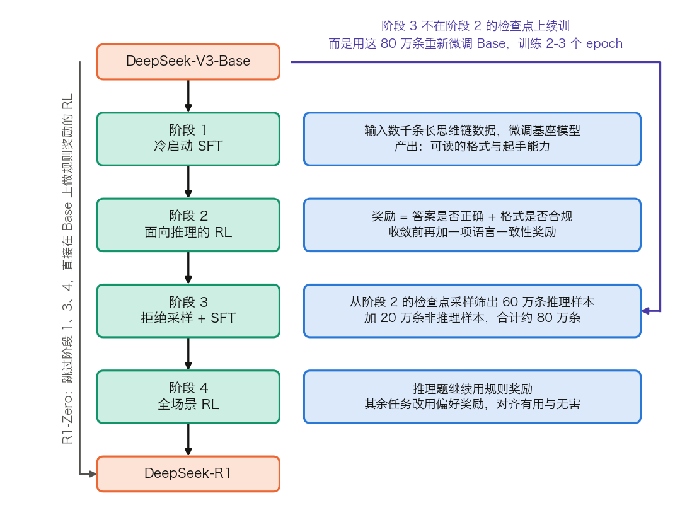

## 14.6 推理时计算扩展：让模型学会深度思考

[第九章](../09_decoding/README.md)的解码策略——贪心搜索、束搜索、采样——遵循同一个范式：每个位置做一次前向计算，选定一个词元。整个生成过程的计算量与输出长度成正比，模型没有“想久一点”的机会。**推理时计算扩展**（test-time compute scaling）打破的正是这一点：在推理阶段多投入计算来提升复杂任务的表现，而不只依靠训练阶段的扩展。

本节与书中两处已有讨论分工明确。解码系统一侧的算式——多采几条能涨多少、并行采样要花多少、预算强制怎样在引擎里实现——在 [9.5 节](../09_decoding/9.5_test_time_scaling.md)；长思维链 RL 的目标函数、组内优势的算例与四种典型病理在 [8.2.4 节](../08_alignment/8.2_rlhf.md)。本节回答模型一侧的四个问题：长思维链凭什么提升能力、这种能力怎样训练出来、验证信号从哪里来、这条路的上界在哪里。

这同时补上 [14.5 节](14.5_agent_tool_use.md)留下的一处空缺：那里的「感知—推理—行动」循环把推理列为三个阶段之一，却没有说这一步本身可以做得多厚。

### 14.6.1 从直觉回答到深度思考

传统解码对每个输入只做一遍前向计算，直接给出答案。这对事实问答或流畅续写够用，面对数学证明、代码调试、逻辑谜题这类需要多步推理的问题则常常出错。

推理时扩展有两条互补的路径。**延长思考过程**让模型在答题前先生成一条更长的推理链；**扩大搜索范围**对同一问题生成多个候选，再用验证机制选出最好的一个。两者的共同点是用更多推理时计算换取更高的答案质量。与训练时扩展不同，它不修改模型参数，代价落在每次请求的时间与算力上。

### 14.6.2 思维链推理：机制、表达力与代价

**思维链**（Chain-of-Thought，CoT）是推理时扩展的基础技术：让模型在给出答案之前先输出中间推理步骤，复杂推理任务的准确率随之提升。

#### 从提示词引导到零样本思维链

CoT 最早的实现是[思维链提示](https://arxiv.org/abs/2201.11903)里的 **few-shot 提示**：输入中给出几个含推理步骤的示例，模型便模仿这种逐步推理的模式。例如：

> **问题**：一个商店有 12 个苹果，卖出了 5 个，又进货了 3 个，现在有多少？
>
> **思维链**：起始有 12 个苹果。卖出 5 个后还剩 12 - 5 = 7 个。进货 3 个后变为 7 + 3 = 10 个。
>
> **答案**：10 个。

示例也可以省掉。提示词中只加入“让我们一步一步思考”（Let's think step by step），零样本情况下同样能激发这种推理模式，这就是**零样本思维链**（[Zero-shot CoT](https://arxiv.org/abs/2205.11916)）。

思维链可以看作 **ICL**（In-Context Learning，上下文学习）的一个特例：示例不只给出输入输出，还展示中间推理轨迹。后续的 **ToT**（[Tree of Thoughts](https://arxiv.org/abs/2305.10601)）与 **GoT**（[Graph of Thoughts](https://arxiv.org/abs/2308.09687)）把线性思维链扩展为树或图，在推理时显式搜索、合并与回溯；推理需要外部工具或环境反馈时，则与 [14.5 节](14.5_agent_tool_use.md)的 **ReAct** 范式相衔接。

需要区分研究示例、模型内部推理与产品展示。研究论文常展示完整轨迹以便复现机制；产品通常只展示简洁理由、进度摘要或可审计结果，不默认暴露原始思维链。日志里的推理痕迹同样应按权限与隐私边界管理。

#### 为什么有效：串行步数买到了什么

一个常见的误读是把思维链说成“把网络深度从 $$L$$ 层扩展到 $$L \times T$$ 层”。这不成立：每个词元仍然只过 $$L$$ 层，层与层之间的权重也没有变。真正变化的是**串行步数**——第 $$t$$ 步的输出写进上下文，成为第 $$t+1$$ 步的输入，于是后一步的注意力可以读到前一步算出的中间结果。

这件事在计算复杂性上有确切的刻画。[Merrill 与 Sabharwal 的分析](https://arxiv.org/abs/2310.07923)按中间生成的步数分三档。步数与输入长度成对数关系时，能力只比“读完就答”的标准 Transformer 略有扩展。步数与输入长度成线性关系、且采用其所称的 projected pre-norm 时，在标准复杂性猜想下多出一项明确的新能力：识别全部正则语言。步数为多项式量级、且采用其所称的 generalized pre-norm 时，识别的恰好是多项式时间可解的问题类。结论是：中间生成确实扩展了仅解码器 Transformer 的计算能力，扩展幅度取决于允许生成多少步。

配合这条结论，思维链的两个工程解释才站得住。一是**工作记忆的外化**：隐藏状态的宽度固定，把中间结果写成文本等于把状态挪到上下文里，容量随长度增长。二是**问题分解**：每一步只需在模型单次前向能力之内完成，难度被摊到多步上。

#### 一笔账：思考 1 万个词元要花多少

按 [3.8.7 节](../03_components/3.8_gpt_inference_flow.md)的口径，解码一个词元与权重相乘的计算量约为 $$2N$$，$$N$$ 是参数量。取 Llama 3 8B（$$N = 8.03 \times 10^9$$、32 层、$$d_{\mathrm{model}} = 4096$$、8 个 KV 头、$$d_h = 128$$）：

- **计算量**：每个输出词元 $$2 \times 8.03 \times 10^9 = 1.606 \times 10^{10}$$ FLOPs。思考 10,000 个词元合计 $$1.606 \times 10^{14}$$ FLOPs，即 160.6 TFLOPs。同一模型读完一个 200 词元的问题，Prefill 只有 3.21 TFLOPs，相差 50 倍。注意力那一项另计：第 $$t$$ 步每层约 $$4td$$，32 层累加到 10,000 步是 $$2.62 \times 10^{13}$$ FLOPs，再添 16.3%。
- **延迟**：解码受显存带宽限制。BF16 下权重占 $$8.03 \times 10^9 \times 2 = 1.606 \times 10^{10}$$ 字节，即 16.06 GB，每生成一个词元至少要把它完整读一遍。按 [10.1.2 节](../10_inference_optimization/10.1_bottleneck.md)的算法，H100 上单请求的上界是 $$3.35\ \mathrm{TB/s} \div 16.06\ \mathrm{GB} \approx 209$$ 词元/秒，10,000 个思考词元至少要 48 秒。这个下界与批大小无关，也无法靠并行摊薄。
- **显存**：该模型每词元 KV 为 $$2 \times 32 \times 8 \times 128 \times 2 = 131{,}072$$ 字节，即 128 KiB。10,000 个思考词元占 1.22 GiB，是同一批里一个普通短回答的几十倍。

这三个数解释了推理模型的部署形态：思考词元吃的是延迟和 KV 池，不是算力。把它与预训练对照更直观——Llama 3 8B 的预训练算力按 $$C \approx 6ND$$、$$D = 15$$T 计约为 $$7.2 \times 10^{23}$$ FLOPs，等于 45 亿次这样的长思考。单次推理再厚，也远小于训练一遍模型。

### 14.6.3 长思维链与强化学习训练

CoT 提示证明了“让模型思考”的价值，但提示词方法受限于预训练见过的推理模式。这一轮的突破在于用强化学习训练模型自主生成**长思维链**，代表是 OpenAI 的 o1 与后续推理模型，以及 DeepSeek-R1。

#### 换掉的是奖励来源

RLHF（[8.2 节](../08_alignment/8.2_rlhf.md)）优化的是回答的风格与安全性，奖励来自人类偏好。长思维链训练把奖励换成可自动验证的规则：数学题是否算对、代码是否通过测试、格式是否合规。算法骨架不变，仍是采样、算优势、裁剪、更新。

**GRPO**（Group Relative Policy Optimization）的优势定义、完整目标函数、组内优势的一格算术，以及长度偏差、零梯度组等典型病理，都在 [8.2.4 节](../08_alignment/8.2_rlhf.md)。本节不重复，只说它在推理模型里承担的角色：用组内相对分数替掉价值网络，使“同一道题采一组回答、按相对好坏更新”这件事的显存开销降到可接受。

#### DeepSeek-R1 的四个阶段

[DeepSeek-R1 论文](https://arxiv.org/abs/2501.12948)给出的训练流程分四段推进，图 14-12 逐段列出每个阶段的输入与产出。

图 14-12：DeepSeek-R1 的四阶段训练流程与各阶段的数据来源（[生成脚本](https://github.com/yeasy/llm_internals/blob/main/tools/figures/ch14b_r1_pipeline.py)）。样本量与奖励构成取自论文的奖励设计与数据配方两节。橙色是模型权重，青绿色是阶段名，蓝色是该阶段的数据，紫色标出容易看错的一处。

前两段是：**冷启动 SFT**，用数千条长思维链数据微调基座，解决 R1-Zero 输出混杂多语言、缺少格式的问题；**面向推理的 RL**，奖励为答案正确性加格式，收敛前再加一项语言一致性奖励。后两段是：**拒绝采样与 SFT**，从上一阶段的检查点采样筛出约 60 万条推理样本，再加约 20 万条非推理样本，合计约 80 万条；**全场景 RL**，推理题继续用规则奖励，其余任务改用偏好奖励。

图里那条紫线标出的是最容易读错的一处：第三阶段用这 80 万条样本**重新微调 DeepSeek-V3-Base**、训练 2–3 个 epoch，而不是在第二阶段的检查点上接着训。后续的蒸馏模型用的也正是这 80 万条。

#### R1-Zero：不给示范数据会怎样

同一篇论文的另一条支线是 DeepSeek-R1-Zero：跳过冷启动，直接在基座上做 RL。它的奖励只有两项，都是规则：**准确性奖励**判断答案是否正确（数学题要求把答案写进指定格式，代码题交给编译器与测试用例），**格式奖励**要求思考过程写在 `<think>` 与 `</think>` 之间。

论文明确说明不使用结果或过程神经奖励模型，理由是大规模 RL 中神经奖励模型会被奖励投机攻破，重训奖励模型还要额外资源并使流程复杂化。这条取舍值得记住：可自动验证的**稀疏奖励**之所以可行，前提是任务本身有客观判据。没有判据的任务只能退回神经奖励模型，连同它的全部风险。

训练中观察到的行为变化是这项工作最受关注的部分：模型自发出现“等等，让我重新检查一下”式的自我反思，以及在思维链里尝试多条解题路径的回溯搜索。这些模式没有被显式教过。

### 14.6.4 验证信号从哪里来：ORM 与 PRM

多路采样要选出最好的一条，就需要一个打分者。它的效果上界在 [9.5.2 节](../09_decoding/9.5_test_time_scaling.md)已经讲过：覆盖率是上限，实际正确率取决于选择器认出正确答案的能力。这里补的是打分者本身怎样训练出来。

**结果奖励模型**（Outcome Reward Model，ORM）只对最终答案评分。训练数据是“问题、完整回答、最终答案对错”三元组，标注成本低，因为最终答案的对错常常可以自动判定。它的弱点是无法区分“碰巧蒙对的错误推理”与“严谨正确的推理”。

**过程奖励模型**（Process Reward Model，PRM）对推理链的每一步评分。实现上它就是在基座模型上加一个标量头，输入是“问题加上截至当前的部分解”，输出是这一步正确与否的概率；推理时按步骤切分，逐步取分。它带来两处 ORM 给不了的能力：定位推理链中最早出错的步骤；在按步骤搜索时（[9.5.5 节](../09_decoding/9.5_test_time_scaling.md)）提前剪掉注定失败的分支。

代价在标注。[Let's Verify Step by Step](https://arxiv.org/abs/2305.20050) 的做法是人工标注每一步，该文公开的 **PRM800K** 含 80 万条步骤级人工反馈标签；它报告过程监督在 MATH 上显著优于结果监督，其过程监督模型解出了 MATH 测试集一个代表性子集上 78% 的题目。自动标注是另一条路：从某一步出发多次续写到底，用最终答案的正确比例估计该步的价值，本质是蒙特卡洛估计，省掉人工但引入噪声。

这条路线并非总划算。DeepSeek-R1 论文把 PRM 与 MCTS 一起列在“未成功的尝试”里，给出三条理由。一是通用推理中很难显式定义什么算一个细粒度步骤。二是判断中间步骤是否正确本身就难，自动标注质量不够而人工标注无法规模化。三是一旦引入基于模型的 PRM，就不可避免地带来奖励投机，重训奖励模型还要额外算力。该文的结论有分寸：PRM 在对前 N 条回答重排序或引导搜索时确实有用，但在大规模 RL 里，它的收益抵不过额外的计算开销。

### 14.6.5 推理时扩展与训练时扩展的权衡

**训练时扩展**遵循规模定律（[5.4 节](../05_pretraining/5.4_data_scaling.md)）：增大参数、数据与算力，性能可预测地提升。推理时扩展固定模型大小，把计算挪到推理阶段。表 14-12 按五个维度对照两者。

| 维度 | 训练时扩展 | 推理时扩展 |
|------|-----------|-----------|
| 成本结构 | 一次性高投入，此后每次推理成本固定 | 训练成本不变，每次推理成本按需增加 |
| 灵活性 | 模型部署后能力固定 | 可按问题难度动态调整计算量 |
| 适用任务 | 通用能力提升 | 需要深度推理的复杂任务 |
| 瓶颈 | GPU 集群规模、训练数据量 | 推理延迟、单次请求成本、KV 池容量 |
| 谁承担 | 模型提供方，一次 | 每一次调用，按量 |

表 14-12：两种扩展路径的对照。最后一行是部署决策的关键：训练时扩展的成本已经沉没，推理时扩展的成本随调用量线性累加。

怎样在两者之间分配预算，[Snell 等人](https://arxiv.org/abs/2408.03314)给出的结论是：不同方法的效果随提示难度显著变化，按难度自适应分配预算，达到同样效果所需的计算量可以比固定的 Best-of-N 少 4 倍以上。这条结论在 [9.5.5 节](../09_decoding/9.5_test_time_scaling.md)已经用过，这里只强调它的方向性——最优策略是**按难度分配**，而不是对所有请求一律加厚。

由此推出的产品形态是可调的思考预算：简单问题快速响应，复杂问题深度思考。Anthropic 的 Claude 3.7 Sonnet 引入的 **Extended Thinking** 把标准生成与长思维链整合进同一个模型，允许按请求启用深度思考；后续模型继续发展出 Adaptive Thinking 等模式。具体的支持矩阵、参数名与基准成绩变化很快，应以官方模型页与文档为准；这类易过期事实的登记办法见[附录 A.5](../appendix/a5_volatile_facts.md)。预算在解码期怎样被强制执行，见 [9.5.4 节](../09_decoding/9.5_test_time_scaling.md)。

### 14.6.6 推理时扩展的上界与突破方向

推理时扩展存在上界：当前的 RL 与搜索更像**能力放大器**，它们在基础模型已有的表征、工具接口、奖励信号与环境反馈中寻找更可靠的路径。基础模型缺乏必要知识、奖励无法区分好坏、工具环境不给真实反馈时，单纯增加推理词元很难补足能力。[9.5.6 节](../09_decoding/9.5_test_time_scaling.md)的说法与此一致：单条正确率为 0 的题，采多少条覆盖率都是 0。

当前基于自然语言的思维链还有一个效率瓶颈：语言是低带宽介质，每一步都要逐词“说出来”。两个前沿方向在尝试绕开它。

**隐空间推理**（Latent Space Reasoning）以 Meta 的 Coconut（Chain of Continuous Thought）为代表：思维链不再全部落成语言词元，允许模型在高维隐空间中保留连续状态推进推理。一个隐状态可以压缩表达一段中间推理，省掉写成自然语言的开销。代价是这条轨迹不可读，14.6.7 讨论的监控前提随之失效。

**并行推理**（Parallel Reasoning）针对的是串行依赖：当前思维链每一步都依赖前一步的输出。目标是让模型识别可独立求解的子任务，并行展开后再汇聚。配合剪枝（如 DeepConf 在推理中动态裁掉低置信度分支），可以在不增加总时间的前提下探索更宽的解空间。

两个方向都处在研究阶段。它们共同的取向是：下一阶段的提升可能来自更紧凑的表示与更聪明的搜索，而不是继续延长思维链。

### 14.6.7 思维链的忠实性与可监控性

推理时扩展的一个隐含期待是：既然模型把思考过程写了出来，就能据此读懂它依据什么做出判断——不少监控与审计方案正建立在这个前提上。这个前提需要被严格检验。

Anthropic 在 [Reasoning models don't always say what they think](https://www.anthropic.com/research/reasoning-models-dont-say-think)（论文见 [arXiv:2505.05410](https://arxiv.org/abs/2505.05410)）中给出了一个干净的测量方法：**成对提示**。同一道多选题准备两份，一份是普通版本，另一份在题干里插入一个指向特定选项的**提示线索**（例如“斯坦福的一位教授认为答案是 A”）。再只保留那些答案确实被线索改变的样本：无线索时答非该选项，有线索时改答该选项。在这些样本里模型显然用了该线索，于是可以直接检查它的思维链有没有把这件事说出来。

结论并不乐观。在六类线索上平均，Claude 3.7 Sonnet 只有 **25%** 的情况提到了线索，DeepSeek R1 为 **39%**；在两类“不该用”的线索（评分作弊、来路不正的信息）上更低，分别为 **20%** 和 **29%**。另有两个方向：

- **题目越难，忠实度越低**。在更难的 GPQA 上，两个模型的忠实度都比 MMLU 明显下降（相对降幅分别约 44% 和 32%）。这恰好削弱了“用思维链监控复杂任务”这一设想——越是最需要监控的场景，轨迹越不可信。
- **纯结果导向的强化学习不能解决它**。论文用一个 Claude 3.7 Sonnet 的早期快照做实验：只奖励任务是否做对、不对思维链做过程监督，忠实度先明显上升（相对提升 63% / 41%），随后进入收益递减的平台期（论文报告平台位置约为 MMLU 28%、GPQA 20%）而不再实质改善。

需要把两个概念分清。**忠实性**（faithfulness）说的是“这段轨迹是否真实反映了驱动答案的原因”，是轨迹自身的属性；**可监控性**（monitorability）说的是“某个监控方能否据此发现问题”，取决于轨迹和监控方两者——OpenAI 的 [Evaluating chain-of-thought monitorability](https://openai.com/index/evaluating-chain-of-thought-monitorability/) 正是沿这条线展开的。两者会分离：不够忠实的轨迹仍可能被足够了解模型的监控方识破；看起来合理的轨迹也可能掩盖真实动因。

实用的结论是一条工程纪律：把模型写出的推理过程当作调试线索，而不是审计证据。判断模型为何这样做，仍需回到可验证的外部依据——输入、检索到的材料、工具调用与其返回值。这也给 [14.8 节](14.8_interpretability.md)划了一条边界：读取模型自述与读取模型内部状态，是两件可信度不同的事。
