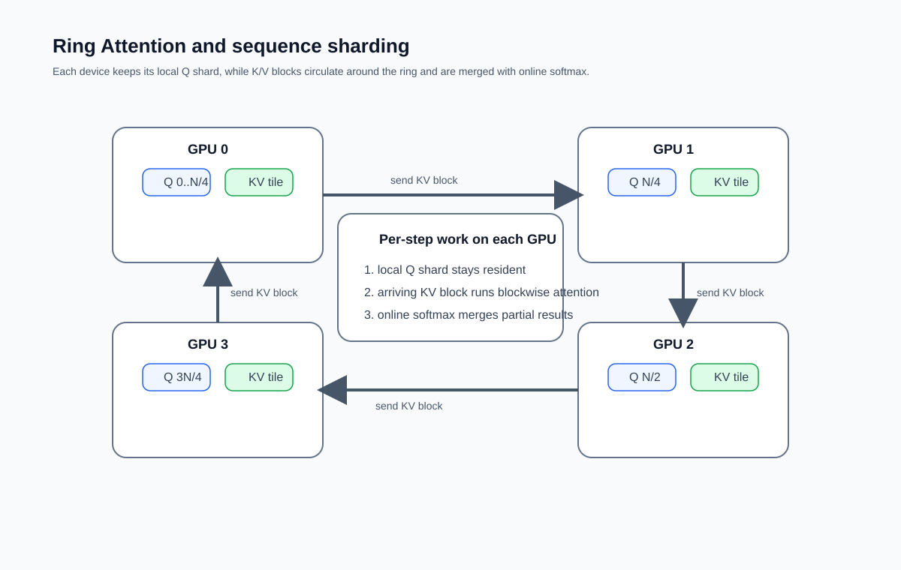
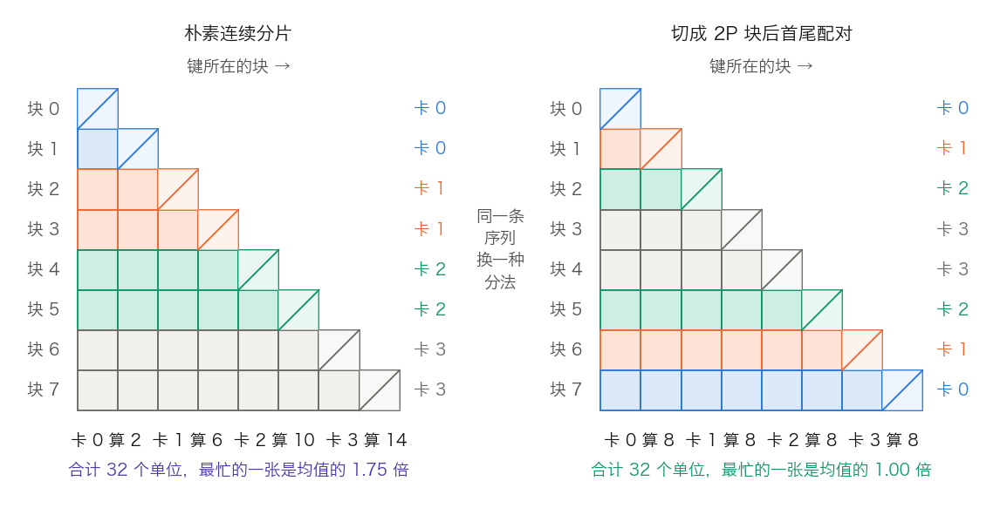
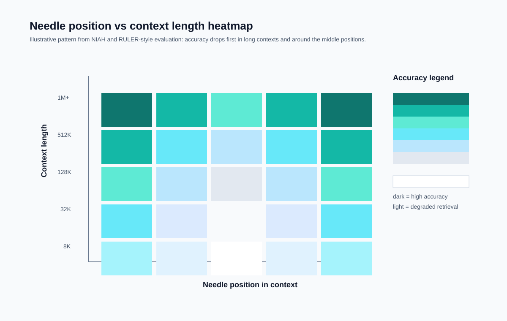
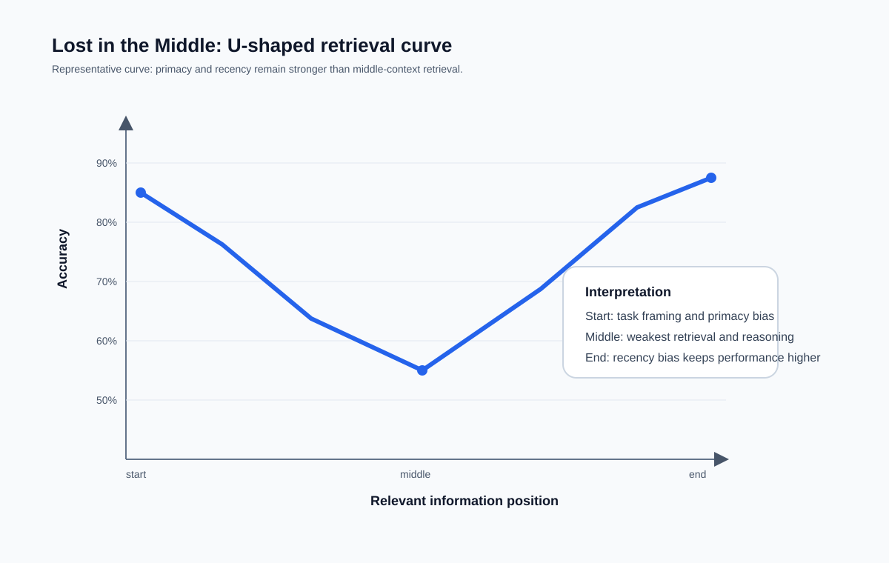

## 14.7 长上下文技术：从理论到工程实践

从 GPT-3 的 2,048 词元窗口到 Gemini 1.5 的 100 万词元，上下文长度在几年内涨了 488 倍，接近三个数量级。这不是“数字变大”那么简单：它同时撞上注意力的平方复杂度（[2.5 节](../02_attention/2.5_complexity_limits.md)）、KV 缓存的线性显存增长（[10.2 节](../10_inference_optimization/10.2_kv_cache.md)）与位置编码的外推极限（[4.3 节](../04_position_encoding/4.3_rope.md)）。

[14.5 节](14.5_agent_tool_use.md)的 Agent 要跑数十轮工具调用，[14.6 节](14.6_test_time_scaling.md)的模型要先写完一整段思维链再回答——两者都在往同一个地方堆东西：上下文窗口。

本节承接上述三章的单点结论，回答它们合起来产生的系统问题：三笔开销各自怎么算、一条序列怎样切到多张卡上、长度怎样训出来、拿到窗口之后为什么还是用不好。前三章已给出的推导不在此重复，只给出交界处的数字与差异。

### 14.7.1 三笔账：计算、显存、通信

把窗口从 4K 推到 1M，要同时解决三笔开销。沿用 [3.8.6 节](../03_components/3.8_gpt_inference_flow.md)表 3-25 的 Llama 3 70B 配置（80 层、$$d_{\mathrm{model}} = 8192$$、64 个 Query 头、8 个 KV 头、$$d_h = 128$$）逐笔算。

**计算：平方项从多长开始主导。** 按 [3.8.7 节](../03_components/3.8_gpt_inference_flow.md)的口径，一层 Prefill 的计算量分成线性项与平方项：前一项是与权重相乘的部分，后一项是打分与读取，因果掩码下已折半。3.8.7 的 $$24nd^2$$ 只对 GPT-3 式的层成立。Llama 3 70B 用 SwiGLU 与 GQA，线性项要按实际形状重数：Q 与输出投影各 $$8192 \times 8192$$，K、V 各 $$8192 \times 1024$$，MLP 是三个 $$8192 \times 28672$$ 的矩阵。每层合计 855,638,016 个参数，即 $$12.75d^2$$。每个参数对每个词元做一次乘、一次加，线性项因此是 $$25.5nd^2$$ 而不是 $$24nd^2$$（[6.4.2 节](../06_training_techniques/6.4_batch_sequence.md)对 Llama 3 8B 数出的是 $$26nd^2$$）：

$$
25.5\,nd^2 + 2n^2d
$$

两项相等于 $$n = 12.75d$$，这里是 104,448 个词元。代入几个长度，下列三组都是 80 层合计，线性项按 $$2 \times 855{,}638{,}016 \times n \times 80$$ 算：

- $$n = 8192$$：线性项 $$1.12 \times 10^{15}$$、平方项 $$8.80 \times 10^{13}$$，平方项只占 7.8%。
- $$n = 104{,}448$$：两项都是 $$1.43 \times 10^{16}$$，正好相等。
- $$n = 10^6$$：线性项 $$1.37 \times 10^{17}$$、平方项 $$1.31 \times 10^{18}$$，平方项已是线性项的 9.6 倍。

所以“计算量与长度的平方成正比”只在超过约 $$12.75d$$ 之后才近似成立，短于这个门槛时主导的是 MLP 和投影。百万词元的量级感也由此而来：单层的平方项是 $$2 \times (10^6)^2 \times 8192 = 1.64 \times 10^{16}$$ FLOPs，即 16.4 PFLOPs；80 层合计 $$1.31 \times 10^{18}$$ FLOPs。按 H100 的 990 TFLOPs/s 稠密峰值（[11.12 节](../11_serving/11.12_hardware.md)表 11-35）且算力用满，光这一项就要 1,324 秒，约 22 分钟。单卡做不了这件事，与内核是否高效无关。

**显存：KV 缓存随长度线性增长。** 每词元字节数为 $$2 \times L \times n_{kv} \times d_h \times s$$，其中 $$s$$ 是每个数的字节数（口径同 [10.2.3 节](../10_inference_optimization/10.2_kv_cache.md)）；FP16 下是 $$2 \times 80 \times 8 \times 128 \times 2 = 327{,}680$$ 字节，即 0.3125 MiB。乘上长度：4,096 词元 1.25 GiB，131,072 词元 40 GiB，100 万词元 305 GiB。最后这个数超过任何单卡的显存，必须切到多张卡上。同一配置若用标准多头注意力（64 个 KV 头），每词元是 2.5 MiB，100 万词元要 2.38 TiB——GQA 在这里贡献了 8 倍。完整的五个可压缩因子（$$n_{kv}$$、$$L$$、表示宽度、词元数、每个数的字节）及 MLA、CLA、CSA 等路线见 [10.2 节](../10_inference_optimization/10.2_kv_cache.md)，本节只用它的结果。

**通信：序列被切开之后才出现的一笔。** 上面两笔都发生在单卡内部。序列一旦分片，每张卡的查询要读到别的卡上的 K、V，通信量与切法直接相关。这笔账没有单卡对应物，下一小节单独算。

### 14.7.2 分布式注意力：Ring Attention 与序列并行

解决百万级上下文的关键路线是**序列维度的分布式计算**——把一条超长序列切到多个设备上并行处理。

#### Ring Attention

[**Ring Attention**](https://arxiv.org/abs/2310.01889)（Liu 等人，2023 年）把 FlashAttention 的分块计算从单设备推广到多设备，三步：

1. **序列分片**：长度 $$N$$ 的序列均分到 $$P$$ 个设备，每个设备持有 $$N/P$$ 个词元的 Q、K、V。
2. **环形传递**：设备组成逻辑环。每一步用本地的 Q 与当前持有的 K、V 算局部注意力，同时把 K、V 块沿环发给下一个设备。
3. **在线聚合**：$$P$$ 步之后，每个设备的 Q 已与全部位置交互过。各步的局部结果用在线 Softmax 增量合并为最终结果，合并式与 [10.3 节](../10_inference_optimization/10.3_flash_attention.md)的单卡版本完全相同——维护 $$(m, \ell, o)$$ 三元组，新块到来时按新旧最大值重新配平指数项。Ring Attention 只是把 10.3 节的分块循环从片上搬到了卡间，数值结果与单卡稠密注意力一致，不是近似。

**重叠条件可以算出来。** Ring 的收益全部押在“算当前块的时间盖过传下一块的时间”上。原论文给出的推导只有一步：块长 $$c$$、宽度 $$d$$ 时，一块的注意力计算约 $$4dc^2$$ FLOPs；K、V 两块本身是 $$2cd$$ 字节，一轮收发的通信需求合计 $$4cd$$ 字节。设每卡算力 $$F$$、卡间带宽 $$B$$，令计算时间不短于传输时间：

$$
\frac{4dc^2}{F} \ge \frac{4cd}{B} \quad\Longrightarrow\quad c \ge \frac{F}{B}
$$

$$d$$ 被约掉，条件只剩“块长不小于算力与带宽之比”。代入两组真实硬件（$$F = 990$$ TFLOPs/s）：节点内 NVLink 单向 450 GB/s 时 $$c \ge 2{,}200$$ 个词元；跨节点 400 Gb/s InfiniBand 单口 50 GB/s 时 $$c \ge 19{,}800$$ 个词元。两个带宽分别取自 [11.12.4 节](../11_serving/11.12_hardware.md)（NVLink 标称 900 GB/s 是双向合计）与 [11.9.3 节](../11_serving/11.9_disaggregated_serving.md)。论文写到这里为止，它的推导按标准多头注意力取宽度 $$d$$。按 GQA 再推一步：计算仍按 $$d$$，传的却只是 $$n_{kv}d_h$$，Llama 3 70B 下是 $$1024/8192 = 1/8$$，两个门槛降到 275 与 2,475。这一步是本书的推广，不在原论文中。

这条式子解释了 Ring 的适用范围。每卡只分到几百个词元时，跨节点的 Ring 藏不住传输；每卡上万个词元时，带宽再慢也被计算盖住。Ring 的重叠假设在超长序列上才成立，短序列上它退化成串行的收发。

图 14-13 把“序列分片 + KV 环传 + 在线聚合”三个动作放在同一个视图里。

图 14-13：Ring Attention 中的序列分片与 KV 块环形传递（示意图，非实测数据）。

#### 因果掩码下的负载不均

还有一处只在因果语言模型里出现的问题。朴素分片把序列切成 $$P$$ 段连续块，第 0 张卡的查询只能看见自己，第 $$P-1$$ 张卡的查询要看见全部前缀。把序列切成 $$2P$$ 个等长块、以“块 $$i$$ 的查询读块 $$j$$ 的键”为一格计数，$$P = 4$$ 时朴素分片的四张卡分别算 2、6、10、14 个单位，最忙的一张是均值的 1.75 倍；$$P = 8$$ 时这个比值升到 1.875。每一步都要等最慢的那张卡，这些空转直接折成墙钟时间。

对策是不按连续段分。[Llama 3 论文](https://arxiv.org/abs/2407.21783)的上下文并行把输入切成 $$2 \times CP$$ 块，第 $$i$$ 个 rank 同时拿第 $$i$$ 块与第 $$2 \times CP - 1 - i$$ 块，论文对此的说明就是为了更好的负载均衡。一头一尾配成一对之后，每张卡的工作量恒为 $$2P$$ 个单位，完全配平。图 14-14 把两种分法并排画出。

图 14-14：把序列切成 $$2P = 8$$ 块后，两种分法的每卡工作量（[生成脚本](https://github.com/yeasy/llm_internals/blob/main/tools/figures/ch14b_causal_shard_balance.py)）。格子 $$(i, j)$$ 表示“第 $$i$$ 块的查询读第 $$j$$ 块的键”，对角块只算一半。左为连续分片，右为首尾配对；两者总工作量相同，最忙的一张卡相差 1.75 倍。

同一篇论文还给出了另一种实现取舍：它的上下文并行不用环形重叠，而是先 all-gather 全部 K、V，再对本地 Q 块算注意力。论文给的两条理由值得记住——all-gather 形式更容易支持各种注意力掩码（例如文档掩码）；由于用了 GQA，K、V 张量远小于 Q，暴露在关键路径上的 all-gather 延迟很小，而注意力计算的复杂度比 all-gather 高一个数量级（$$O(S^2)$$ 对 $$O(S)$$）。训练侧的选择因此可以与推理侧不同：训练每步都是长序列 Prefill，计算足够厚，用最简单的通信形式即可。

#### 序列并行与 Ulysses 的硬上限

**序列并行**（Sequence Parallelism）是另一族策略。这个词在文献里有三种用法，读到时要先分清指的是哪一种：[7.3.6 节](../07_distributed_training/7.3_model_tensor_parallel.md)的窄义序列并行只切 LayerNorm 与 Dropout，注意力内部每张卡仍看到完整序列；本小节与上一小节讨论的是把注意力本身沿序列维切开，也常称上下文并行（Context Parallelism）；下面 Ulysses 切的则是注意力头。**Megatron-SP** 属于第一种：它在张量并行基础上，把 LayerNorm、Dropout 这类非注意力操作也沿序列维度分片，避免它们在单设备上占用完整序列长度的显存。

[**DeepSpeed Ulysses**](https://arxiv.org/abs/2309.14509)（Jacobs 等人，2023 年）换了一个切面。每个 GPU 先对本地分片做 Q、K、V 投影，然后用一次 **All-to-All** 集合通信重组数据：通信后每个 GPU 持有**所有词元**在**互不重叠的一部分注意力头**上的完整 Q、K、V，于是可以独立算完自己那几个头。论文给的口径有两条：序列长度与设备数同比例增加时，单卡通信量保持恒定；其对照表把每卡通信复杂度记为 $$O(M/P)$$，而此前的 ColAI-SP 与 Megatron-SP 为 $$O(M)$$。该表未收录 Ring，两者的直接对比需自行按各自的传输量推算。

论文没有把并行度的上界单列成一条，但它由“互不重叠的一部分头”直接推出：$$P$$ 不能超过可分配的注意力头数。Llama 3 70B 有 64 个 Query 头，但只有 8 个 KV 头；不复制 KV 时 $$P \le 8$$，复制 KV 之后才能到 64。GQA 越激进，这个上限越紧。Ring 没有这条限制，它切的是序列而不是头。两者因此互补而非替代：节点内头数够用时选 Ulysses，跨节点或头数不足时选 Ring。

#### 与 FlashAttention 的协同

这两族技术与 FlashAttention 处在不同层次。FlashAttention 解决单设备内的访存问题，靠分块把 $$[n, n]$$ 的中间矩阵挡在片上；Ring 与序列并行解决跨设备的分布问题，把单卡放不下的序列切开。实践中组合使用：设备内用 FlashAttention 算本地分块，设备间用环传或 All-to-All 协调全局。

#### 局部窗口、SWA 与 Attention Sinks

另一条路线是不做全局注意力，只让每个词元看最近的窗口。**滑动窗口注意力**（SWA）在 Mistral 7B 等模型中用于降低长序列推理成本，配合滚动 KV 缓存可以把显存从“随总上下文增长”改为“随窗口大小增长”。代价是远端信息只能靠多层逐步传递，精确检索能力弱于全局注意力。

**Attention sinks** 解释了纯窗口缓存为什么会突然退化。[StreamingLLM 论文的解释很干净](https://arxiv.org/abs/2309.17453)：Softmax 要求被注意到的权重加起来等于 1，于是即便某个头在当前这一步“没什么需要看的”，它仍被迫把注意力质量倾倒到某处。模型学到的解法是倒给一个位置固定、语义无害的地方——序列开头那几个词元。

论文用一组对照实验区分了两种可能的解释。把开头四个词元换成换行符 `\n`，模型照样重点关注它们，重新引入这几个换行符也照样能把困惑度拉回正常水平。可见起作用的不是这几个词元的语义，而是模型对绝对位置形成的偏好。

需要说清的是因果链条。Softmax 的归一化只是必要条件，“沉到开头”这一步是训练中学出来的。论文给的解释是：自回归掩码下开头词元对后续几乎所有位置可见，因此最容易被训练成 sink。它还发现预训练时加入一个专用 sink 词元，可以把注意力汇聚集中到这一个位置上，并改善流式部署。所以把根因完全归给 Softmax 的定义过头了，训练同样参与其中。

顺着这条链条能看懂两件事。**一是纯窗口缓存为什么会突然崩**：一旦淘汰掉开头几个词元的 KV，Softmax 分母里那一大块消失，剩余位置的分数分布整体偏移，与正常推理时对不上——不是慢慢变差，而是分布错位。StreamingLLM 的对策是保留少量开头词元的 KV 再加最近窗口，论文的消融显示只留一两个不够、留四个就基本够用，再多收益有限，其实现默认保留四个。**二是更彻底的解法长什么样**：既然问题在于“必须把权重分配出去”，就给模型一个合法的“不看”出口。做法是引入一个可学习的 sink logit，等价于在 Softmax 分母里加一个与任何键都无关的常数项，注意力权重之和因此可以小于 1。它比保留几个真实词元更干净，既不占 KV 缓存，也不依赖恰好有几个开头词元可留。

### 14.7.3 长上下文训练策略

有了处理长序列的工程能力，下一个问题是怎样训练模型真正利用长上下文。

#### 渐进式长度扩展

直接在百万级长度上预训练既昂贵（计算量按上一节的平方项增长）又缺数据。主流做法是先用标准长度（4K–8K）完成大规模预训练，再用较小的学习率和长序列数据继续训练，逐步扩窗。

[Llama 3 论文](https://arxiv.org/abs/2407.21783)给出了一个可以照抄口径的样本。它在 405B 的预训练里**分六个阶段**把上下文从 8K 提到 128K，这一长上下文预训练阶段用了约 **800B 词元**。每一阶段的推进标准写得很具体：短上下文评测的成绩完全恢复，且该长度上的大海捞针任务全部做对。论文给的不在早期就训长序列的理由，正是 14.7.1 的那笔计算账——自注意力的计算量随序列长度平方增长。

这里要避免一处常见的夸大：分阶段扩长节省的是长序列上的训练量，不是“效率高出数个数量级”。800B 词元本身就是一笔可观的投入，相当于 405B 全部 15.6T 训练词元的 5.1%。

#### 位置编码的外推与适配

渐进式训练的使能技术是位置编码的外推能力。RoPE 的波长谱、临界维度，以及位置内插、NTK 感知缩放、NTK-by-parts、YaRN 五种做法的对照与逐维验算，[4.3.4 节与 4.3.5 节](../04_position_encoding/4.3_rope.md)已经给全，本节不重复。

只强调一条与本节主题相关的结论：这些方法**几乎都需要微调**，而不是零样本改个参数就能用。YaRN 的 128K 模型是在 64K 检查点上再训 200 步得到的；位置内插需要千步量级的微调。换句话说，长度扩展是训练策略的一部分，不是部署时的开关。

#### 长文本数据的构造

高质量长文本本身稀缺。常用的构造策略有四种。把同一领域的多个短文档拼接成长序列，并用分隔符标记边界。使用书籍与学术论文这类自然长文本，代价是领域偏向。把完整代码仓库的多个文件组织成超长上下文，文件间的引用关系提供了天然的长距离依赖。用模型生成的长文本做补充。

数据质量直接决定能力上限。如果训练数据里的长距离信息多为冗余重复，模型会学到忽略远端上下文的习惯——它在训练集上是对的。

#### 配置里长什么样

上述机制在公开配置里是可以逐项对上的。Hugging Face 模型配置中，`rope_scaling` 描述长度扩展方案，Llama 3.1 的那一组是 `factor`、`low_freq_factor`、`high_freq_factor`、`original_max_position_embeddings`，四个数的逐维验算见 4.3.5 节；`num_attention_heads` 与 `num_key_value_heads` 决定 Ulysses 的并行度上限与每词元 KV 字节数（10.2.4 节）。推理引擎一侧，vLLM 的 `max_model_len` 决定实际放行的最大长度，它同时是 KV 池预留的依据——设成模型标称的最大值，往往会把并发压到个位数。字段名与默认值随版本变化，应以当时的官方文档为准。

### 14.7.4 长上下文评测方法

支持长上下文是一回事，真正有效利用是另一回事。评测方法的设计对于区分这两者至关重要。

#### 大海捞针测试

**Needle-in-a-Haystack**（NIAH）最直观：在一段很长的无关文本（干草堆）中随机插入一条关键信息（针），在末尾提问要求精确检索；改变针的位置与干草堆的长度，画成一张热力图。

它的优势是直观，局限是只评估最基础的精确检索能力——相当于测试一个人能否在书里找到某句话，而不是理解这本书。图 14-15 画出热力图通常呈现的稳定模式：上下文越长、针越靠中间，检索越容易先崩。

图 14-15：长上下文评测中，针的位置与上下文长度共同影响检索准确率（示意图，非实测数据）。

#### RULER 与其他基准

[RULER](https://arxiv.org/abs/2404.06654) 针对 NIAH 的局限设计了四类任务：**检索**（多键、多值，找出分散在不同位置的多条信息）、**追踪**（跟踪实体之间的变量传递链与因果链）、**聚合**（对分散信息做汇总、计数、排序）、**问答**（基于长上下文的综合推理）。它揭示的重要发现是：几乎所有现有模型的有效上下文长度都远短于标称值。一个标称 128K 的模型，在聚合类任务上可能 32K 之后就开始显著下降。

[LongBench](https://arxiv.org/abs/2308.14508) 是多任务中英文长上下文基准，覆盖单文档问答、多文档问答、摘要、少样本学习、代码补全等 21 个任务。[InfiniteBench](https://arxiv.org/abs/2402.13718)（论文里写作 ∞Bench）专门关注 100K+ 的超长场景，任务包括理解完整小说情节、分析极长代码。**MK-NIAH**（RULER 中的多键检索变体）在原始 NIAH 上增加干扰项，除真针外还插入若干语义相似但答案不同的假针，测试区分与精确定位能力。

#### 评测的反思

所有评测方法都面临同一个问题：通过测试不等于有效利用。模型可能在人工构造的测试上表现良好，却无法在分析长文档、理解代码库这类真实任务中充分利用长上下文。差距源于真实任务的信息密度、关联复杂度与推理深度远超当前评测的覆盖范围。

### 14.7.5 有效利用长上下文的挑战

拥有大窗口与用好大窗口之间存在鸿沟。

**注意力分布不均匀。** [Lost in the Middle](https://arxiv.org/abs/2307.03172) 发现，相关信息放在长上下文中间时模型表现显著下降；注意力倾向于集中在开头（首因效应）与末尾（近因效应），准确率随针的位置画出图 14-16 那条首尾高、中间低的 U 形曲线。一种解释指向训练数据的分布：多数样本开头是任务描述或系统提示、末尾是最新对话轮次，两端信息密度天然较高，模型可能隐式学到了“重要信息在两端”的启发式。

图 14-16：Lost in the Middle 现象常表现为首尾高、中间低的 U 形曲线（示意图，非实测数据）。

**成本与延迟。** 这里有一处常见的误读：成本取决于实际送进模型的词元数，不取决于窗口上限。同一份 10 页文档（约 5,000 词元）放进 1M 窗口与放进 32K 窗口，计算量完全相同，按 14.7.1 的式子都是每层 $$8.97 \times 10^{12}$$ FLOPs。真正贵的是**把窗口填满**：把 5,000 词元换成 100 万词元，平方项涨 4 万倍。选 1M 窗口的模型本身不额外花钱，往里塞满东西才花钱。

**注意力稀释。** 上下文里无关信息过多时，模型要在更大的空间里找相关内容，准确率反而下降。在一些任务上，有选择地只给最相关的上下文（例如用 RAG 检索）比一次性塞入全部可用信息效果更好。

**推理深度的限制。** 即使模型能“看到”全部信息，它在**多跳推理**——综合多个分散位置的信息并构建推理链——上的能力仍然有限。上下文变长不会自动提升推理深度。

**上下文工程。** 应对手段集中在怎样组织上下文：关键信息前置以利用首因效应；用明确的分隔符与元数据标注各部分的角色；先给概要、需要时再给细节；删除重复与无关内容以提高信息密度。

**RAG 与长上下文互补而非替代。** RAG 的优势是精准检索、成本可控、信息可追溯、支持实时更新；长上下文的优势是保持信息连贯、支持全局推理、不受检索质量限制。实践中常见的组合是先用 RAG 检索最相关的片段，再放进长上下文供模型综合分析。

### 14.7.6 长上下文窗口 ≠ 长期记忆

窗口扩展解决的是“单次推理能看多少”，实际应用中还有一个不同层面的问题：**跨会话的持久记忆**。

**长上下文窗口**是模型能力问题，由注意力机制、位置编码、训练策略决定。**长期记忆**是系统设计问题：用户上周说的偏好、上个月做的决策、跨多次会话积累的项目上下文，需要在模型之外构建专门的基础设施。

更大的窗口替代不了记忆系统，障碍有三条。

1. **成本不可持续**。把用户全部历史交互塞进每次请求，按 14.7.1 的式子，超过 $$12.75d$$ 之后成本按平方增长。即使窗口支持，成本也迅速不可接受。
2. **注意力稀释不可避免**。如 14.7.5 所述，上下文越长，中间位置越容易被忽视。海量历史会把真正相关的信息淹没。
3. **状态管理缺失**。窗口提供的是“看见所有信息”，不提供“哪些已过时、哪些该被覆盖、哪些互相矛盾”的判断。用户三个月前说“我住在纽约”、上周说“我搬到了旧金山”，两条信息同时在窗口里，模型需要自行判断时间关系，这并不可靠。

LongMemEval、LoCoMo、[ConvoMem](https://arxiv.org/abs/2511.10523) 等长期记忆基准测的正是这些能力：跨会话推理、时间推理、知识更新、事实冲突消解。公开报告中表现较好的系统通常不靠更大的窗口，而靠**结构性优化**：从对话中抽取事实、维护用户画像、处理时间变化与矛盾、自动遗忘过期信息，再把治理过的记忆与文档检索合并为统一查询。引用具体商业产品的榜单时，应单独标明评测口径与可复现性。

这类设计本质上是用应用层的状态管理弥补模型层的推理局限。窗口提供了更大的工作台，记忆系统提供的是“哪些材料该放上工作台”的决策。两者的最优组合，而非任一方的单独扩展，是长会话系统的基础架构。

本节的结论全部建立在外部观测上：FLOPs、字节、带宽、准确率曲线。[14.8 节](14.8_interpretability.md)转向这条链路上唯一还没被打开的那一层。
