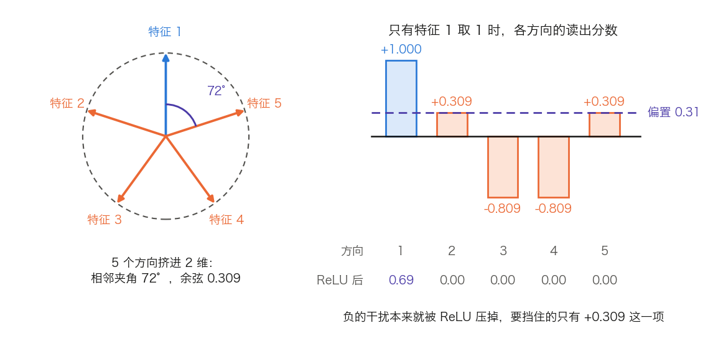

## 14.8 机制可解释性：打开黑箱

[14.7 节](14.7_long_context.md)把上下文从 2K 推到百万级，解决的是往模型里塞多少材料、怎么塞得下。塞进去之后模型拿这些材料算了什么，那一节没有回答，也回答不了：三笔开销的账逐笔算得清，权重里跑的是什么算法则一个字也读不出。**机制可解释性**（Mechanistic Interpretability，MI）冲的正是这个缺口，它试图把神经网络的权重逆向工程成人类可理解的计算过程。它既是理解“原理”的终点，也是 AI 安全的关键前沿。

直接问模型这条路已经被堵死。[14.6.7 节](14.6_test_time_scaling.md)划下的边界是：Claude 3.7 Sonnet 只有 25% 的情况会在思维链里说出自己用了提示线索，模型的自述因此只能当调试线索。剩下的那条路是不听它说，直接读权重与激活。

本节按四步展开：为什么分析单位不是神经元；怎样把叠加在一起的方向解开；怎样把解开的方向串成计算过程；以及这些方法各自的可信度边界。

### 14.8.1 叠加与多义性：为什么神经元不能直接解读

最朴素的解读思路是逐个神经元地看它代表什么概念。实践中绝大多数神经元是**多义的**（Polysemantic）：同一个神经元会对“学术引用”“中文文本”“DNA 序列”这类毫不相关的概念都强烈激活。

[Anthropic 的叠加玩具模型](https://transformer-circuits.pub/2022/toy_model/index.html)（Elhage 等人，2022）给出的解释是**叠加**（Superposition）。一个 $$d$$ 维激活空间只能容纳 $$d$$ 个互相正交的方向，却能容纳远多于 $$d$$ 个“近似正交”的方向——这与 Johnson–Lindenstrauss 引理同源：容许两两余弦不超过 $$\varepsilon$$ 时，可容纳的方向数随 $$d$$ 指数增长。当真实特征远多于维度、且每个特征只在少数输入上激活时，模型就把多个特征挤进同一组神经元，以近似正交的方向叠加存储。

**一个可以手算的最小例子。** 把 5 个特征放进 2 维，最省事的排法是让它们指向正五边形的五个顶点，两两相隔 72°。任意两个方向的余弦只有两种取值：相邻的 $$\cos 72° = 0.309$$，相隔两个的 $$\cos 144° = -0.809$$。现在只让特征 1 取值 1，其余为 0，激活就是特征 1 的方向。用各个方向去读这个激活，得到的分数依次是 $$+1.000$$、$$+0.309$$、$$-0.809$$、$$-0.809$$、$$+0.309$$。

关键在读出这一步。负的干扰本来就被 ReLU 压掉，真正要挡住的只有 $$+0.309$$。给每个方向配一个 0.31 的偏置再过 ReLU，读出变成 $$0.69, 0, 0, 0, 0$$——只剩特征 1 自己。图 14-17 把这两步画在一起。

图 14-17：5 个特征挤进 2 维时的方向排布，以及只有特征 1 激活时各方向的读出（[生成脚本](https://github.com/yeasy/llm_internals/blob/main/tools/figures/ch14b_superposition_2d.py)）。余弦值由脚本算出。蓝色是当前激活的方向，橙色是其余方向，紫色是偏置线与 ReLU 之后的结果。

这个例子说明了叠加成立的两个前提。**稀疏性**：同时激活的特征越少，干扰项越少，偏置才压得住。五个特征若同时取 1，读出就全部越过阈值。**非线性**：没有 ReLU 或类似的阈值，干扰无法被丢掉。这正是“特征的载体是激活空间中的方向，而非单个神经元”的机制来源，也解释了逐神经元解读为什么注定失败。

### 14.8.2 稀疏自编码器：从叠加中恢复单义特征

既然特征以叠加方式藏在方向里，能否把它们解开？[Anthropic 的“迈向单义性”](https://transformer-circuits.pub/2023/monosemantic-features)（Towards Monosemanticity，2023）给出的工具是**稀疏自编码器**（Sparse Autoencoder，SAE）。它训练一个**过完备**的自编码器去重构某一层的激活，并在隐层施加稀疏约束，迫使每个样本只激活极少数隐单元。

**前向与损失。** 记被解释的激活为 $$\mathbf{x} \in \mathbb{R}^{D}$$，字典大小为 $$F \gg D$$。[扩展单义性](https://transformer-circuits.pub/2024/scaling-monosemanticity/)（Scaling Monosemanticity，2024）写出的形式是：

$$
f_i(\mathbf{x}) = \mathrm{ReLU}\left(\mathbf{W}^{enc}_{i,\cdot} \cdot \mathbf{x} + b^{enc}_i\right), \qquad
\hat{\mathbf{x}} = \mathbf{b}^{dec} + \sum_{i=1}^{F} f_i(\mathbf{x})\, \mathbf{W}^{dec}_{\cdot,i}
$$

$$
\mathcal{L} = \mathbb{E}_{\mathbf{x}}\left[\ \lVert \mathbf{x} - \hat{\mathbf{x}} \rVert_2^2 + \lambda \sum_i f_i(\mathbf{x}) \cdot \lVert \mathbf{W}^{dec}_{\cdot,i} \rVert_2\ \right]
$$

形状是 `x[1, D] × W_enc^T[D, F] → f[1, F]`，再 `f[1, F] × W_dec^T[F, D] → x̂[1, D]`。稀疏项里那个 $$\lVert \mathbf{W}^{dec}_{\cdot,i} \rVert_2$$ 因子不是装饰：没有它，模型可以把解码器方向的模长放大、把 $$f_i$$ 缩小来绕过 L1 惩罚。乘上这个因子之后，解码向量可以按单位长度解读为“特征方向”，$$f_i$$ 才是它的激活强度。

**两组公开规模。** Towards Monosemanticity 解释的是一个单层 Transformer 中 512 个神经元的 MLP 激活，训练数据 80 亿个样本点。它的膨胀倍数从 1×（512 个特征）到 256×（131,072 个特征），详细分析集中在名为 A/1 的那一次运行的 4,096 个特征上。Scaling Monosemanticity 把方法搬到生产级模型 Claude 3 Sonnet，取中间层的残差流，训了三档字典：1,048,576（约 1M）、4,194,304（约 4M）、33,554,432（约 34M）个特征。选残差流而不是 MLP 层的理由有两条：残差流比 MLP 窄，训练与推理都更便宜；以及它有助于缓解该文所称的跨层叠加问题。

**怎么判断一个 SAE 好不好。** 论文报告的指标有四类，读公开 SAE 时都要看：

- **L0**，即平均每个词元上有多少个特征非零。Scaling Monosemanticity 的三档都低于 300。
- **解释方差**，重构 $$\hat{\mathbf{x}}$$ 解释掉原激活方差的比例，该文三档都不低于 65%。
- **下游损失恢复率**，把原激活换成重构值后模型交叉熵的恢复程度，比重构误差更贴近“这个分解是否抓住了模型实际用到的东西”。
- **死特征比例**，在大样本上从不激活的特征占比。该文以 $$10^7$$ 个词元为样本，1M 档约 2%、4M 档约 35%、34M 档约 65%。字典越大，浪费越多，这是扩字典的直接代价。

**三种稀疏化各有取舍。** L1 惩罚可导、实现简单，代价是收缩偏差：它既压特征数，也把留下来的激活值一并压小。[OpenAI 的做法](https://arxiv.org/abs/2406.04093)改用 k-稀疏自编码器，直接保留最大的 $$k$$ 个激活，稀疏度由 $$k$$ 精确控制，不必调 $$\lambda$$。该文另有一组改动，使最大规模下的死特征也很少；它在 GPT-4 的激活上训出了 1,600 万个隐单元的自编码器，用了 400 亿个词元。[Gemma Scope](https://arxiv.org/abs/2408.05147) 用的是 JumpReLU：给每个特征一个可学的阈值，低于阈值直接置零，从而在保住稀疏的同时不压低通过阈值的激活值；该项工作把 SAE 训到了 Gemma 2 2B 与 9B 的全部层与子层上并公开权重。

Scaling Monosemanticity 的另一项结论把可解释性从“观察”推进到了“干预”：人为放大或抑制某个特征方向，就能定向改变模型行为。这是因果证据，不是相关性。

### 14.8.3 电路与归纳头：上下文学习的机制基础

要解释模型如何计算，需要追踪信息在组件间的流动。[Transformer 电路数学框架](https://transformer-circuits.pub/2021/framework/index.html)（Elhage 等人，2021）把注意力头拆成两条可独立分析的**电路**。

**QK 电路决定注意到哪里。** 按 3.8 节的行向量写法，打分是 $$XW_Q(XW_K)^{\top} = X\,(W_QW_K^{\top})\,X^{\top}$$，于是 $$W_{QK} = W_QW_K^{\top}$$ 是一个 $$[d_{\mathrm{model}}, d_{\mathrm{model}}]$$ 的矩阵，秩不超过 $$d_h$$。GPT-3 Small 里它是 `[768, 768]`、秩 ≤ 64。

**OV 电路决定把什么写进残差流。** 输出是 $$A\,XW_VW_O$$，于是 $$W_{OV} = W_VW_O$$ 同样是 $$[d_{\mathrm{model}}, d_{\mathrm{model}}]$$。

把嵌入与反嵌入接上，两条电路都可以写成词元对词元的表：$$W_EW_{QK}W_E^{\top}$$ 给出“哪个词元会注意哪个词元”，$$W_EW_{OV}W_U$$ 给出“看到某个词元时输出会偏向哪个词元”，GPT-3 Small 下都是 `[50257, 50257]`。这两张表是单个头的完整行为描述，不依赖任何具体输入。多个头还能跨层**组合**（composition），形成更复杂的算法。

**归纳头是这个框架最著名的成果。** [归纳头](https://transformer-circuits.pub/2022/in-context-learning-and-induction-heads/index.html)（Induction Heads，Olsson 等人，2022）由两层、两个头组成，实现规则“序列中出现过 [A][B]，再次遇到 [A] 时就预测 [B]”。用一个 6 词元的序列走一遍：

1. 序列是 `[A] [B] [C] [D] [A] ?`，位置编号 1 到 6。
2. **前序词元头**在第 1 层工作。它在位置 2 上注意位置 1，通过 OV 电路把“我前面是 A”写进位置 2 的残差流。这一步与内容无关，只依赖相对位置，所以它的 QK 电路学的是“盯住前一个”。
3. **归纳头**在第 2 层工作。位置 5 的查询携带“当前是 A”的信息，它的 QK 电路把这个查询与“前面是 A”这条键匹配上，于是位置 5 注意到位置 2。
4. 位置 2 的 OV 电路输出的是它自身的内容 B。归纳头把 B 复制进位置 5 的残差流，模型据此预测下一个词元为 B。

这条链路的关键是第 3 步的 K-composition：归纳头的键读的不是原始词元嵌入，而是第 1 层写进去的东西。单看任何一个头都解释不了这个行为。

归纳头的重要性在于它为上下文学习提供了一个可被机制分析的候选电路。证据强度需要分清：小型 attention-only 模型上有较强的因果证据；大型模型上更多是相关性或局部干预层面的证据。它能解释很多模式复制与少样本现象，但不能直接解释全部少样本推理、工具使用或长思维链机制。另一个常被引用的观察是，归纳头在训练中伴随损失曲线的明显变化出现，为“某些能力如何形成”提供了少见的机制级案例。

### 14.8.4 读取与干预的工具箱

围绕“读取模型内部状态”，社区发展出一组互补工具。它们的可信度依次递增。

**探针**（Probing）在某层激活上训练一个简单的线性分类器，检验某种信息是否被线性可解码地表示。它的结论只有一个方向：能解码说明表示存在，不说明模型用到了它。

**Logit Lens** 把中间层的残差流直接送进最终归一化与反嵌入，看模型“当前的猜测”：

$$
p^{(\ell)} = \mathrm{softmax}\left(\mathrm{Norm}_{\mathrm{final}}\left(x^{(\ell)}\right)W_{\mathrm{vocab}}\right)
$$

常能看到正确答案在中后层才被锁定。它的失真来源是基不对齐：$$W_{\mathrm{vocab}}$$ 是为第 $$L$$ 层的表示训出来的，中间层的残差流未必在同一套基上。tuned lens 的做法是为每一层各学一个线性变换，先把 $$x^{(\ell)}$$ 映射到末层的基，再解码。

**激活补丁**（Activation Patching）是这组工具里唯一给出因果结论的：先跑一遍“干净”输入、再跑一遍“被破坏”输入，然后把某个组件的激活从一次运行移植到另一次，观察输出是否恢复。常用的度量是 logit 差恢复率——被补丁的那个组件把“正确答案减错误答案”的 logit 差拉回了原值的百分之多少。

用补丁时要分清几个容易混用的概念。**因果追踪**（ROME 的做法）是激活补丁的一个特例：破坏的方式是给输入加噪，再逐个恢复组件。**消融**的基线选择会改变结论。置零消融把激活换成 0，但 0 通常不在激活的分布内，效果被高估。均值消融换成数据集均值。重采样消融换成另一个样本在同一位置的激活，最接近“这个组件不提供信息时会怎样”。**路径补丁**只替换某条特定路径上的贡献，用来区分“这个头直接影响输出”与“它通过下游某个头间接影响输出”。

### 14.8.5 从特征到计算图：转码器与归因图

SAE 回答的是“某一层里有哪些特征”，回答不了“这些特征之间如何相互计算”。两项后续工作朝这个方向推进。

**转码器**（transcoder）改变了拟合目标：SAE 用一层的激活重构同一层，转码器用一层的输入预测下一处的输出，于是它学到的是一个可解释的**替代计算**，而不只是一个分解。Anthropic 的 [Sparse Crosscoders](https://transformer-circuits.pub/2024/crosscoders/index.html)（Lindsey 等人，2024）进一步让同一组稀疏特征同时读写多个层，甚至多个模型。论文列出的用途包括解决跨层叠加、简化电路，以及**模型对比**（model diffing）：用同一组特征去重构两个模型的激活，比较各特征在两侧的解码器范数，就能区分共享特征与某一方独有的特征。

**归因图**是把这件事用到具体提示上的产物。Anthropic 的 [Circuit Tracing](https://transformer-circuits.pub/2025/attribution-graphs/methods.html)（Ameisen、Lindsey 等人，2025）分三步走。先训一个**跨层转码器**（cross-layer transcoder，CLT）去逼近原模型的 MLP。再用它替换掉 MLP，得到一个**替代模型**。最后在替代模型上对某个具体提示画出计算图。图里的节点是提示各位置上激活的转码器特征、输入嵌入和输出词元，边是替代模型里的直接线性归因。图里还有一类**误差节点**，装的是 CLT 没能解释掉的那部分 MLP 输出——它明确标出了这张图有多少没说清楚，这一点比“看上去讲得通”重要得多。

这条线与 14.8.7 的局限直接相关：它把“没有大模型被完整解释”这句话，从一句感叹变成了可以按提示、按误差节点占比来度量的东西。

### 14.8.6 动手入口

上述方法有成熟的开源实现，在 GPT-2 small 上复现归纳头检测是常见的入门练习。**TransformerLens** 提供 `HookedTransformer`，其 `run_with_cache` 一次前向就把全部中间激活缓存下来，按钩子名取用：`blocks.{l}.hook_resid_pre`、`hook_resid_mid`、`hook_resid_post` 是残差流的三个位置，形状 `[batch, pos, d_model]`；`blocks.{l}.attn.hook_pattern` 是 Softmax 之后的注意力权重，形状 `[batch, head_index, query_pos, key_pos]`；`blocks.{l}.attn.hook_z` 是各头读出的 context，形状 `[batch, pos, head_index, d_head]`。检测归纳头只需要 `hook_pattern`：喂进一段重复两遍的随机词元，看哪个头在第二遍稳定地注意到“上次出现处的下一个位置”。

配套的还有训练与分析 SAE 的 **SAELens**、做干预实验的 **nnsight**，以及公开权重的 **Gemma Scope**。这些库的接口名与默认值随版本变化，应以当时的官方文档为准；这类易过期事实的登记办法见[附录 A.5](../appendix/a5_volatile_facts.md)。上面列出的钩子名取自 TransformerLens 的源码，形状注释也写在同一行。

### 14.8.7 意义与局限

机制可解释性的价值是双重的：对科学理解，它让“原理”从行为层深入到算法层；对 AI 安全，它有望直接检测欺骗、后门与危险能力，而不必依赖模型的自我报告。

局限同样要说清。SAE 有重构误差，也有**特征分裂**——同一个概念随字典变大被拆成多个特征，14.8.2 的死特征比例是这个问题的一个侧影。电路级分析扩展到前沿模型仍是开放难题，迄今没有任何一个大型语言模型被完整地、电路级地解释清楚。归因图的误差节点给了这句话一个量化形式，而不是取消它。可解释性给出的是打开黑箱的第一批工具，黑箱远未被完全照亮——这也是它至今仍是最活跃前沿之一的原因。
