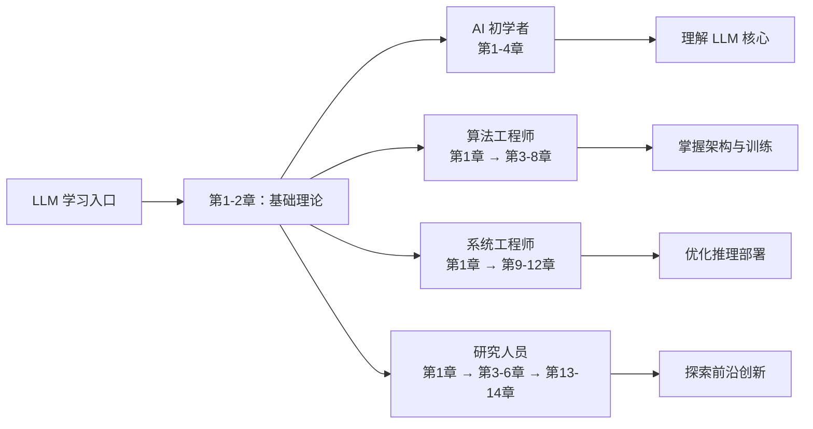

<div align="center">

# 大模型原理与架构

[](https://creativecommons.org/licenses/by-nc-sa/4.0/)
[](https://github.com/yeasy/llm_internals)
[](https://yeasy.gitbook.io/llm_internals)

> 以 Transformer 为例，深入剖析大模型为什么能工作、为什么这样设计，系统掌握从架构原理到训练部署的完整知识体系。

<!-- 封面图片待补充：请将 cover.jpg 放入项目根目录 -->

</div>

---

## 本书简介

2017 年，Vaswani 等人在论文《Attention Is All You Need》中提出了 Transformer 架构。这一看似简洁的设计——用注意力机制完全替代循环和卷积——却引发了深度学习领域最深刻的范式变革。从 BERT 到 GPT-4，从 Llama 到 DeepSeek，几乎所有现代大语言模型的核心都建立在 Transformer 之上。

但知道 Transformer "是什么" 远远不够。**为什么自注意力需要除以 $\sqrt{d_k}$？为什么多头比单头更有效？为什么残差连接对深层网络如此关键？为什么旋转位置编码能够外推到更长的序列？** 这些 "为什么" 背后的设计直觉与数学原理，才是真正理解这一架构的关键。

本书的核心目标，是帮助读者建立对 Transformer 及其衍生模型的**深层理解**：

- **追溯来龙去脉**：从 RNN 的梯度困境讲到注意力机制的诞生，理解每一步创新解决了什么问题
- **解剖设计决策**：不仅给出公式，更解释每个设计选择背后的动机和权衡
- **揭示工作原理**：用直觉、可视化和数学推导三位一体地解释核心机制为什么有效
- **贯通工程实践**：从理论推导自然过渡到训练、推理与部署中的关键技术

## 目标读者

- **AI/NLP 研究者**：需要深入理解 Transformer 设计原理及其变体的研究人员
- **算法工程师**：从事大模型架构、训练、微调与部署的研发人员
- **机器学习从业者**：希望从 "会用" 进阶到 "理解为什么" 的开发者
- **高校师生**：希望结合业界最新实践，研究深度学习与大模型方向

## 阅读本书，你将学到

1. **Transformer 为什么能取代 RNN**：从序列建模的根本挑战出发，理解注意力机制解决了什么问题
2. **注意力机制为什么有效**：缩放因子的数学直觉、多头注意力的信息论解释、因果掩码的设计逻辑
3. **各组件如何协同工作**：残差连接如何解决梯度问题、层归一化为什么优于批归一化、前馈网络的"记忆"角色
4. **位置编码的设计哲学**：从正弦编码的外推性到 RoPE 的旋转直觉，理解不同方案的取舍
5. **预训练范式背后的思想**：为什么"预测下一个词"能学到语言知识？掩码预训练与自回归的本质区别
6. **训练工程的底层逻辑**：学习率预热的必要性、混合精度的精度保证、分布式训练的通信与拆分策略
7. **对齐技术的设计动机**：从 RLHF 的复杂性到 DPO 的简化之路
8. **推理优化的第一性原理**：KV 缓存为什么能加速、投机解码为什么是正确的、量化的精度-效率权衡
9. **主流 LLM 的架构创新**：GPT 系列的扩展逻辑、Llama 的开源策略、DeepSeek-V3 的 MoE 设计
10. **前沿趋势的底层思考**：状态空间模型能否替代注意力？多模态融合的核心挑战是什么？

## 如何阅读

本书共分为四个部分：

- **第一部分（基础篇）**：追溯 Transformer 的来龙去脉，从底层原理解析每一个核心组件的设计动因
- **第二部分（训练篇）**：从预训练思想到分布式训练工程，解释每种技术为什么有效
- **第三部分（推理与部署篇）**：从解码原理到推理加速，用第一性原理拆解优化技术
- **第四部分（模型与前沿篇）**：从经典模型的设计思路到前沿架构的创新逻辑

建议按顺序阅读第一部分以建立深层理解，之后可根据个人需求选择性深入后续部分。

## 五分钟快速上手

"理解 Transformer 的核心机制"——跟随以下步骤快速掌握 LLM 基础：

1. **LLM 基础**（第1-2章）：理解什么是大语言模型、为什么采用神经网络、预训练的核心思想
2. **Transformer 架构**（第3章）：深入理解 Transformer 的核心设计——自注意力、位置编码、多头机制
3. **注意力机制**（第4章）：掌握缩放点积注意力的数学原理和为什么这样设计能让模型有效工作
4. **进阶机制**（第5-8章）：学习层归一化、残差连接、前馈网络等核心组件如何协同工作
5. **工程实践**（第9-12章）：理解训练、推理优化和部署的底层逻辑

## 学习路线图



| 读者角色 | 学习重点 | 核心成果 |
|---------|---------|---------|
| **AI 初学者** | 第1-4章 | 深入理解 Transformer 的工作原理 |
| **算法工程师** | 第1章 → 第3-8章 | 掌握 LLM 架构设计和训练优化 |
| **系统工程师** | 第1章 → 第9-12章 | 实现高效的推理和部署方案 |
| **研究人员** | 第1章 → 第3-6章 → 第13-14章 | 探索 LLM 前沿技术与创新方向 |

## 在线阅读

本书在线阅读，可直接访问 [GitBook](https://yeasy.gitbook.io/llm_internals/)。

## 本地阅读

本书使用 [HonKit](https://github.com/honkit/honkit) 构建，支持本地阅读：

```bash
npm install        # 安装依赖
npx honkit serve   # 启动本地服务器后，访问 http://localhost:4000
```

---

## 进阶阅读

读完本书后，你可以根据兴趣方向选择以下进阶读物：

| 书名 | 说明 |
|------|------|
| [《零基础学 AI》](https://github.com/yeasy/ai_beginner_guide) | 普通人视角的 AI 入门与基础认知 |
| [《大模型提示词工程指南》](https://github.com/yeasy/prompt_engineering_guide) | 系统掌握与 AI 高效对话的提示词技术 |
| [《大模型上下文工程权威指南》](https://github.com/yeasy/context_engineering_guide) | 从提示词工程进阶到上下文工程 |
| [《Claude 技术指南》](https://github.com/yeasy/claude_guide) | 深入掌握 Claude 的核心能力与最佳实践 |
| [《智能体 AI 权威指南》](https://github.com/yeasy/agentic_ai_guide) | 全面学习智能体架构、多智能体协作与工程实践 |
| [《大模型安全权威指南》](https://github.com/yeasy/ai_security_guide) | 了解大语言模型面临的安全威胁与防御机制 |
| [《OpenClaw 从入门到精通》](https://github.com/yeasy/openclaw_guide) | 开源智能体框架的实践入门 |

---

## 参与贡献

欢迎贡献！您可以通过以下方式参与：

- 🐛 [提交 Issue](https://github.com/yeasy/llm_internals/issues) — 报告错误或提出建议
- 📝 [提交 PR](https://github.com/yeasy/llm_internals/pulls) — 改进内容或修复 typo
- ⭐ Star 本项目 — 帮助更多人发现这本书

---

## 许可证

本书采用 [CC BY-NC-SA 4.0](https://creativecommons.org/licenses/by-nc-sa/4.0/) 许可证。

您可以自由分享和演绎，但需署名、非商业使用、相同方式共享。
